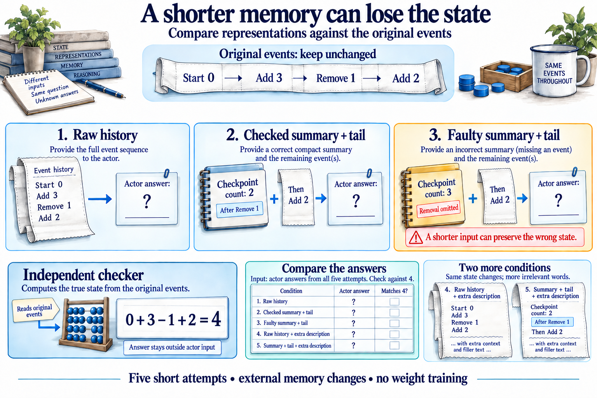

# 10.32 · Compare raw history and summarized memory

[Course](../../../README.md) · [Theme](../../README.md)

**You are here:** Theme 10, Research studio → lab 32 of 38. [Find this theme in the course map](../../../COURSE-MAP.md#theme-10) · [Whole-course mindmap](../../../COURSE-MAP.md#whole-course-mindmap).

## What you will build

A tiny state-tracking task with an exact checker and two memory representations.

## Why this matters

A long history and a useful memory can contain similar facts but impose different retrieval demands.

## Before you start

Complete [10.31: Compare harness generation and harness improvement](../../09_efficient_harnesses/step_31_harness_builders/README.md). You need the concepts and the reports named below, not its old chat. If you start here directly, ask the tutor to prepare the listed starting state and explain the missing prerequisite first.

Open the coding agent at the repository root. Read [the tutor skill](../../../skills/rsi-tutor/SKILL.md) and this lab's [brief](BRIEF.md). The agent creates a separate sibling workspace named <code>rsi-work/10-32</code> and reports its absolute path. It checks local Python and the [tool requirements](../../../tools/README.md) before execution. You do not write code or configuration.

**Starting state:** A synthetic sequence of inventory changes, such as add 3, remove 1, add 2, with a known final count.

**Budget:** Five short attempts: raw history, summary plus tail, faulty summary, and two expanded-description conditions. No model-weight training. Plan about 40–60 minutes of reading and discussion; this is an author estimate, not a measured student duration. Coding-agent inference may use a paid online service. Record its cost separately when available.

## How it works

The task asks the agent to recover the final state from a sequence. One condition receives raw events; another receives a checked summary plus subsequent events. The checker computes the answer from the original sequence. This tests an external memory interface, not parameter learning.

**A concrete example.** Starting from zero, add 3, remove 1, then add 2. The final count is 4. A summary after the first two events should say 2; a summary that forgets the removal says 3 and leads to 5. Compression can be shorter and systematically wrong at the same time.



*These counts are a synthetic teaching example. After adding three and removing one, the checkpoint is two; adding two more gives four. The faulty summary omits the removal. Do not pre-fill the actor’s answer or supply the checker’s result in its input. The two extra-description conditions change wording, not state transitions. The drawn counters and tally frame are props; the explicit event tape defines the arithmetic. This external-memory exercise does not reproduce S3Gym’s game or training protocols, and a shorter representation is not presumed better.*

[Open the illustration at full size](../../../assets/illustrations/memory-interface-v2.png).

<details>
<summary>See the step diagram</summary>


*Read the diagram:* Both memory representations refer to the same event history. The checker computes truth from the original events.

</details>

## Run the lab

Start with this prompt. The tutor pauses for your prediction before it runs the next step.

```text
Read rsi/AGENTS.md and
rsi/skills/rsi-tutor/SKILL.md.
Guide me through lab 10.32, Compare raw
history and summarized memory, one step at a
time.
Read its README and BRIEF. Prepare its
separate workspace.
You write and run the implementation. Keep
the reports and failures.
Ask me to predict the result before the
experiment.
```

**Make a prediction:** Can a shorter summary be worse if it omits one state-changing event?

### 1. Build an exact task

Give the comparison an executable ground truth.

```text
Generate a small deterministic inventory
event sequence and a checker. Save raw
events and a correct summary at a declared
checkpoint. Keep the final answer outside
the actor prompt where the host can enforce
it.
```

**Observe:** The answer follows from explicit operations.

### 2. Compare representations

Measure retrieval and summary failure.

```text
Run raw-history and summary-plus-tail
conditions with matched budgets. Then use a
labelled summary missing one removal event.
Check all answers and state context-exposure
limits.
```

**Observe:** A compact memory can help or introduce a systematic error.

## Check your result

The checker uses original events. Correct and faulty summaries are distinguished. The report does not claim model training or a full S3Gym reproduction.

### Open these outputs

The agent keeps these in your lab workspace or records the original experiment path when reusing evidence.

| Output | What to inspect |
|---|---|
| Original events, checkpoint summary, and exact checker | Keep ground truth tied to the original operations. |
| Five condition records | Include raw, correct summary, faulty summary, and both expanded-description attempts. |
| Memory-interface report | States actual information exposure and separates external representation from weight learning. |

Ask the agent to open the actual files and show the command exit status. A written description of a run is not a run. Keep a short <code>LAB-NOTE.md</code> with your prediction, measured observation, explanation, and one limit. The tutor must mark skipped learner responses as skipped.

## Try one change

Increase irrelevant event descriptions while keeping state changes fixed. Measure whether the representation effect changes.

## If something goes wrong

If the summary includes the final answer, inspect whether it was computed before the declared checkpoint and exposed later events. If both conditions share a context, do not claim a clean memory ablation. When adding irrelevant descriptions, preserve every state-changing operation so the scientific comparison remains the same.

Say “Stop this lab” to stop further work. Ask the agent to save <code>PROGRESS.md</code> with the last completed step and remaining budget. To resume, have it read that file and inspect active processes first. A reset creates a new sibling workspace; it does not erase failures or alter the source data. See the [recovery rules](../../../tools/README.md) for interrupted tool runs.

## Key takeaways

- Memory representation affects access to evidence.
- Compression can lose essential state.
- External memory and parameter learning differ.

## Research connection

[S3Gym](https://arxiv.org/abs/2608.31100), submitted 31 August 2026. This is an adjacent memory-interface exercise; read the full training protocol before making paper-specific training claims.

**Activity type: mechanism exercise.** You execute a small classroom mechanism. Its task, models, and budget differ from the source. Local observations do not reproduce the paper’s headline result.

## Check your understanding

Answer before opening the explanation. You can ask the tutor for a hint.

1. What supplies ground truth?
2. Does a shorter prompt guarantee better performance?
3. What changed in this exercise?
4. What would be needed to claim weight learning?

<details>
<summary>Hint</summary>

Trace the state numerically through the original events. That independent calculation reveals whether the memory preserved the information needed for the task.

</details>

<details>
<summary>Explained answers</summary>

1. The executable state transition calculation over the original events.

2. No. It can omit or distort necessary information.

3. The actor’s external information representation.

4. An actual training procedure and parameter-update evidence under the source protocol.

</details>

## What's next

Separate hints about actions from richer observations. Continue to [10.33: Compare action hints and richer observations](../step_33_scaffolding/README.md).
