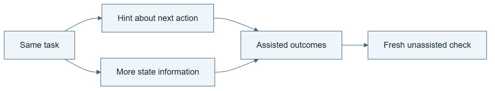

# 10.33 · Compare action hints and richer observations

[Course](../../../README.md) · [Theme](../../README.md)

**You are here:** Theme 10, Research studio → lab 33 of 38. [Find this theme in the course map](../../../COURSE-MAP.md#theme-10) · [Whole-course mindmap](../../../COURSE-MAP.md#whole-course-mindmap).

## What you will build

A small task comparison with action guidance, observation enrichment, and assistance removed.

## Why this matters

Help can change what a system does without establishing what it can do unaided.

## Before you start

Complete [10.32: Compare raw history and summarized memory](../step_32_memory_interface/README.md). You need the concepts and the reports named below, not its old chat. If you start here directly, ask the tutor to prepare the listed starting state and explain the missing prerequisite first.

Open the coding agent at the repository root. Read [the tutor skill](../../../skills/rsi-tutor/SKILL.md) and this lab's [brief](BRIEF.md). The agent creates a separate sibling workspace named <code>rsi-work/10-33</code> and reports its absolute path. It checks local Python and the [tool requirements](../../../tools/README.md) before execution. You do not write code or configuration.

**Starting state:** A local three-step data-check task with an exact success condition.

**Budget:** Four short attempts: action hint, richer observation, unassisted fresh fixture, and stale-hint counterexample. No model fits. Plan about 40–60 minutes of reading and discussion; this is an author estimate, not a measured student duration. Coding-agent inference may use a paid online service. Record its cost separately when available.

## How it works

An action hint suggests the next operation. An enriched observation exposes useful state, such as which field is missing. The classroom comparison keeps these distinct, then removes assistance. The source studies training settings; this inference-only exercise does not reproduce its reinforcement-learning results.

**A concrete example.** “Open column B next” is an action hint. “Column B is missing its unit” is richer observation. If the missing unit moves to column C, the old action hint can become misleading while an accurate observation still describes the new problem. Success with either help does not establish unassisted learning.



*Read the diagram:* Action hints and richer observations supply different assistance. Remove help in a separate fresh check.

## Run the lab

Start with this prompt. The tutor pauses for your prediction before it runs the next step.

```text
Read rsi/AGENTS.md and
rsi/skills/rsi-tutor/SKILL.md.
Guide me through lab 10.33, Compare action
hints and richer observations, one step at a
time.
Read its README and BRIEF. Prepare its
separate workspace.
You write and run the implementation. Keep
the reports and failures.
Ask me to predict the result before the
experiment.
```

**Make a prediction:** Which assistance remains useful if the task’s next action changes but the state description stays accurate?

### 1. Create two kinds of help

Avoid mixing instruction and observation.

```text
Generate a small missing-field task. Prepare
one action-hint condition and one
richer-observation condition, with the same
underlying task and budget. Define exact
completion checks.
```

**Observe:** The interventions supply different information.

### 2. Remove the scaffold

Inspect dependence on assistance.

```text
Run both conditions and then an unassisted
attempt on a fresh fixture. Keep traces,
checks, and context limits. Do not call
inference-time improvement learned weight
capability.
```

**Observe:** Performance with help can differ from unassisted performance.

## Check your result

The assistance types are explicit. The unassisted task is fresh and its limits are stated. The paper’s training claim is not transferred to the toy run.

### Open these outputs

The agent keeps these in your lab workspace or records the original experiment path when reusing evidence.

| Output | What to inspect |
|---|---|
| Task fixtures and assistance packets | Separate prescribed next actions from added state information. |
| Four traces and exact checks | Cover action help, observation help, unassisted work, and the stale-hint case. |
| Assistance-dependence report | Names context exposure, fresh-case limits, and the absence of parameter training. |

Ask the agent to open the actual files and show the command exit status. A written description of a run is not a run. Keep a short <code>LAB-NOTE.md</code> with your prediction, measured observation, explanation, and one limit. The tutor must mark skipped learner responses as skipped.

## Try one change

Give a stale action hint while preserving correct observations. Observe which condition can recover.

## If something goes wrong

If the enriched observation contains the next action verbatim, the two interventions are no longer distinct. If the unassisted attempt has already seen the same answer, use the declared fresh fixture and still report shared-context limits. Keep the stale hint labelled so it is not mistaken for a course instruction.

Say “Stop this lab” to stop further work. Ask the agent to save <code>PROGRESS.md</code> with the last completed step and remaining budget. To resume, have it read that file and inspect active processes first. A reset creates a new sibling workspace; it does not erase failures or alter the source data. See the [recovery rules](../../../tools/README.md) for interrupted tool runs.

## Key takeaways

- Hints and observations affect different parts of decision-making.
- Assisted success does not prove unassisted capability.
- Training results require actual training evidence.

## Research connection

[Environments as Scaffold](https://arxiv.org/abs/2609.08404), 8 September 2026.

**Activity type: mechanism exercise.** You execute a small classroom mechanism. Its task, models, and budget differ from the source. Local observations do not reproduce the paper’s headline result.

## Check your understanding

Answer before opening the explanation. You can ask the tutor for a hint.

1. What is an action hint?
2. What is an enriched observation?
3. Why remove assistance?
4. Does a successful prompt intervention establish RL learning?

<details>
<summary>Hint</summary>

Separate information about the world from advice about what to do. Then ask which one remains valid when the next required action changes.

</details>

<details>
<summary>Explained answers</summary>

1. Guidance about what operation to perform next.

2. Additional relevant state information without necessarily prescribing an action.

3. To measure dependence on the scaffold under the declared protocol.

4. No. It changes inference conditions without demonstrating parameter updates.

</details>

## What's next

Study why a model and harness can become mismatched. Continue to [10.34: Keep model training aligned with its harness](../step_34_model_harness_fit/README.md).
