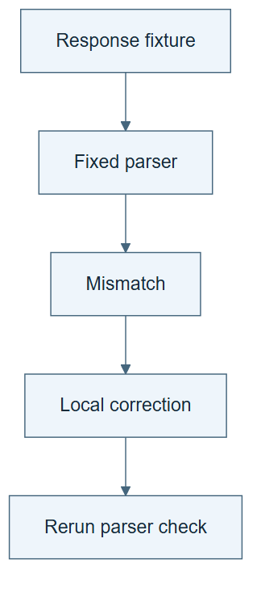

# 10.34 · Keep model training aligned with its harness

[Course](../../../README.md) · [Theme](../../README.md)

## What you will build

An interface-mismatch experiment and a source audit of local versus whole-trajectory correction.

## Why this matters

Training or instruction changes can teach behavior that no longer fits the surrounding workflow.

## Before you start

Complete [10.33: Compare action hints and richer observations](../step_33_scaffolding/README.md). You need the concepts and the reports named below, not its old chat. If you start here directly, ask the tutor to prepare the listed starting state and explain the missing prerequisite first.

Open the coding agent at the repository root. Read [the tutor skill](../../../skills/rsi-tutor/SKILL.md) and this lab's [brief](BRIEF.md). The agent creates a separate sibling workspace named <code>rsi-work/10-34</code> and reports its absolute path. It checks local Python and the [tool requirements](../../../tools/README.md) before execution. You do not write code or configuration.

**Starting state:** A small harness expecting a fixed tool-result format and two labelled response fixtures.

**Budget:** Three interface checks, no LLM training. Plan about 40–60 minutes of reading and discussion; this is an author estimate, not a measured student duration. Coding-agent inference may use a paid online service. Record its cost separately when available.

## How it works

The source contrasts training from full expert trajectories with correction on the agent’s own trajectories in evolved harnesses. Our toy version changes an output convention while keeping the harness parser fixed. It illustrates compatibility, not the paper’s trained-model results.



*Read the diagram:* An otherwise sensible answer can violate a harness interface. The local correction restores compatibility without training model weights.

## Run the lab

Start with this prompt. The tutor pauses for your prediction before it runs the next step.

```text
Read rsi/AGENTS.md and rsi/skills/rsi-tutor/SKILL.md.
Guide me through lab 10.34, Keep model training aligned with its harness, one step at a time.
Read its README and BRIEF. Prepare its separate workspace.
You write and run the implementation. Keep the reports and failures.
Ask me to predict the result before the experiment.
```

**Make a prediction:** Can a more polished response fail because it violates a tool contract?

### 1. Expose the mismatch

Make compatibility executable.

```text
Generate a parser for a simple candidate report format. Test a correct response and a polished response using a different field convention. Keep both fixtures.
```

**Observe:** Surface quality and interface validity differ.

### 2. Repair locally and audit the source

Connect the toy idea to the actual study carefully.

```text
Apply a minimal correction to the mismatched field and rerun the check. Read the paper’s training comparison, model families, data, and hardware. Explain what the toy omits and what real on-policy training would require.
```

**Observe:** The local repair restores compatibility without pretending to train a model.

## Check your result

The parser failure and repair are executed. The source audit distinguishes parameter training from an interface demonstration.

Ask the agent to open the actual files and show the command exit status. A written description of a run is not a run. Keep a short <code>LAB-NOTE.md</code> with your prediction, measured observation, explanation, and one limit. The tutor must mark skipped learner responses as skipped.

## Try one change

Replace the whole correct response with another expert’s incompatible template. Explain why globally imitating a good trajectory can break a local contract.

## If something goes wrong

If the expected artifact is missing, inspect the last command and its exit status before running again. If a check fails, preserve the failing result and diagnose that check; do not weaken it to obtain a pass.

Say “Stop this lab” to stop further work. Ask the agent to save <code>PROGRESS.md</code> with the last completed step and remaining budget. To resume, have it read that file and inspect active processes first. A reset creates a new sibling workspace; it does not erase failures or alter the source data. See the [recovery rules](../../../tools/README.md) for interrupted tool runs.

## Key takeaways

- A capable model can be mismatched to its harness.
- Local correction can preserve valid surrounding behavior.
- Toy interface evidence does not reproduce training performance.

## Research connection

[Co-Evolving Harnesses and Models with On-Policy Correction](https://arxiv.org/abs/2609.09134), Salesforce research, 8 September 2026.

**Activity type: source audit and mechanism exercise.** You inspect the source and execute a small local analogue. The task, models, resources, and evaluation differ from the paper.

## Check your understanding

Answer before opening the explanation. You can ask the tutor for a hint.

1. Why can a correct-looking answer fail?
2. What stays fixed in the toy comparison?
3. What does on-policy mean at a high level here?
4. What would establish the source’s training effect?

<details>
<summary>Hint</summary>

Trace what changed, what stayed fixed, and which observation supports the conclusion. A filename or a confident explanation is not enough evidence.

</details>

<details>
<summary>Explained answers</summary>

1. The harness depends on a specific semantic and structural interface.

2. The parser and task contract.

3. Correction is based on behavior produced by the current agent under its operating conditions.

4. A faithful parameter-training and evaluation comparison with the stated models, harnesses, data, and resources.

</details>

## What's next

Compose different improvement surfaces and inspect the schedule itself. Continue to [10.35: Compose changes to data, harness, and model](../../11_composition_and_reference_learning/step_35_metarsi/README.md).
