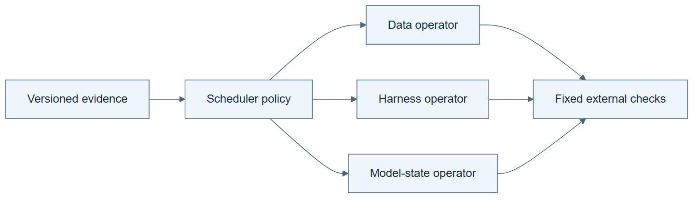

# 10.35 · Compose changes to data, harness, and model

[Course](../../../README.md) · [Theme](../../README.md)

**You are here:** Theme 10, Research studio → lab 35 of 38. [Find this theme in the course map](../../../COURSE-MAP.md#theme-10) · [Whole-course mindmap](../../../COURSE-MAP.md#whole-course-mindmap).

## What you will build

A typed operator schedule and a labelled simulation of revising that schedule.

## Why this matters

A failure does not automatically reveal whether it needs better data, a harness change, or model training.

## Before you start

Complete [10.34: Keep model training aligned with its harness](../../10_feedback_and_transfer/step_34_model_harness_fit/README.md). You need the concepts and the reports named below, not its old chat. If you start here directly, ask the tutor to prepare the listed starting state and explain the missing prerequisite first.

Open the coding agent at the repository root. Read [the tutor skill](../../../skills/rsi-tutor/SKILL.md) and this lab's [brief](BRIEF.md). The agent keeps this lab's notes in <code>rsi-work/10-35</code>, outside the repository, and reports the absolute path. If the lab continues an earlier experiment, keep that experiment in its original workspace with its existing budget and locks. A new notes folder does not reset an experiment. The agent checks local Python and the [tool requirements](../../../tools/README.md) before execution. You do not write code or configuration.

**Starting state:** Your ontology and three labelled operator stubs: data, harness, model. No actual LLM training.

**Budget:** Five schedule checks: two orderings from the same start, stale evidence, a forbidden write, and inherited scheduler use. Allow twelve operator attempts including failures, one static scheduler-rule gate, and three synthetic evaluations. No model fits. Plan about 40–60 minutes of reading and discussion; this is an author estimate, not a measured student duration. Coding-agent inference may use a paid online service. Record its cost separately when available.

## How it works

MetaRSI composes operators over data, harness, and model state, with a policy that chooses their order and can itself be revised. The classroom simulation makes write boundaries and input versions explicit. A changed system can make old diagnostic evidence stale. Keep the external evaluator fixed.

**A concrete example.** A model stub copies the harness format. Running the harness update first gives it the new format; running the model first leaves it with the old one. In the [author walkthrough](../../../evidence/2026-09-21/operator-composition/README.md), the two orders scored 100 and 50 under a fixed synthetic rule. Stale evidence and forbidden writes were rejected. A saved scheduler revision then moved the harness update before the model in a later term. That trace shows inherited use, not an empirical RSI gain. The [source comparison](../../../evidence/2026-09-21/operator-composition/SOURCE-AUDIT.md) asks the stronger question: which improver does better from the same start?


*The write-surface rows are separate examples, not one sequential run. The evidence panel compares two exact version sets and requires a fresh diagnosis after the harness changes. Q1’s interface rule is an original classroom example. Follow the author walkthrough linked above for one executed case; the illustration itself is conceptual. Its accepted path shows structural inheritance, not a demonstrated empirical benefit. Preserve Q0 if the revision fails. This five-check simulation omits much of MetaRSI’s full architecture and does not train an LLM. The external evaluator and allowed write boundaries remain fixed.*

[Open the illustration at full size](../../../assets/illustrations/operator-composition-v1.png).

<details>
<summary>See the step diagram</summary>



*Read the diagram:* The simulation composes typed changes and can revise their schedule. Its synthetic values are not model-training results.

</details>

## Run the lab

Start with this prompt. The tutor pauses for your prediction before it runs the next step.

```text
Read rsi/AGENTS.md and
rsi/skills/rsi-tutor/SKILL.md.
Guide me through lab 10.35, Compose changes
to data, harness, and model, one step at a
time.
Read its README and BRIEF. Prepare its
separate workspace.
You write and run the implementation. Keep
the reports and failures.
Ask me to predict the result before the
experiment.
```

**Make a prediction:** Could the same two operators give different results when applied in the opposite order?

### 1. Define typed operators

Make each mutable surface visible.

```text
Generate a small simulator with separate
data, harness, and model version fields.
Give each operator a declared read/write
contract and a synthetic outcome rule.
Reject stale evidence and undeclared writes.
Label every value synthetic.
```

**Observe:** Composition is checked through interfaces and versions.

### 2. Revise the schedule

Trace a meta-level change into later work.

```text
Compare two allowed schedules, propose one
scheduler-rule revision from their outcomes,
and use it in a later simulated term.
Preserve the original scheduler and fixed
evaluator. Audit structure separately from
synthetic benefit.
```

**Observe:** The revised scheduling rule is actually inherited.

## Check your result

The simulator enforces declared surfaces and evidence versions. Synthetic outcomes are not presented as the paper’s results. The audit distinguishes schedule composition from real model training.

### Open these outputs

The agent keeps these in your lab workspace or records the original experiment path when reusing evidence.

| Output | What to inspect |
|---|---|
| Typed operator contracts | Declare data, harness, and model reads/writes and label synthetic outcomes. |
| Five schedule checks | Include valid composition, order differences, stale evidence, and forbidden writes. |
| Scheduler revision and later-term trace | Connect the altered rule to an executed simulated choice while keeping the evaluator fixed. |

Ask the agent to open the actual files and show the command exit status. A written description of a run is not a run. Keep a short <code>LAB-NOTE.md</code> with your prediction, measured observation, explanation, and one limit. The tutor must mark skipped learner responses as skipped.

## Try one change

Read the paper’s same-start improver comparison and per-term gains. Explain why rising cumulative gains can coexist with declining gains per term.

## If something goes wrong

If a model-update stub is reported as a trained checkpoint, correct the label and retain the distinction. If a schedule reads evidence from an older system version, reject or explicitly regenerate the diagnostic under a new budget. Do not change the synthetic scoring table during the comparison to reward the preferred schedule.

Say “Stop this lab” to stop further work. Ask the agent to save <code>PROGRESS.md</code> with the last completed step and remaining budget. To resume, have it read that file and inspect active processes first. A reset creates a new sibling workspace; it does not erase failures or alter the source data. See the [recovery rules](../../../tools/README.md) for interrupted tool runs.

## Key takeaways

- Operator order can matter.
- Versioned evidence can become stale after a change.
- Cumulative progress does not imply an increasing progress rate.

## Research connection

[MetaRSI / RSI2](https://arxiv.org/abs/2609.06396), Zihan Tan and colleagues; first submitted 6 September 2026, revised 9 September.

**Activity type: simulation.** You execute rules over labelled synthetic states. Those values are not trained-model measurements or the paper’s results.

## Check your understanding

Answer before opening the explanation. You can ask the tutor for a hint.

1. What are the three surfaces?
2. Why keep the evaluator outside them?
3. What supports structural recursion in the simulation?
4. Does increasing cumulative gain prove acceleration?

<details>
<summary>Hint</summary>

Track the version read by each operator, the version it writes, and the scheduler that selected it. Order and inheritance are visible in those links.

</details>

<details>
<summary>Explained answers</summary>

1. Data state, harness state, and model state; the toy represents them without training an LLM.

2. Otherwise an operator could improve the apparent result by changing the measurement.

3. An altered scheduling policy governs a later improvement term.

4. No. Smaller positive increments still increase the total while the rate declines.

</details>

## What's next

Use reference trajectories carefully, without leaking their answers into active skills. Continue to [10.36: Diagnose failures with checked reference trajectories](../step_36_harnessevolve/README.md).
