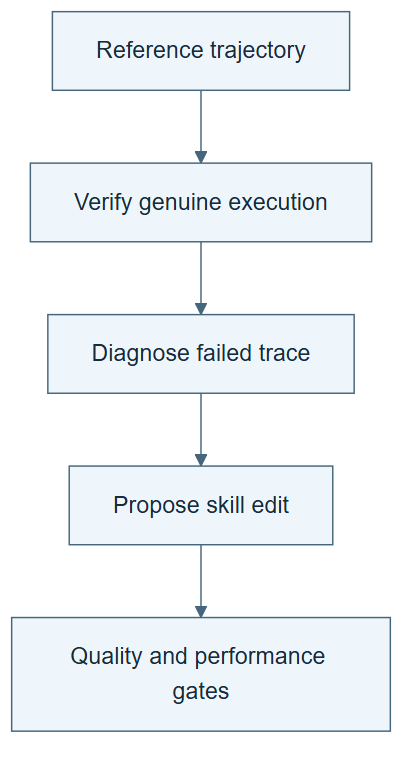

# 10.36 · Diagnose failures with checked reference trajectories

[Course](../../../README.md) · [Theme](../../README.md)

## What you will build

A reference-guided diagnosis with leakage and regression checks on the proposed skill edit.

## Why this matters

A final failure score says little about the first wrong action. A valid reference can help localize it, but an answer shortcut can mislead.

## Before you start

Complete [10.35: Compose changes to data, harness, and model](../step_35_metarsi/README.md). You need the concepts and the reports named below, not its old chat. If you start here directly, ask the tutor to prepare the listed starting state and explain the missing prerequisite first.

Open the coding agent at the repository root. Read [the tutor skill](../../../skills/rsi-tutor/SKILL.md) and this lab's [brief](BRIEF.md). The agent creates a separate sibling workspace named <code>rsi-work/10-36</code> and reports its absolute path. It checks local Python and the [tool requirements](../../../tools/README.md) before execution. You do not write code or configuration.

**Starting state:** A failed local workflow trace, a successful reference trace, and a labelled shortcut trace.

**Budget:** Four trace checks, including the alternative-path counterexample, and one candidate-skill evaluation on two fixtures. No model fits. Plan about 40–60 minutes of reading and discussion; this is an author estimate, not a measured student duration. Coding-agent inference may use a paid online service. Record its cost separately when available.

## How it works

HarnessEvolve uses answer-conditioned reference trajectories, checks that they contain genuine execution, and compares failures against them. Candidate changes face quality and performance gates. Our exercise uses small workflow traces and prevents a copied answer from becoming the active skill.

**A concrete example.** A shortcut reference prints “the units are missing” because it was given the answer. A useful reference opens the schema, checks the required field, and records the failure. Both may end with the same sentence, but only the latter provides an executable path that can help diagnose the failed workflow.



*Read the diagram:* Check a reference before using it to diagnose failure. A proposed edit must also pass leakage and regression checks.

## Run the lab

Start with this prompt. The tutor pauses for your prediction before it runs the next step.

```text
Read rsi/AGENTS.md and rsi/skills/rsi-tutor/SKILL.md.
Guide me through lab 10.36, Diagnose failures with checked reference trajectories, one step at a time.
Read its README and BRIEF. Prepare its separate workspace.
You write and run the implementation. Keep the reports and failures.
Ask me to predict the result before the experiment.
```

**Make a prediction:** Is a reference that immediately prints the known answer a useful execution path?

### 1. Check the reference

Reject a shortcut before using it as teaching evidence.

```text
Generate two reference fixtures for a missing-data task: one with valid tool actions and one that only repeats the known answer. Validate required action evidence and retain the rejected shortcut.
```

**Observe:** Correct final text alone does not establish a useful reference trajectory.

### 2. Diagnose and gate an edit

Keep the improvement general and nonregressing.

```text
Compare the failed trace with the valid reference. Propose one general skill edit. Check for answer copying and unnecessary growth, then test the current and a prior fixture before promotion. Keep every verdict.
```

**Observe:** A current-case gain can be rejected for leakage or regression.

## Check your result

The reference is validated independently of its final answer text. The active skill does not copy case-specific answers. Both current and prior cases are evaluated.

### Open these outputs

The agent keeps these in your lab workspace or records the original experiment path when reusing evidence.

| Output | What to inspect |
|---|---|
| Four trace verdicts | Cover the failure, valid reference, answer shortcut, and an alternative valid route. |
| General skill proposal and quality check | Look for case-answer copying and unnecessary instruction growth. |
| Current/prior fixture results | Show whether the retained edit helps without losing previously checked behavior. |

Ask the agent to open the actual files and show the command exit status. A written description of a run is not a run. Keep a short <code>LAB-NOTE.md</code> with your prediction, measured observation, explanation, and one limit. The tutor must mark skipped learner responses as skipped.

## Try one change

Supply a legitimate alternative successful path. Explain why the first divergence is a diagnostic lead, not automatic proof that the failed path’s differing action was wrong.

## If something goes wrong

If the reference passes solely because its final text matches the answer, strengthen the declared action-evidence check. If the child embeds a case-specific label, retain and reject that proposal. An alternative valid route should not fail simply because its action order differs; check the task’s actual constraints.

Say “Stop this lab” to stop further work. Ask the agent to save <code>PROGRESS.md</code> with the last completed step and remaining budget. To resume, have it read that file and inspect active processes first. A reset creates a new sibling workspace; it does not erase failures or alter the source data. See the [recovery rules](../../../tools/README.md) for interrupted tool runs.

## Key takeaways

- Reference quality matters to diagnosis.
- Known answers can create shortcuts.
- Promotion should account for leakage and retained competence.

## Research connection

[HarnessEvolve](https://arxiv.org/abs/2609.00829), Wen Jiang and colleagues; submitted 1 September 2026.

**Activity type: mechanism exercise.** You execute a small classroom mechanism. Its task, models, and budget differ from the source. Local observations do not reproduce the paper’s headline result.

## Check your understanding

Answer before opening the explanation. You can ask the tutor for a hint.

1. Why verify reference execution?
2. What does a quality gate check here?
3. Why retest prior cases?
4. Is every divergence an error?

<details>
<summary>Hint</summary>

A reference is evidence of a possible successful route, not proof that every different route is wrong.

</details>

<details>
<summary>Explained answers</summary>

1. Answer-conditioned generation can produce a shortcut rather than a usable successful procedure.

2. Case-answer leakage and unnecessary instruction growth, within its declared scope.

3. A new edit can improve the current batch while forgetting earlier competence.

4. No. Multiple valid paths can exist; divergence needs interpretation and evidence.

</details>

## What's next

Compare systems using the same mechanism and evidence questions. Continue to [10.37: Compare systems without flattening their differences](../../12_evidence_and_open_questions/step_37_compare_systems/README.md).
