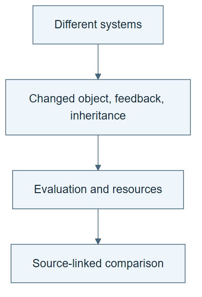

# 10.37 · Compare systems without flattening their differences

[Course](../../../README.md) · [Theme](../../README.md)

**You are here:** Theme 10, Research studio → lab 37 of 38. [Find this theme in the course map](../../../COURSE-MAP.md#theme-10) · [Whole-course mindmap](../../../COURSE-MAP.md#whole-course-mindmap).

## What you will build

A comparison matrix of six systems and your own bounded experiment.

## Why this matters

A single “RSI” label hides differences in mutable components, feedback, inheritance, and evaluation.

## Before you start

Complete [10.36: Diagnose failures with checked reference trajectories](../../11_composition_and_reference_learning/step_36_harnessevolve/README.md). You need the concepts and the reports named below, not its old chat. If you start here directly, ask the tutor to prepare the listed starting state and explain the missing prerequisite first.

Open the coding agent at the repository root. Read [the tutor skill](../../../skills/rsi-tutor/SKILL.md) and this lab's [brief](BRIEF.md). The agent creates a separate sibling workspace named <code>rsi-work/10-37</code> and reports its absolute path. It checks local Python and the [tool requirements](../../../tools/README.md) before execution. You do not write code or configuration.

**Starting state:** Paper audits for Dream-RSI, RSIAgent, AIDE², ScientistTwo, ScienceBuddy, MetaRSI, and your local lineage.

**Budget:** No fits. One source-linked matrix and one claim challenge. Plan about 40–60 minutes of reading and discussion; this is an author estimate, not a measured student duration. Coding-agent inference may use a paid online service. Record its cost separately when available.

## How it works

Compare the same questions across systems: what changes, what remains fixed, who supplies feedback, what persists, what later work inherits it, what is evaluated, and at what cost. Keep paper-reported evidence separate from your measurements. Missing information is a result of the audit, not a blank to fill by inference.

**A concrete example.** One system updates memory; another updates weights and harness instructions; a third revises the search policy. Their headline scores come from different tasks. A useful matrix compares changed objects, feedback, inheritance, and evaluation before asking whether any numbers are comparable.


*The ledger is a template to fill, not a completed comparison. Link paper claims to their primary method and result sections; use raw execution records where available and mark missing evidence unresolved. Link local claims to the course’s actual records. The named folders carry no rank or inferred method assignment. The lower challenge needs two distinct checks: whether an improver changed and governed later work, and whether its downstream outcomes improved under a fair total-resource comparison. A task-score gain alone answers neither.*

[Open the illustration at full size](../../../assets/illustrations/compare-research-systems-v1.png).

<details>
<summary>See the step diagram</summary>



*Read the diagram:* Compare systems on common questions before comparing scores. Missing evidence stays visible.

</details>

## Run the lab

Start with this prompt. The tutor pauses for your prediction before it runs the next step.

```text
Read rsi/AGENTS.md and
rsi/skills/rsi-tutor/SKILL.md.
Guide me through lab 10.37, Compare systems
without flattening their differences, one
step at a time.
Read its README and BRIEF. Prepare its
separate workspace.
You write and run the implementation. Keep
the reports and failures.
Ask me to predict the result before the
experiment.
```

**Make a prediction:** Which two systems share a label but change different objects?

### 1. Build the comparison

Use dimensions rather than a forced ranking.

```text
Create SYSTEM-COMPARISON.md for the six
named systems and the local course run. Link
each row to primary evidence. Include
mutable surface, fixed components, feedback
source, inheritance, evaluation boundary,
resources, and reading depth.
```

**Observe:** The matrix makes differences visible without declaring a universal winner.

### 2. Challenge one classification

Test whether the evidence supports the label.

```text
Choose one row and construct a plausible
weaker explanation of its result. State the
experiment or source detail that would
distinguish the explanations. Mark
unresolved cases.
```

**Observe:** The comparison identifies a useful next question.

## Check your result

All technical entries have sources or an unresolved label. The matrix does not treat local demonstrations as reproductions of frontier results.

### Open these outputs

The agent keeps these in your lab workspace or records the original experiment path when reusing evidence.

| Output | What to inspect |
|---|---|
| SYSTEM-COMPARISON.md | Covers the six named systems and the local experiment with primary links and reading depth. |
| Mechanism-only view | Separates structure from scores and marks unknown fields. |
| One challenged classification | States a plausible weaker explanation and the evidence that would distinguish it. |

Ask the agent to open the actual files and show the command exit status. A written description of a run is not a run. Keep a short <code>LAB-NOTE.md</code> with your prediction, measured observation, explanation, and one limit. The tutor must mark skipped learner responses as skipped.

## Try one change

Remove performance columns and compare mechanisms alone, then restore results with their protocols. Explain why both views are useful.

## If something goes wrong

If a row lacks a resource measurement, mark it unknown rather than ranking cost by intuition. If a paper-reported number appears beside a local score, label their different protocols. New optional sources can enrich a comparison, but an unread abstract must not become a detailed method claim.

Say “Stop this lab” to stop further work. Ask the agent to save <code>PROGRESS.md</code> with the last completed step and remaining budget. To resume, have it read that file and inspect active processes first. A reset creates a new sibling workspace; it does not erase failures or alter the source data. See the [recovery rules](../../../tools/README.md) for interrupted tool runs.

## Key takeaways

- Shared terminology does not imply shared mechanisms.
- Mechanism and evidence strength are different dimensions.
- A comparison should expose uncertainty.

## Research connection

[Research inventory](../../../research/README.md), including the primary sources used throughout this studio.

**Activity type: source audit.** You inspect and compare evidence from primary sources. This activity does not execute or reproduce the paper’s system.

## Check your understanding

Answer before opening the explanation. You can ask the tutor for a hint.

1. Why avoid a single ranking?
2. What if a source omits a cost?
3. Can a mechanism be interesting without a strong effectiveness result?
4. What makes the matrix useful for new papers?

<details>
<summary>Hint</summary>

Use the same questions across rows. Preserve different answers instead of forcing every system into the same supposed stage.

</details>

<details>
<summary>Explained answers</summary>

1. Different systems target different tasks, surfaces, resources, and evidence claims.

2. Mark it unknown; do not assume zero or infer equal budgets.

3. Yes, provided the distinction is explicit.

4. Stable questions that can be applied without relying on a paper’s marketing terminology.

</details>

## What's next

Examine the bottlenecks that limit sustained improvement. Continue to [10.38: Reason about bottlenecks and acceleration](../step_38_economics/README.md).
