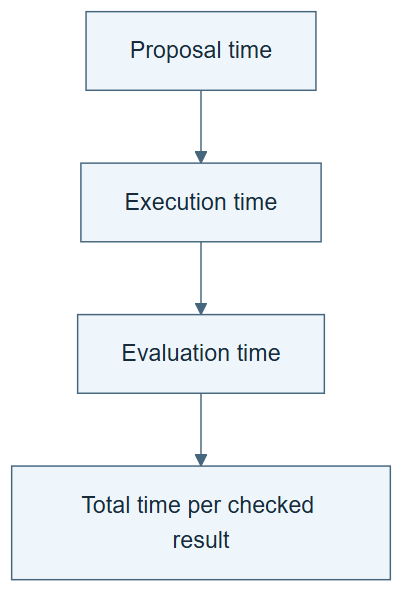

# 10.38 · Reason about bottlenecks and acceleration

[Course](../../../README.md) · [Theme](../../README.md)

**You are here:** Theme 10, Research studio → lab 38 of 38. [Find this theme in the course map](../../../COURSE-MAP.md#theme-10) · [Whole-course mindmap](../../../COURSE-MAP.md#whole-course-mindmap).

## What you will build

A small resource model and an evidence checklist for an acceleration claim.

## Why this matters

Faster proposal generation does not remove slow evaluation, missing data, hardware limits, or human review.

## Before you start

Complete [10.37: Compare systems without flattening their differences](../step_37_compare_systems/README.md). You need the concepts and the reports named below, not its old chat. If you start here directly, ask the tutor to prepare the listed starting state and explain the missing prerequisite first.

Open the coding agent at the repository root. Read [the tutor skill](../../../skills/rsi-tutor/SKILL.md) and this lab's [brief](BRIEF.md). The agent creates a separate sibling workspace named <code>rsi-work/10-38</code> and reports its absolute path. It checks local Python and the [tool requirements](../../../tools/README.md) before execution. You do not write code or configuration.

**Starting state:** Your cost ledger and a labelled synthetic model of proposal, execution, and evaluation time.

**Budget:** Five numerical scenarios: baseline, faster proposals, faster evaluation, checking overhead, and one saturation or verifier-cost extension. No paid compute. Plan about 40–60 minutes of reading and discussion; this is an author estimate, not a measured student duration. Coding-agent inference may use a paid online service. Record its cost separately when available.

## How it works

Total progress depends on the whole research process. If evaluation takes most of the time, making proposals twice as fast has a limited effect. Use explicit synthetic numbers to study the bottleneck, then return to measured evidence. Do not confuse a theoretical possibility with a demonstrated trajectory.

**A concrete example.** Proposal work takes 1 minute and the remaining execution/evaluation takes 9. Doubling proposal speed changes total time from 10 to 9.5 minutes: a 5% reduction. Even eliminating proposal time saves only 10%. A claimed proposal speedup needs the full process denominator before it becomes a research speedup.


*Use the explicit numbers, not the decorative clock faces, to read the example. The five scenarios are alternatives; they are not successive generations. Execution time is set to zero only for this teaching calculation. Restore measured execution, failures, retries, and other costs in a real ledger. The instant-proposal limit follows from the baseline and is not a sixth run. The gain units below are a separate illustration; an acceleration claim must also account for resources and difficulty. This is neither a forecast nor the economics paper’s calibrated model.*

[Open the illustration at full size](../../../assets/illustrations/research-bottlenecks-v1.png).

<details>
<summary>See the step diagram</summary>



*Read the diagram:* The slow stage limits total speedup. The calculator uses declared synthetic costs, not a forecast.

</details>

## Run the lab

Start with this prompt. The tutor pauses for your prediction before it runs the next step.

```text
Read rsi/AGENTS.md and
rsi/skills/rsi-tutor/SKILL.md.
Guide me through lab 10.38, Reason about
bottlenecks and acceleration, one step at a
time.
Read its README and BRIEF. Prepare its
separate workspace.
You write and run the implementation. Keep
the reports and failures.
Ask me to predict the result before the
experiment.
```

**Make a prediction:** How much total time can be saved if proposals take one minute and evaluation takes nine?

### 1. Model the bottleneck

Make assumptions visible.

```text
Generate a small calculator with proposal,
execution, and evaluation times. Use a
labelled 1-plus-9-minute example, then
compare faster proposals, faster evaluation,
and added checking overhead. Save
assumptions and outputs.
```

**Observe:** The slow stage limits total speedup.

### 2. Audit acceleration

Require evidence for the rate claim.

```text
Use your lineage and cost ledger to
distinguish cumulative gain, gain per
generation, and gain per unit total
resource. List missing evidence for
sustained acceleration. Read the economics
paper’s assumptions before attributing its
conclusions.
```

**Observe:** The audit can reject an acceleration claim while accepting useful improvements.

## Check your result

Synthetic values are labelled. The calculation uses total time. The final claim separates theory, reported research, and local measurements.

### Open these outputs

The agent keeps these in your lab workspace or records the original experiment path when reusing evidence.

| Output | What to inspect |
|---|---|
| Resource calculator and assumptions | Define sequential stages, units, synthetic inputs, and any omitted costs. |
| Five scenario outputs | Compare baseline, faster stages, checking overhead, and one later-limit scenario. |
| Acceleration audit | Separates cumulative gain, per-generation increment, and progress per total resource. |

Ask the agent to open the actual files and show the command exit status. A written description of a run is not a run. Keep a short <code>LAB-NOTE.md</code> with your prediction, measured observation, explanation, and one limit. The tutor must mark skipped learner responses as skipped.

## Try one change

Add a saturation limit or a more expensive verifier. Explain how either can slow later gains even when the improver becomes more capable.

## If something goes wrong

If wall-clock savings exceed the time originally spent in the accelerated stage, inspect the arithmetic and parallelism assumptions. If measured and synthetic values share a chart, label them separately. A rising cumulative curve with smaller increments supports continued progress, not increasing marginal progress.

Say “Stop this lab” to stop further work. Ask the agent to save <code>PROGRESS.md</code> with the last completed step and remaining budget. To resume, have it read that file and inspect active processes first. A reset creates a new sibling workspace; it does not erase failures or alter the source data. See the [recovery rules](../../../tools/README.md) for interrupted tool runs.

## Key takeaways

- Bottlenecks can move as components improve.
- Cumulative gain and accelerating gain differ.
- Economic and empirical assumptions must be stated.

## Research connection

[Economics of Recursive Self-Improvement](https://arxiv.org/abs/2609.15802), 14 September 2026, and the source-scoped results audited in this studio.

**Activity type: numerical simulation.** You explore explicit resource assumptions with synthetic numbers. The calculation is not an empirical forecast of RSI.

## Check your understanding

Answer before opening the explanation. You can ask the tutor for a hint.

1. What happens if the one-minute stage becomes instantaneous?
2. Can an improving system have declining marginal gains?
3. Does a synthetic model forecast actual RSI?
4. What would support acceleration empirically?

<details>
<summary>Hint</summary>

Write total time as the sum of the declared stages before changing one. Then compare increments as well as cumulative totals.

</details>

<details>
<summary>Explained answers</summary>

1. Total time falls from ten to nine minutes, only a 10% reduction.

2. Yes. It can approach a task ceiling or encounter harder remaining problems.

3. No. It illustrates consequences of its stated assumptions.

4. Repeated comparable generations showing an increasing progress rate after accounting for total resources and changing task difficulty.

</details>

## What's next

Build a new harness and defend its result in a capstone. Continue to [11.01: Build a harness for a new prediction brief](../../../11_capstones/step_01_new_harness/README.md).
