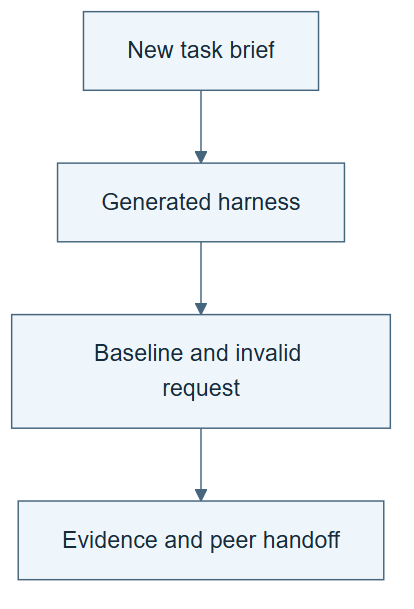

# 11.01 · Build a harness for a new prediction brief

[Course](../../README.md) · [Theme](../README.md)

**You are here:** Theme 11, Capstones → lab 1 of 5. [Find this theme in the course map](../../COURSE-MAP.md#theme-11) · [Whole-course mindmap](../../COURSE-MAP.md#whole-course-mindmap).

## What you will build

A runnable harness that another student can inspect and execute.

## Why this matters

A new task reveals whether you understand the method or only remember the earlier examples.

## Before you start

Complete [10.38: Reason about bottlenecks and acceleration](../../10_research_studio/12_evidence_and_open_questions/step_38_economics/README.md). You need the concepts and the reports named below, not its old chat. If you start here directly, ask the tutor to prepare the listed starting state and explain the missing prerequisite first.

Open the coding agent at the repository root. Read [the tutor skill](../../skills/rsi-tutor/SKILL.md) and this lab's [brief](BRIEF.md). The agent creates a separate sibling workspace named <code>rsi-work/11-01</code> and reports its absolute path. It checks local Python and the [tool requirements](../../tools/README.md) before execution. You do not write code or configuration.

**Starting state:** Choose a small permitted tabular dataset, or a new prespecified question on the supplied data. Explain what makes the task new.

**Budget:** At most four small CPU fits. No paid cluster launch in the required path. Plan about 60–120 minutes of reading and discussion; this is an author estimate, not a measured student duration. Coding-agent inference may use a paid online service. Record its cost separately when available.

## How it works

Begin with the scientific contract, not a preferred optimizer. State target, prediction time, available inputs, split, metric, baseline, and limitations. Use the builder skill to create a harness, then test a valid run and an intended refusal. Keep any departure from the earlier task explicit.

**A concrete example.** You change from describing recorded hourly demand to predicting tomorrow’s demand. That is a new scientific question even on the same public dataset. Tomorrow’s observed weather is no longer an available input. The new brief must resolve input availability and evaluation time before the builder chooses a model.



*Read the diagram:* A new scientific brief should produce a runnable system and a meaningful refusal. Files alone are insufficient.

## Run the lab

Start with this prompt. The tutor pauses for your prediction before it runs the next step.

```text
Read rsi/AGENTS.md and
rsi/skills/rsi-tutor/SKILL.md.
Guide me through lab 11.01, Build a harness
for a new prediction brief, one step at a
time.
Read its README and BRIEF. Prepare its
separate workspace.
You write and run the implementation. Keep
the reports and failures.
Ask me to predict the result before the
experiment.
```

**Make a prediction:** Which assumption from the bike task is least safe to reuse unchanged?

### 1. Write and review the brief

Make the new task scientifically coherent.

```text
Create a task brief and data card with
source, permission, checksum, prediction
unit, input availability, split design,
metric, baseline, and budget. Use plain
language. Resolve scientific ambiguity
before training.
```

**Observe:** The brief can be understood without the old course chat.

### 2. Generate and prove the harness

Deliver behavior as well as files.

```text
Use build-ml-harness to generate the system.
Run its baseline and one intended refusal.
Save setup, commands, exit status,
predictions, checks, and a clean-start
handoff.
```

**Observe:** A peer can reproduce a small valid run and see the boundary work.

## Check your result

The handoff is sufficient, evidence is actual, and the refusal is meaningful. A different dataset alone does not establish transfer of every learned procedure.

### Open these outputs

The agent keeps these in your lab workspace or records the original experiment path when reusing evidence.

| Output | What to inspect |
|---|---|
| Task brief and data card | Define the new question, permissions, source identity, prediction unit, inputs, split, and objective. |
| Generated harness and real baseline | Retain its dependencies, entry point, predictions, checks, and known costs. |
| Intended refusal and handoff | Demonstrate one meaningful invalid request and supply a clean-start route for a peer. |

Ask the agent to open the actual files and show the command exit status. A written description of a run is not a run. Keep a short <code>LAB-NOTE.md</code> with your prediction, measured observation, explanation, and one limit. The tutor must mark skipped learner responses as skipped.

## Try one change

Use scale-experiment to prepare a larger-job plan with resources, cancellation, checkpoints, and cost limits. Label it generated-only until tested on that backend.

## If something goes wrong

If the new task requires data that the dataset does not provide, narrow the question or identify the missing source before fitting. If generation produces instructions without an executable entry, finish the implementation and retain any failed attempt. A cluster plan remains generated-only until its actual backend checks run.

Say “Stop this lab” to stop further work. Ask the agent to save <code>PROGRESS.md</code> with the last completed step and remaining budget. To resume, have it read that file and inspect active processes first. A reset creates a new sibling workspace; it does not erase failures or alter the source data. See the [recovery rules](../../tools/README.md) for interrupted tool runs.

## Key takeaways

- Transfer begins with a new scientific contract.
- A generated harness needs execution and failure evidence.
- Scaling preserves interfaces but can change the comparison.

## Check your understanding

Answer before opening the explanation. You can ask the tutor for a hint.

1. What makes the task new?
2. Why include an intended refusal?
3. Does a cluster launch file establish backend support?
4. What should a peer receive?

<details>
<summary>Hint</summary>

Before asking whether the model is good, ask whether each input could exist when the prediction is needed and whether the evaluation answers the new question.

</details>

<details>
<summary>Explained answers</summary>

1. A stated difference in data, prediction question, distribution, or constraints; the report must identify it.

2. It demonstrates that the harness checks a relevant invalid condition.

3. No. A real small backend run, cancellation, and resume checks are needed.

4. The brief, data provenance, versions, setup, entry point, expected artifacts, checks, and limits.

</details>

## What's next

Use a bounded recursive experiment to test a procedural change on this task. Continue to [11.02: Run and audit a bounded recursive experiment](../step_02_recursive_experiment/README.md).
