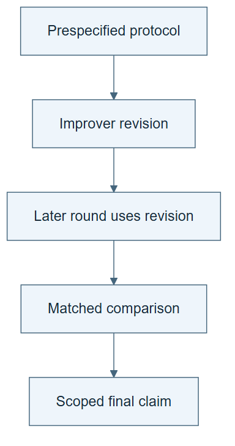

# 11.02 · Run and audit a bounded recursive experiment

[Course](../../README.md) · [Theme](../README.md)

**You are here:** Theme 11, Capstones → lab 2 of 5. [Find this theme in the course map](../../COURSE-MAP.md#theme-11) · [Whole-course mindmap](../../COURSE-MAP.md#whole-course-mindmap).

## What you will build

A solver–improver lineage with matched comparisons and an honest final claim.

## Why this matters

The capstone should demonstrate the mechanism you claim, including inheritance and the cost of finding a change.

## Before you start

Complete [11.01: Build a harness for a new prediction brief](../step_01_new_harness/README.md). You need the concepts and the reports named below, not its old chat. If you start here directly, ask the tutor to prepare the listed starting state and explain the missing prerequisite first.

Open the coding agent at the repository root. Read [the tutor skill](../../skills/rsi-tutor/SKILL.md) and this lab's [brief](BRIEF.md). The agent keeps this lab's notes in <code>rsi-work/11-02</code>, outside the repository, and reports the absolute path. If the lab continues an earlier experiment, keep that experiment in its original workspace with its existing budget and locks. A new notes folder does not reset an experiment. The agent checks local Python and the [tool requirements](../../tools/README.md) before execution. You do not write code or configuration.

**Starting state:** The new harness, a fixed improver baseline, and prespecified development and evaluation cases.

**Budget:** Two generations maximum, eight CPU fits total, and a declared agent-inference limit if available. Plan about 60–120 minutes of reading and discussion; this is an author estimate, not a measured student duration. Coding-agent inference may use a paid online service. Record its cost separately when available.

## How it works

First establish the fixed-improver baseline. Propose one improver revision from development evidence. Make a later round inherit it. Compare old and new improvers from matching starting artifacts. Keep the external comparison and final acceptance criteria outside the ordinary candidate’s writable surface, or state the weaker local boundary. An improver’s internal proposal-selection rule may be revised as a candidate change; the unchanged external protocol judges its consequences.

**A concrete example.** In the saved [eight-fit author experiment](../../evidence/2026-09-21/capstone-recursion/README.md), the original improver chooses a tree with zero training error but poor selection error. After inspecting that failure, the author changes one instruction: rank by selection error. Both later arms start from the same tree recipe and fit the same three models. The original rule keeps the tree; the revised candidate keeps the forest. Frozen final-evaluation MAE is 0.67540 versus 0.54631. The trace proves later candidate-trial use, and the external gate accepts the revision. No post-acceptance generation ran. This is one author-guided comparison against a deliberately weak baseline, not autonomous discovery or general RSI effectiveness.


*These are the evidence needed to inspect the experiment. The pictured contrasting-case check is one possible revision; the saved author run changes ranking from training to selection MAE. Its later use occurs in the candidate trial, with acceptance afterward and no third generation. Match starting artifacts and external comparison rules. Eight fits is the total maximum across the two-generation protocol; record agent-inference limits and unavailable costs separately.*

[Open the illustration at full size](../../assets/illustrations/capstone-recursion-v1.png).

<details>
<summary>See the step diagram</summary>



*Read the diagram:* The capstone joins revision, inheritance, and matched evaluation in a bounded experiment.

</details>

## Run the lab

Start with this prompt. The tutor pauses for your prediction before it runs the next step.

```text
Read rsi/AGENTS.md and
rsi/skills/rsi-tutor/SKILL.md.
Guide me through lab 11.02, Run and audit a
bounded recursive experiment, one step at a
time.
Read its README and BRIEF. Prepare its
separate workspace.
You write and run the implementation. Keep
the reports and failures.
Ask me to predict the result before the
experiment.
```

**Make a prediction:** Which result would demonstrate structure but fail to show effective improvement?

### 1. Predeclare the experiment

Prevent claims from following favorable accidents.

```text
Write a complete bounded protocol: solver
and improver versions, permitted edits,
tasks, metrics, resource limits, promotion,
rollback, context boundary, and stop
conditions. Identify the final evaluation
exposure.
```

**Observe:** The experiment’s claims have explicit acceptance evidence.

### 2. Run and audit

Keep the complete lineage.

```text
Execute the protocol, including rejected
proposals. Save inheritance traces, matched
comparisons, costs, and final retained
versions. Use audit-rsi-claim and write a
conclusion that may be negative or
inconclusive.
```

**Observe:** The claim follows the complete record rather than the best isolated score.

## Check your result

The improved object is identified. The revised improver actually governs later work. Fairness limits and missing costs remain in the conclusion.

### Open these outputs

The agent keeps these in your lab workspace or records the original experiment path when reusing evidence.

| Output | What to inspect |
|---|---|
| Bounded recursive protocol | Freezes external comparison, allowed inner edits, two generations, eight-fit total, and stop/rollback rules. |
| Lineage and matched outcomes | Connect active versions to later decisions and preserve all rejected proposals. |
| Final claim audit | Separates structure, benefit, efficiency, context limits, and unknown resources. |

Ask the agent to open the actual files and show the command exit status. A written description of a run is not a run. Keep a short <code>LAB-NOTE.md</code> with your prediction, measured observation, explanation, and one limit. The tutor must mark skipped learner responses as skipped.

## Try one change

Ask a reviewer to remove one key artifact from the evidence pack and identify which claim no longer follows.

## If something goes wrong

If the newest proposal is automatically active, reconcile it with the last acceptance decision before resuming. If the child receives more attempts, report the resource mismatch. If a final result changes the next proposal, those cases are now development information; do not continue calling them untouched final evidence.

Say “Stop this lab” to stop further work. Ask the agent to save <code>PROGRESS.md</code> with the last completed step and remaining budget. To resume, have it read that file and inspect active processes first. A reset creates a new sibling workspace; it does not erase failures or alter the source data. See the [recovery rules](../../tools/README.md) for interrupted tool runs.

## Key takeaways

- A capstone can succeed by demonstrating and correctly limiting a mechanism.
- Complete histories are stronger than selected success stories.
- Effective RSI requires evidence beyond structural recursion.

## Check your understanding

Answer before opening the explanation. You can ask the tutor for a hint.

1. What proves inheritance?
2. What evaluates effectiveness?
3. What if the revised improver loses?
4. Why is acceleration a separate claim?

<details>
<summary>Hint</summary>

Show the revised improver governing a later improvement action, then compare the consequences. A changed file and a good task score alone leave that chain incomplete.

</details>

<details>
<summary>Explained answers</summary>

1. Version identity plus a later executed action governed by the changed procedure.

2. A matched comparison of improvement produced by old and new improvers.

3. Report the failure; structural recursion may still be demonstrated.

4. It concerns progress rate across generations and resources, beyond a local two-version gain.

</details>

## What's next

Test which parts transfer across tasks, agents, and compute environments. Continue to [11.03: Test transfer and portability separately](../step_03_portability/README.md).
