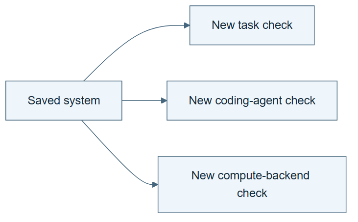

# 11.03 · Test transfer and portability separately

[Course](../../README.md) · [Theme](../README.md)

**You are here:** Theme 11, Capstones → lab 3 of 5. [Find this theme in the course map](../../COURSE-MAP.md#theme-11) · [Whole-course mindmap](../../COURSE-MAP.md#whole-course-mindmap).

## What you will build

A compatibility matrix backed by actual small runs and clearly marked untested paths.

## Why this matters

A procedure can transfer across tasks while failing in another agent’s tool environment, or the reverse.

## Before you start

Complete [11.02: Run and audit a bounded recursive experiment](../step_02_recursive_experiment/README.md). You need the concepts and the reports named below, not its old chat. If you start here directly, ask the tutor to prepare the listed starting state and explain the missing prerequisite first.

Open the coding agent at the repository root. Read [the tutor skill](../../skills/rsi-tutor/SKILL.md) and this lab's [brief](BRIEF.md). The agent keeps this lab's notes in <code>rsi-work/11-03</code>, outside the repository, and reports the absolute path. If the lab continues an earlier experiment, keep that experiment in its original workspace with its existing budget and locks. A new notes folder does not reset an experiment. The agent checks local Python and the [tool requirements](../../tools/README.md) before execution. You do not write code or configuration.

**Starting state:** Your frozen harness, a second task or agent environment, and optional available larger-compute backend.

**Budget:** Two small smoke runs; larger jobs require a concrete resource plan. Plan about 60–120 minutes of reading and discussion; this is an author estimate, not a measured student duration. Coding-agent inference may use a paid online service. Record its cost separately when available.

## How it works

Task transfer changes the scientific problem. Agent portability changes the host interpreting skills and operating tools. Compute portability changes execution resources. Test these dimensions separately so one successful run is not mistaken for universal support.

**A concrete example.** The saved [two-task author check](../../evidence/2026-09-21/capstone-portability/README.md) runs the same skill and shared tool on bike regression and red-wine classification in one Codex file-reading session. Both prediction checks pass. Wine recall is about 0.734 for class zero and 0.756 for class one. Extra fits and a changed budget are refused. This tests two existing task adapters on one host; it does not test another agent, a cluster, or transfer of the previous capstone’s revised improver. A separate commandless-profile fixture is refused without changing actual host permissions.


*Test these dimensions separately. Describe what changed in Task B; a different label does not establish task transfer. Choose two small tests you can actually run and leave other combinations explicitly untested. The pictured notebooks and machines are examples, not certified environments.*

[Open the illustration at full size](../../assets/illustrations/capstone-portability-v1.png).

<details>
<summary>See the step diagram</summary>



*Read the diagram:* Task transfer, agent portability, and compute portability require different checks. One passing check does not certify the others.

</details>

## Run the lab

Start with this prompt. The tutor pauses for your prediction before it runs the next step.

```text
Read rsi/AGENTS.md and
rsi/skills/rsi-tutor/SKILL.md.
Guide me through lab 11.03, Test transfer
and portability separately, one step at a
time.
Read its README and BRIEF. Prepare its
separate workspace.
You write and run the implementation. Keep
the reports and failures.
Ask me to predict the result before the
experiment.
```

**Make a prediction:** Does a successful Codex run prove the same hooks work in Claude or Gemini?

### 1. Define the matrix

Separate compatibility questions.

```text
Create PORTABILITY.md with task, agent,
runtime version, backend, required
capabilities, and status. Use statuses
planned, generated, inspected, and executed.
Choose two small tests you can actually run.
```

**Observe:** Unsupported combinations remain explicit.

### 2. Execute and record

Replace intended support with evidence.

```text
Run the selected smoke tests through
canonical skills. Check outputs, refusal
behavior, recovery, and dependency versions.
For a cluster test, record job ID, cancel,
resume, and cost. Do not launch unavailable
infrastructure or invent results.
```

**Observe:** Each executed cell has evidence and limits.

## Check your result

Every support claim corresponds to a run. Task transfer, agent compatibility, and backend compatibility are not merged into one label.

### Open these outputs

The agent keeps these in your lab workspace or records the original experiment path when reusing evidence.

| Output | What to inspect |
|---|---|
| PORTABILITY.md | Separates task, host, version, backend, required capabilities, and actual status. |
| Two small smoke-run records | Retain setup, commands, outputs, refusal/recovery behavior, and observed limits. |
| Optional backend evidence | If executed, records job identity, cancellation, checkpoint resume, and cost; otherwise remains planned or generated. |

Ask the agent to open the actual files and show the command exit status. A written description of a run is not a run. Keep a short <code>LAB-NOTE.md</code> with your prediction, measured observation, explanation, and one limit. The tutor must mark skipped learner responses as skipped.

## Try one change

Remove one host capability, such as command execution, and identify which lesson outcomes can no longer be completed.

## If something goes wrong

If a target host lacks command execution, identify which course outcomes it cannot produce. If no second agent or backend is available, choose the available meaningful tests and leave other cells unexecuted. Do not invent cluster behavior from a launch file or call a new folder a new agent environment.

Say “Stop this lab” to stop further work. Ask the agent to save <code>PROGRESS.md</code> with the last completed step and remaining budget. To resume, have it read that file and inspect active processes first. A reset creates a new sibling workspace; it does not erase failures or alter the source data. See the [recovery rules](../../tools/README.md) for interrupted tool runs.

## Key takeaways

- Portability has several independent dimensions.
- Readable instructions help portability but do not prove it.
- Target-environment evidence is required for support claims.

## Check your understanding

Answer before opening the explanation. You can ask the tutor for a hint.

1. What changes in task transfer?
2. What changes in agent portability?
3. What changes in compute portability?
4. How should an untested backend be listed?

<details>
<summary>Hint</summary>

Change one portability dimension at a time where possible. A failure is easier to interpret when task, agent, and backend do not all change together.

</details>

<details>
<summary>Explained answers</summary>

1. The scientific task or distribution.

2. The host’s skill loading, tools, permissions, context behavior, and execution interface.

3. The runtime backend and resource behavior, ideally preserving task and evaluation contracts.

4. As planned or generated-only, with the missing tests stated.

</details>

## What's next

Apply the same evidence standard to someone else’s RSI claim. Continue to [11.04: Audit an unfamiliar RSI claim](../step_04_external_audit/README.md).
