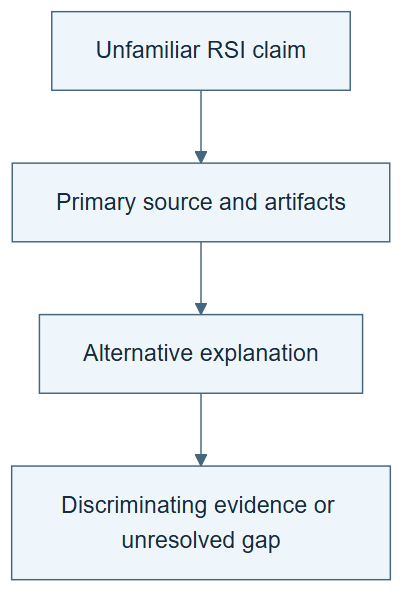

# 11.04 · Audit an unfamiliar RSI claim

[Course](../../README.md) · [Theme](../README.md)

**You are here:** Theme 11, Capstones → lab 4 of 5. [Find this theme in the course map](../../COURSE-MAP.md#theme-11) · [Whole-course mindmap](../../COURSE-MAP.md#whole-course-mindmap).

## What you will build

A short primary-source audit with a concrete follow-up experiment.

## Why this matters

Independent judgment matters more than remembering the systems in this course.

## Before you start

Complete [11.03: Test transfer and portability separately](../step_03_portability/README.md). You need the concepts and the reports named below, not its old chat. If you start here directly, ask the tutor to prepare the listed starting state and explain the missing prerequisite first.

Open the coding agent at the repository root. Read [the tutor skill](../../skills/rsi-tutor/SKILL.md) and this lab's [brief](BRIEF.md). The agent creates a separate sibling workspace named <code>rsi-work/11-04</code> and reports its absolute path. It checks local Python and the [tool requirements](../../tools/README.md) before execution. You do not write code or configuration.

**Starting state:** Choose a new primary source discovered within the preceding month, or a clearly dated required foundation.

**Budget:** No large reproduction. One small mechanism check if appropriate. Plan about 60–120 minutes of reading and discussion; this is an author estimate, not a measured student duration. Coding-agent inference may use a paid online service. Record its cost separately when available.

## How it works

Start with what changes and how it is evaluated. Then inspect inheritance, resources, retained artifacts, failures, transfer, and access boundaries. Use the authors’ definitions accurately while stating your own evaluation criteria. A critical audit should be precise and fair, not reflexively skeptical.

**A concrete example.** A new source reports a better retained agent after several harness edits. You can accept that reported result while asking whether the edit-generating procedure itself changed. The follow-up should inspect or test that missing link, rather than dismissing the result because it does not establish every stronger RSI claim.


*A source announcement, supported result, and independent reproduction are different evidence. Record the source date, version, and what you actually read. State the strongest support and the main limitation, then propose an observation that could change your conclusion. No pictured source or experiment is a reported result.*

[Open the illustration at full size](../../assets/illustrations/capstone-audit-v1.png).

<details>
<summary>See the step diagram</summary>



*Read the diagram:* Audit an unfamiliar claim through its source, artifacts, and strongest alternative explanation.

</details>

## Run the lab

Start with this prompt. The tutor pauses for your prediction before it runs the next step.

```text
Read rsi/AGENTS.md and
rsi/skills/rsi-tutor/SKILL.md.
Guide me through lab 11.04, Audit an
unfamiliar RSI claim, one step at a time.
Read its README and BRIEF. Prepare its
separate workspace.
You write and run the implementation. Keep
the reports and failures.
Ask me to predict the result before the
experiment.
```

**Make a prediction:** Which missing detail would most change your interpretation of the claim?

### 1. Read the primary evidence

Build a source trail.

```text
Search the preceding month with explicit
dates. Select one primary paper, lab report,
or original author announcement. Read
relevant methods and limitations. Save the
exact query, source version, reading depth,
and access gaps.
```

**Observe:** The audit distinguishes what was read from what was inferred.

### 2. Write the audit

Make the next step testable.

```text
Use audit-rsi-claim. Produce a
two-page-equivalent note with supported
claim, strongest evidence, main limitation,
alternative explanation, and the smallest
useful follow-up. If running a toy check,
label its relation to the source.
```

**Observe:** The critique identifies evidence that could change the conclusion.

## Check your result

The audit uses primary sources and accurate dates. It neither exaggerates nor dismisses results beyond the evidence.

### Open these outputs

The agent keeps these in your lab workspace or records the original experiment path when reusing evidence.

| Output | What to inspect |
|---|---|
| Dated primary-source trail | Records query, original date, version, exact reading depth, and access gaps. |
| Short audit | States strongest supported claim, evidence, limitation, and alternative explanation fairly. |
| Discriminating follow-up | Names the smallest test that could change the assessment and labels any toy check. |

Ask the agent to open the actual files and show the command exit status. A written description of a run is not a run. Keep a short <code>LAB-NOTE.md</code> with your prediction, measured observation, explanation, and one limit. The tutor must mark skipped learner responses as skipped.

## Try one change

State the strongest reasonable interpretation of the authors’ result before presenting your limitation. Check that both can be true.

## If something goes wrong

If the chosen source is only a social announcement, keep its identity and date but leave unavailable methods unresolved. If a toy counterexample differs from the source’s assumptions, state that difference rather than presenting it as a refutation. Cite primary evidence for both the positive finding and its limitation.

Say “Stop this lab” to stop further work. Ask the agent to save <code>PROGRESS.md</code> with the last completed step and remaining budget. To resume, have it read that file and inspect active processes first. A reset creates a new sibling workspace; it does not erase failures or alter the source data. See the [recovery rules](../../tools/README.md) for interrupted tool runs.

## Key takeaways

- Good audits are charitable and exact.
- A missing detail should connect to a consequential uncertainty.
- A follow-up experiment makes criticism productive.

## Check your understanding

Answer before opening the explanation. You can ask the tutor for a hint.

1. Why inspect original dates?
2. Can a social-only announcement be included?
3. What makes a criticism useful?
4. Does a toy counterexample refute a paper’s measured result?

<details>
<summary>Hint</summary>

State the strongest reasonable interpretation first. Then identify precisely which additional observation would support or weaken a stronger claim.

</details>

<details>
<summary>Explained answers</summary>

1. Recent discussion can concern old work; the search window should not mislabel it as new.

2. Yes, with identity, date, canonical link, and evidence status, without inventing missing methods.

3. It names an uncertainty and the evidence that would resolve it.

4. Not automatically. It can expose a possible limitation that must be connected to the paper’s actual protocol.

</details>

## What's next

Assemble a small portfolio and explain the whole path in your own words. Continue to [11.05: Teach the mechanism and defend the evidence](../step_05_teach_back/README.md).
