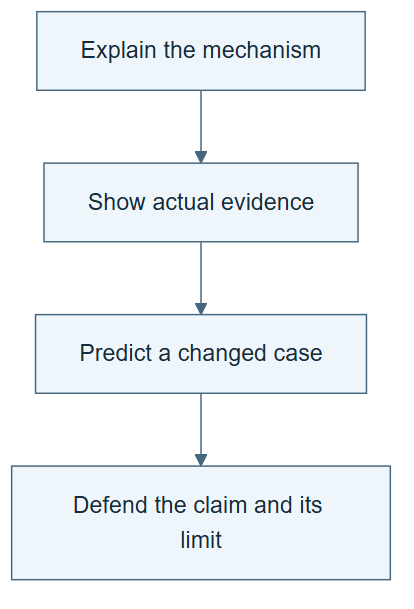

# 11.05 · Teach the mechanism and defend the evidence

[Course](../../README.md) · [Theme](../README.md)

## What you will build

A concise portfolio that a peer can run, question, and understand.

## Why this matters

You understand a complex system better when you can explain one concrete path through it and one case where it fails.

## Before you start

Complete [11.04: Audit an unfamiliar RSI claim](../step_04_external_audit/README.md). You need the concepts and the reports named below, not its old chat. If you start here directly, ask the tutor to prepare the listed starting state and explain the missing prerequisite first.

Open the coding agent at the repository root. Read [the tutor skill](../../skills/rsi-tutor/SKILL.md) and this lab's [brief](BRIEF.md). The agent creates a separate sibling workspace named <code>rsi-work/11-05</code> and reports its absolute path. It checks local Python and the [tool requirements](../../tools/README.md) before execution. You do not write code or configuration.

**Starting state:** Your task brief, harness, skills, lineage, results, failure, cost ledger, and claim audit.

**Budget:** One peer reproduction of a small run; no new search to improve the presentation. Plan about 60–120 minutes of reading and discussion; this is an author estimate, not a measured student duration. Coding-agent inference may use a paid online service. Record its cost separately when available.

## How it works

Tell the story from a row of data to a model result, then from a failure to a skill change, then from an improver change to later work. At each step name the evidence. Keep the main walkthrough short and link to detail. An impressive architecture is not a substitute for a clear causal explanation.



*Read the diagram:* Teach-back connects the mechanism to an observation and then to a new case. Repeating vocabulary is not enough.

## Run the lab

Start with this prompt. The tutor pauses for your prediction before it runs the next step.

```text
Read rsi/AGENTS.md and rsi/skills/rsi-tutor/SKILL.md.
Guide me through lab 11.05, Teach the mechanism and defend the evidence, one step at a time.
Read its README and BRIEF. Prepare its separate workspace.
You write and run the implementation. Keep the reports and failures.
Ask me to predict the result before the experiment.
```

**Make a prediction:** Which part of your claim would a careful peer find hardest to verify?

### 1. Assemble the handoff

Make the evidence navigable.

```text
Create PORTFOLIO.md with task, starting command through the agent, generated artifacts, one successful run, one failure, lineage, costs, and claim limits. Link every result to its source file. Include a simple mechanism illustration with an accurate caption.
```

**Observe:** A peer can follow one complete chain without reading the entire history.

### 2. Teach and reproduce

Test understanding beyond memorized wording.

```text
Guide a peer through one small run. Ask them to explain process, loop, graph, ontology, meta-harness, self-improvement, and recursion using your project. Record actual feedback and unanswered questions. Do not invent a peer session if none is available.
```

**Observe:** The portfolio separates executed validation from pending learner review.

## Check your result

The portfolio has runnable evidence and a failed case. The teach-back explains the solver/improver distinction and names remaining uncertainty. Pending peer review is honestly marked.

Ask the agent to open the actual files and show the command exit status. A written description of a run is not a run. Keep a short <code>LAB-NOTE.md</code> with your prediction, measured observation, explanation, and one limit. The tutor must mark skipped learner responses as skipped.

## Try one change

Ask the peer to propose a different prediction task. Explain what should transfer and what must be redesigned before running it.

## If something goes wrong

If the expected artifact is missing, inspect the last command and its exit status before running again. If a check fails, preserve the failing result and diagnose that check; do not weaken it to obtain a pass.

Say “Stop this lab” to stop further work. Ask the agent to save <code>PROGRESS.md</code> with the last completed step and remaining budget. To resume, have it read that file and inspect active processes first. A reset creates a new sibling workspace; it does not erase failures or alter the source data. See the [recovery rules](../../tools/README.md) for interrupted tool runs.

## Key takeaways

- A clear explanation follows a concrete evidence chain.
- Failure cases reveal the limits of a mechanism.
- A complete portfolio lets another person test the claim.

## Check your understanding

Answer before opening the explanation. You can ask the tutor for a hint.

1. What distinguishes a loop from RSI?
2. Why include an ontology?
3. What does the meta-harness generate?
4. What is your strongest defensible final claim?

<details>
<summary>Hint</summary>

Trace what changed, what stayed fixed, and which observation supports the conclusion. A filename or a confident explanation is not enough evidence.

</details>

<details>
<summary>Explained answers</summary>

1. A loop repeats; RSI requires a changed improvement procedure to govern later improvement work, with separate evidence for benefit.

2. It makes domain meanings and invariants explicit so plausible records can be checked semantically.

3. A task-specific execution harness from a readable brief; generation alone is not recursion.

4. The one supported by your actual artifacts, comparisons, resource accounting, and boundaries; it may be narrower than the original ambition.

</details>

## What's next

Use the instructor guide to review the portfolio, then apply the reusable course-building skill when teaching another topic. Continue to [Teaching portfolio](../../instructor/README.md).
