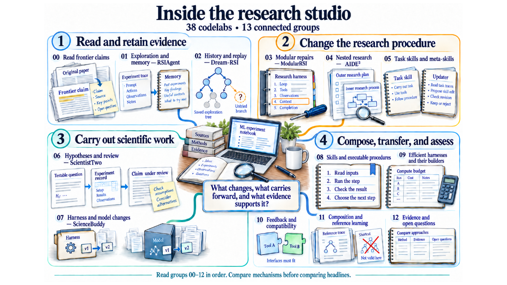
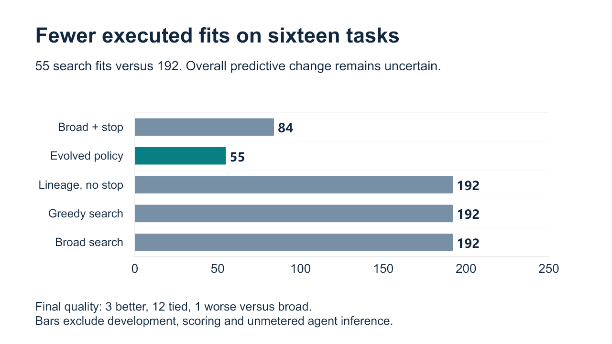
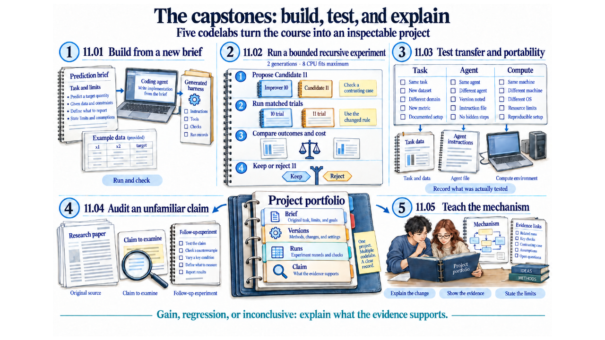

# Presentation and speaker notes

**[Download the 37-slide PowerPoint review draft](../how-did-i-generate-it/rsi/presentation/output/rsi-masterclass-review-v2.pptx)** (57 MB).

The deck follows the course from one ML experiment to changes in a research
procedure and its improver. It includes the course illustrations, an editable
results chart, editable comparison tables and speaker notes on all 37 slides.
Allow an estimated 75–90 minutes for the lecture and discussion. The codelabs
have their own schedule.

- [Read the complete speaker notes](../how-did-i-generate-it/rsi/presentation/build-v2/SPEAKER-NOTES.md).
- [Browse all 37 rendered slides](../how-did-i-generate-it/rsi/presentation/RENDERED-SLIDES.md).
- [Read the teaching outline](../how-did-i-generate-it/rsi/presentation/STORYBOARD.md).
- [Inspect the authoring sources, earlier draft and checks](../how-did-i-generate-it/rsi/presentation/README.md).
- [Browse all 101 codelab illustrations](VISUAL-GUIDE.md).

This is a **review draft of the verified findings**. The discovery experiment
used fewer search fits. The later researcher comparison produced two gains,
three ties and one regression against its primary control. Its uncertainty
interval includes zero. These findings do not establish an overall RSI gain.
See the [results guide](RESULTS-GUIDE.md) for the full interpretation.

## Preview the lecture

The research studio connects the advanced mechanisms to their codelabs:

Measured search work and prediction quality answer different questions:

The capstones ask students to build, compare, transfer, audit and explain:

All slides were rendered and inspected. Package checks and 120 content checks
pass, including embedded notes and result values. Native PowerPoint
application behavior has not been tested. The original request for a deck
showing strong RSI gains remains conditional on evidence that supports them.
