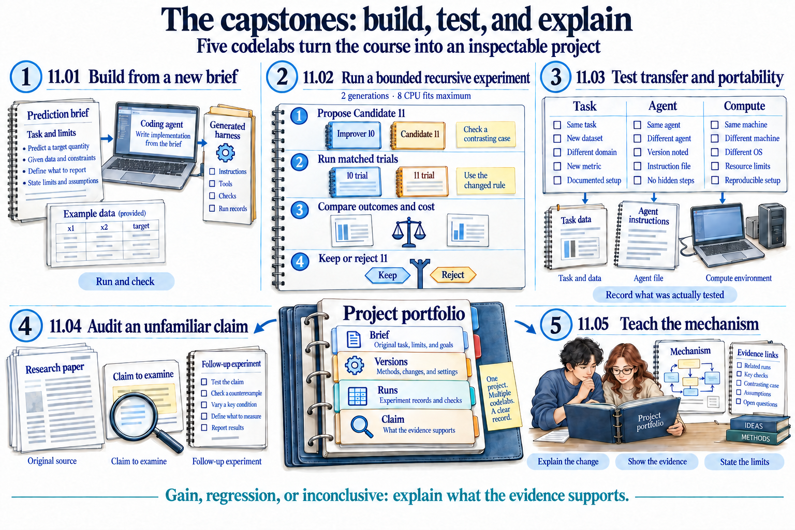
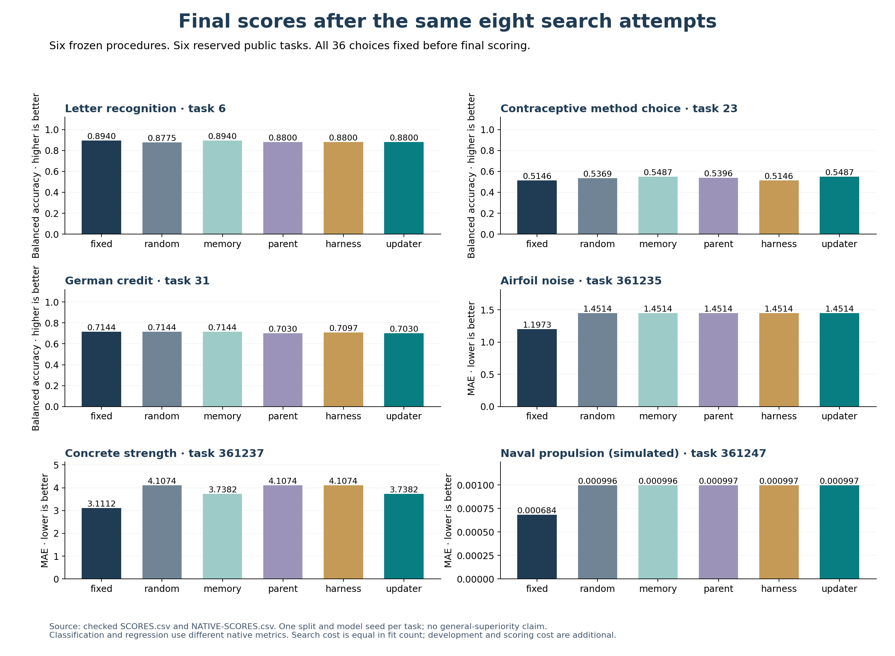
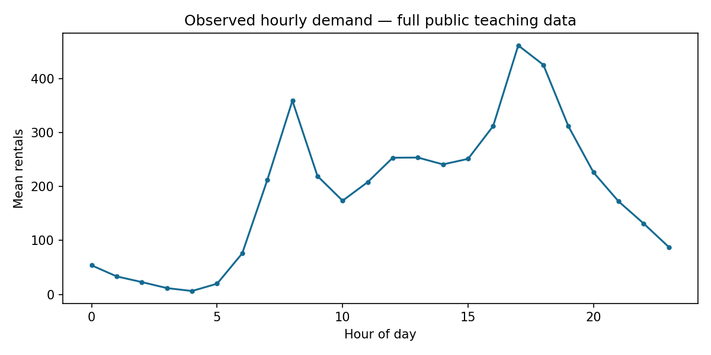

# From one ML experiment to recursive self-improvement

You ask a coding agent to predict hourly bike demand. It trains a model and reports an error. You inspect the mistakes and ask it to try a better idea.

That is useful. It is also ordinary model improvement.

Now save the procedure that chooses experiments. Test a change to that procedure. Later, let the system revise the procedure that proposes and evaluates those changes. Make the next round use the revision. Compare what the old and new procedures can improve under the same conditions.

This course builds that distinction slowly. You begin with one understandable prediction and finish with an inspectable, bounded experiment in recursive self-improvement, or RSI. A successful final project can report a gain, a regression, or an inconclusive result. Its evidence must support its conclusion.


*First change the model. Then test changes to the research procedure. Finally, ask whether a revised improver governs later improvement work and helps under a fair comparison. This is a conceptual illustration: its accepted I1 is a possible outcome, not a claim that this course has demonstrated a successful recursive gain.* [Open the full-size illustration](assets/illustrations/main-overview-v2.png).

**Begin with [Start here](START-HERE.md).** You use ordinary language and Markdown. The coding agent writes the code, configuration, tests, and launch files.

## See the whole journey

[](COURSE-MAP.md)

Follow themes **00–11**. Start with one prediction; add loops, graphs and
domain rules; build a harness; distinguish the self-* ideas; then investigate
changes to the improver. [Open the guided outline](COURSE-MAP.md) for each
theme's purpose, prerequisites and readiness check.

The research studio and capstones are the destination. Select a preview to
open its illustrated walkthrough; use the full-size links to read every label.

| Research studio · 38 labs | Capstones · 5 projects |
|---|---|
| [](10_research_studio/README.md) | [](11_capstones/README.md) |
| [Explore the studio](10_research_studio/README.md) · [Full-size map](assets/illustrations/research-studio-map-v3.png) | [Explore the capstones](11_capstones/README.md) · [Full-size map](assets/illustrations/capstone-map-v3.png) |

**[Browse all 101 codelab illustrations](VISUAL-GUIDE.md)** · [Teaching roadmap](TEACHING-ROADMAP.md) · [Skills and intent briefs](SOURCE-ARTIFACTS.md).

**Presentation:** [Download the 37-slide PowerPoint review draft](../how-did-i-generate-it/rsi/presentation/output/rsi-masterclass-review-v2.pptx) · [Speaker notes](../how-did-i-generate-it/rsi/presentation/build-v2/SPEAKER-NOTES.md) · [Preview the slides](PRESENTATION.md).
Every slide has embedded speaker notes. The deck presents measured search savings
and mixed prediction results, with their limits visible.

These maps explain the mechanisms and learning route. They do not report
experimental wins. Each lab connects its illustration to instructions, checks,
takeaways and an explained quiz.

## What has been tested

Start with [what changed after the zero-gain results](RESULTS-GUIDE.md).
It separates better predictions, fewer executed experiments and improvement
of the researcher, with illustrations and links to the measured evidence.

**What the results currently show:** this course has executed mechanism lessons and small author-guided comparisons. It has **not demonstrated general, autonomous recursive self-improvement**. The original Dream-RSI exercise retained its baseline; the positive recursive capstone uses an author-written correction to a weak ranking rule. Read the [results diagnosis and benchmark repair plan](../how-did-i-generate-it/rsi/validation/RSI-RESULTS-DIAGNOSIS-2026-09-22.md) before interpreting the original near-zero result table or the newer examples as evidence of a successful RSI system.

The repair began with [360 pilot attempts](evidence/2026-09-22/pipeline-operator-pilot/README.md) and [43 online discovery fits](evidence/2026-09-22/online-discovery/README.md). It now includes a [completed sixteen-task comparison](evidence/2026-09-22/discovery-final/README.md): the replay-selected policy used **55 search fits versus 192** for broad search. Separate final-row quality improved on three tasks, tied on twelve and worsened on one. Its uncertainty interval includes zero, so a predictive gain is not established. This is a real reduction in executed search work on known synthetic task families; development costs, unmetered agent inference and an explicitly recorded host interruption remain additional. The completed public-task and improver comparisons below test different mechanisms and retain their separate costs.

Use the [teaching roadmap](TEACHING-ROADMAP.md) to plan a short orientation, the core course, or the full masterclass. It includes session plans, readiness checks, and capstone milestones. Keep the [glossary](GLOSSARY.md) nearby for plain-language definitions, examples, and distinctions that are easy to confuse.

The [public-tabular development study](evidence/2026-09-22/real-tabular-revision-2/README.md)
now adds 96 checked fits and two source-level builder revisions. The digit
selection scores improve, while the stronger earlier regression models remain
retained. The subsequent [six-procedure comparison](evidence/2026-09-22/tabular-comparison/README.md)
has now completed **288 search fits and 36 final-scoring refits** on the six
reserved tasks. Memory beats random search in this sample but loses to the
stronger fixed portfolio overall. The revised updater improves two tasks,
ties three and worsens one against the revised harness with the original
updater; its uncertainty interval includes zero. Later skill use is verified,
but a reliable recursive improvement has not been established.



*These bars are measured results, separate from the conceptual course maps.
All procedures spend eight search fits per task. Read the full comparison
before interpreting one favorable task as a general gain.*

The [subsequent operator repair](evidence/2026-09-22/composition-repair/README.md)
fixes template settings that were overwritten and a higher-capacity branch
that incorrectly capped unlimited trees. Four integration fits run successfully;
their scores tie or slightly regress. Correct execution is necessary, but it
does not by itself establish a better improver.

The next [complete-researcher development comparison](evidence/2026-09-22/nested-research-development/README.md)
executes **234 attempts**. I1's rewritten researcher improves two evaluation
results and ties four, narrowly passing its predefined development gate.
These tasks were previously exposed, and the uncertainty interval reaches zero.
Both inherited improvers generated a later complete researcher. The
[completed reserved-task comparison](evidence/2026-09-22/nested-research-evaluation/README.md)
adds 390 attempts: I1 improves two tasks, ties three and worsens one against
I0 and the parent. Its mean loss change is near zero and all paired intervals
include zero. Later execution is verified; an overall RSI gain is not established.

To inspect the authored materials, open [all 101 codelabs and their source instructions](SOURCE-ARTIFACTS.md). Each entry links the lesson, its intent brief, and its authoring module. The same index links the shared skills and whole-course requirements.

Every codelab now has its own conceptual illustration. Browse the [visual guide](VISUAL-GUIDE.md) to see the mechanisms, then follow the lab instructions to test them. Blank result cards show what to record; measured plots link to actual experiment evidence. Illustration coverage is complete. The [author handoff](../how-did-i-generate-it/rsi/validation/AUTHOR-HANDOFF-2026-09-22.md) separates completed maintainer checks from learner and environment validation.

To see what has actually run, open the [measured-example guide](evidence/README.md). It connects questions about ML results, memory, GUI mistakes, reporting cost, and harness changes to actual traces and checks. Some improvements preserve predictions while making the process clearer or cheaper; some proposed changes fail. Each example explains what its evidence supports and what remains untested.

For one complete evidence story, open the [example teaching portfolio](PORTFOLIO.md). Follow a data row, a failed decision, a repaired task skill and a changed improver into their actual records. Its peer handoff is ready; the peer session itself remains pending.

The first [capstone walkthrough](evidence/2026-09-21/capstone-harness/README.md) starts from a new white-wine regression brief. Its generated harness runs a checked baseline, refuses invalid requests, and reproduces the predictions in a fresh dependency environment. The [next capstone](evidence/2026-09-21/capstone-recursion/README.md) tests one changed improver instruction across eight fits. The revised rule retains a better model in this small comparison; its trace shows later candidate-trial use. The author supplies the revision, so this does not demonstrate autonomous RSI. The [portability capstone](evidence/2026-09-21/capstone-portability/README.md) checks two local task paths and keeps other-agent and cluster support explicitly untested. Improver transfer, independent review and learner assessment still need separate evidence.

## What you will learn

By the end of the full course, you should be able to:

- Build a small ML experiment from a data question through error analysis and checked evaluation.
- Design bounded loops, dependencies, domain rules, and a harness generated from a readable brief.
- Explain what changes in each self-* mechanism and test whether a revised improver helps later work.
- Inspect current research, adapt its mechanism to a laptop, and defend a capstone with evidence and clear limits.

**Prerequisites:** basic ML concepts—tables, features, targets, training, evaluation, and prediction error. No RSI or harness background is assumed. You need a coding agent with file and command access, a CPU laptop, and internet for setup and research. The agent writes implementation code and configuration.

**Duration:** plan roughly **50–82 hours of reading and guided discussion** across 101 labs: 20–34 hours through RSI, 25–38 hours in the research studio, and 5–10 hours for capstone guidance. These are author estimates from the lab budgets, not measured student durations. Setup, debugging, deeper paper reading, and independent project work need additional time. The [guided course map](COURSE-MAP.md) gives the breakdown and readiness checks.

## Start your first session

Open the repository root in your coding agent and paste this first instruction. If you need the local copy, [Start here](START-HERE.md) explains the branch to clone.

```text
Read rsi/AGENTS.md and
rsi/skills/rsi-tutor/SKILL.md.
Start lab 00.01 with me.
Explain the prediction task before running code.
You write the implementation.
I will predict, inspect, and explain.
Wait at the learning checkpoints.
Keep my work in a sibling rsi-work folder.
```

Your first session starts with a few rows of data and a question about what can be predicted. Setup and the first measured model result follow in the next labs. You build the larger system only after those basics are clear.

The next three illustrated checkpoints show how to [prepare a workspace](00_start_here/step_02_prepare_the_workspace/README.md), [fit one fixed baseline](00_start_here/step_03_one_attempt/README.md), and [check the evidence behind its score](00_start_here/step_04_check_the_evidence/README.md). Follow the arrows, predict what each saved file should contain, and then ask the agent to show the actual output.

## The project you will build

The main task is small enough for local CPU experiments: estimate bike rentals from calendar fields and observed weather. Later, transfer the research procedure to wine-quality classification.



*A chart from the pinned teaching data. A constant prediction misses the daily pattern. This gives you a concrete reason to improve the model. The chart describes public data; it is not evidence of forecast accuracy.*

You will follow the full data science process: frame a question, inspect data, prevent leakage, define partitions, fit baselines, test features and models, examine errors, compare candidates, and report limits. The task stays familiar while the research process becomes more capable.

The **task model** is a small regressor or classifier trained on your laptop. The **coding agent’s language model** reads instructions and operates tools. Editing a skill changes the agent’s external procedure. It does not train that language model’s weights.

Most experiments stay with these two datasets. Short queue simulations make organization and emergence visible. One [self-play lab](07_understanding_self_star/step_07_self_play/README.md) uses tic-tac-toe to show actual policy learning on CPU. Its table values change while its learning procedure stays fixed. That contrast prepares you to ask what recursion would add.

## Your role and the agent’s role

| You | The coding agent |
|---|---|
| Read the question and predict an outcome | Prepare the workspace and check capabilities |
| Give a short natural-language instruction | Generate and run code and configuration |
| Inspect the actual report, plot, and failure | Preserve predictions, versions, costs, and traces |
| Explain why a result supports a claim | Offer hints and show the relevant evidence |
| Assess the explanation and its limits | Apply the declared checks and stopping rules |

You do not need to type Python, JSON, YAML, or scheduler syntax. The implementation remains available to inspect. Hiding syntax does not mean hiding scientific decisions.

## See what changes at each stage

Keep four objects separate as the course progresses:

| Object | Concrete example | What changing it can establish |
|---|---|---|
| Task model | A regressor fitted to hourly bike data | A better prediction recipe, if the comparison supports it |
| Research skill | Inspect hourly errors before choosing the next model | A changed way to conduct experiments |
| Improver | Propose one research-skill edit and test it before promotion | A changed way to produce and select research procedures |
| Evaluator | Fixed data roles, metric, identity checks, and final protocol | The basis for judging a change; keep it fixed within the comparison |

A model search changes the first object. Editing a research skill changes the second. The recursive question concerns the third: does a revised improvement procedure govern later improvement work, and does that revision help? The same coding agent can perform several roles, so different role names do not prove independent contexts.

A meta-harness answers another question: can a procedure generate a usable harness from a brief? Its output can change while the builder stays exactly the same. Later labs make you inspect that difference before using the word “recursive.”

The [worked builder example](evidence/2026-09-22/builder-reconciliation/README.md) makes this concrete: one recorded builder produces bike-regression and wine-classification packages. You can inspect their task differences, actual predictions and refusal checks. A package that runs is an important milestone; it is not yet evidence that its builder improved.

## Follow one learning path


*Follow themes 00–11. The branches group ideas; they are not execution dependencies or a universal maturity ladder. Each lab and theme now links to its position in the [guided course map](COURSE-MAP.md). The research names shown here are examples; the studio contains thirteen groups.* [Open the mindmap at full size](assets/illustrations/course-mindmap-v2.png).

The [visual guide](VISUAL-GUIDE.md) lets you preview the central mechanisms and return to their explanations, from a fixed data science process to research systems such as AIDE² and ScientistTwo. Follow the theme order below for the experiments and quizzes.

| Theme | The question you will answer |
|---|---|
| [00 · Start here](00_start_here/README.md) | What does one valid prediction and its evidence look like? |
| [01 · A process without loops](01_process_without_loops/README.md) | Can I run and reuse a fixed data science procedure? |
| [02 · Loop engineering](02_loop_engineering/README.md) | When should I repeat, what should change, and when should I stop? |
| [03 · Graph engineering](03_graph_engineering/README.md) | Which actions depend on others, and how should failures take different routes? |
| [04 · Ontology engineering](04_ontology_engineering/README.md) | Do data, models, metrics, and evidence have the intended meaning? |
| [05 · System intelligence](05_system_intelligence/README.md) | What capability comes from coordinating fixed components? |
| [06 · Meta-harness engineering](06_meta_harness_engineering/README.md) | Can a readable brief generate a runnable research harness? |
| [07 · The self-* family](07_understanding_self_star/README.md) | How do correction, learning, organization, emergence, and modification differ? |
| [08 · Measuring improvement](08_measuring_improvement/README.md) | Is the apparent gain real, transferable, and fairly measured? |
| [09 · Recursive self-improvement](09_recursive_self_improvement/README.md) | Does a revised improvement procedure govern later work, and does it help? |
| [10 · Research studio](10_research_studio/README.md) | How do recent systems implement and evaluate these mechanisms? |
| [11 · Capstones](11_capstones/README.md) | Can I build, transfer, audit, and explain a complete experiment? |

The [course map](COURSE-MAP.md) links 101 authored lessons. The research studio has 38 labs in 13 themed subdirectories, including Dream-RSI, RSIAgent, ModularRSI, AIDE², ScientistTwo, ScienceBuddy, MetaRSI, and HarnessEvolve. Five capstones connect the ideas to independent work. Written coverage and completed execution validation are tracked separately. The [folder map](STRUCTURE.md) shows how themes, labs, skills, tools, illustrations, and development records fit together.

Preview the destination in the expanded [research-studio map](10_research_studio/README.md) and [capstone map](11_capstones/README.md). They show the questions you will investigate and the portfolio you will assemble.

Each lab explains the purpose, starting state, run prompts, expected observations, checks, and recovery. It ends with key takeaways, an explained quiz, and a next step. The tutor pauses for your prediction and interpretation.

For the complete masterclass, follow every theme in order, then work through all research-studio groups and the capstones. The [learning path](LEARNING-PATH.md) divides that long route into six teaching blocks with concrete checkpoints. A short introductory workshop can stop after theme 02; it teaches dependable ML loops and does not claim to have reached RSI.

## Before you start

This is an advanced AI/ML course that starts from no RSI knowledge. Familiarity with tables, training, prediction, and error will help. New agent terms enter through examples. The [glossary](GLOSSARY.md) gives definitions and counterexamples.

The default path uses small datasets and CPU models. No GPU or foundation-model training is required. Initial dependency installation needs internet access. A hosted coding agent can require an account and paid inference. Agent costs are additional to the local fit budget unless measured.

“No loops” in the first process theme means no outer search or improvement loop designed by the student. The coding agent and numerical fitting library may already iterate internally. Those internal repetitions do not, by themselves, demonstrate learning or recursive improvement.

An 8 GB laptop is a design target, not yet a measured minimum. The [execution record](evidence/2026-09-20/README.md) gives the tested environment and limits. [Agent adapters](adapters/README.md) distinguish the portable file-reading route from native integrations that need testing.

## Keep the evidence honest

A retry is not automatically learning. A saved memory is not automatically useful. A better task model does not automatically imply a better researcher. A meta-harness that generates a harness is not automatically RSI.

The supplied data is public. Fixed training, selection, and final partitions teach evaluation discipline, but do not hide cases from a host agent that can read the repository. A stronger independent evaluation requires a separate access boundary.

Current research discovery covers the preceding month, with priority given to the latest two weeks. The [research inventory](../how-did-i-generate-it/rsi/RSI-RESEARCH-SWEEP.md) records dates, reading depth, corrections, and access gaps. Older requested foundations remain explicitly dated. A classroom adaptation does not reproduce a paper’s headline result.

## Continue beyond the laptop

The scientific contract stays separate from compute. A larger experiment still needs a task brief, data version, candidate, evaluator, improvement procedure, and run record. Follow [the larger-compute guide](compute/README.md). The [scale skill](skills/scale-experiment/SKILL.md) uses a readable job brief, an adapter contract, and small backend checks to generate GPU or cluster setup.

Larger jobs add checkpoints, cancellation, resumption, job identities, bounded concurrency, and resource accounting. A generated cluster configuration is not a tested backend. Optional larger-compute paths need validation on the actual hardware.

## For students and instructors

Work through the first themes in order. Keep one short lab note: prediction, observation, explanation, and remaining uncertainty. Attempt the quiz before opening the answers. When you return, ask the tutor to read your progress file.

Use the [instructor guide](instructor/README.md) to choose checkpoints and assess explanations. The complete [course-authoring skill](../skills/build-research-codelabs/SKILL.md) preserves the method for diffusion models, flow methods, or another complex topic.

All 101 lesson pages, individual illustrations, briefs, and shared skills are authored. The [sequential source review](../how-did-i-generate-it/rsi/validation/READING-PATH-REVIEW-2026-09-22.md) now covers every lesson and has corrected budget and prerequisite ambiguities. The [maintainer acceptance pass](../how-did-i-generate-it/rsi/validation/AUTHOR-HANDOFF-2026-09-22.md) is complete, and the course is ready for a teaching pilot. The [activity inventory](../how-did-i-generate-it/rsi/validation/REQUIRED-ACTIVITY-COVERAGE.md) identifies actual execution evidence and its limits. Real learner assessment, peer sessions and additional agent/GPU environments remain untested.

The [development record](../how-did-i-generate-it/rsi/README.md) retains plans, intermediate artifacts, checks, and GitHub checkpoints. The [visual record](../how-did-i-generate-it/rsi/visuals/generated/README.md) preserves every generated version and prompt; [per-lab coverage](../how-did-i-generate-it/rsi/validation/INFOGRAPHIC-COVERAGE.md) maps the selected figures to all 101 labs.

The [research guide](research/README.md) records the latest discovery window, reading depth and exclusions. Its 22 September refresh adds comparisons on search cost, harness integrity, generated layers and targeted repair. These readings deepen the existing route; they do not replace the small experiments with frontier-scale training.
