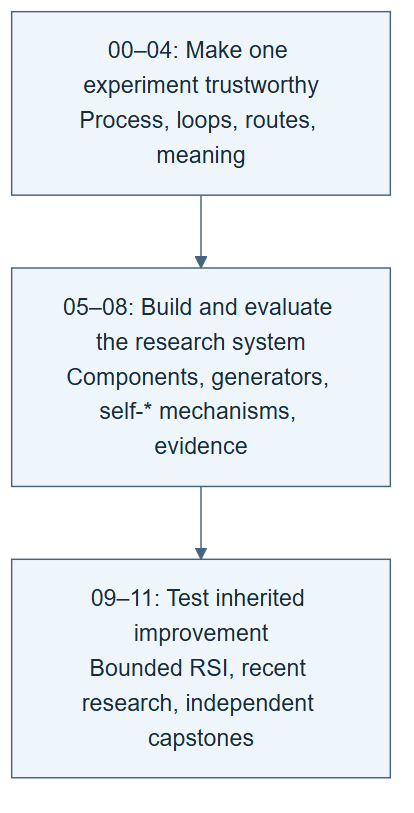

# From one ML experiment to recursive self-improvement

You ask a coding agent to predict hourly bike demand. It trains a model and reports an error. You inspect the mistakes and ask it to try a better idea.

That is useful. It is also ordinary model improvement.

Now save the procedure that chooses experiments. Test a change to that procedure. Later, let the system revise the procedure that proposes and evaluates those changes. Make the next round use the revision. Compare what the old and new procedures can improve under the same conditions.

This course builds that distinction slowly. You begin with one understandable prediction and finish with an inspectable, bounded experiment in recursive self-improvement, or RSI. A successful final project can report a gain, a regression, or an inconclusive result. Its evidence must support its conclusion.

**Begin with [Start here](START-HERE.md).** You use ordinary language and Markdown. The coding agent writes the code, configuration, tests, and launch files.

Open the repository root in your coding agent and paste this first instruction. If you need the local copy, [Start here](START-HERE.md) explains the branch to clone.

```text
Read rsi/AGENTS.md and rsi/skills/rsi-tutor/SKILL.md.
Start lab 00.01 with me. Explain the prediction task before running code.
You write the implementation; I will predict, inspect, and explain.
Wait at the learning checkpoints. Keep my work in a sibling rsi-work folder.
```

Your first session starts with a few rows of data and a question about what can be predicted. Setup and the first measured model result follow in the next labs. You build the larger system only after those basics are clear.

## The project you will build

The main task is small enough for local CPU experiments: estimate bike rentals from calendar fields and observed weather. Later, transfer the research procedure to wine-quality classification.


*A chart from the pinned teaching data. A constant prediction misses the daily pattern. This gives you a concrete reason to improve the model. The chart describes public data; it is not evidence of forecast accuracy.*

You will follow the full data science process: frame a question, inspect data, prevent leakage, define partitions, fit baselines, test features and models, examine errors, compare candidates, and report limits. The task stays familiar while the research process becomes more capable.

The **task model** is a small regressor or classifier trained on your laptop. The **coding agent’s language model** reads instructions and operates tools. Editing a skill changes the agent’s external procedure. It does not train that language model’s weights.

Most experiments stay with these two datasets. Short queue simulations make organization and emergence visible. One [self-play lab](07_understanding_self_star/step_07_self_play/README.md) uses tic-tac-toe to show actual policy learning on CPU. Its table values change while its learning procedure stays fixed. That contrast prepares you to ask what recursion would add.

## Your role and the agent’s role

| You | The coding agent |
|---|---|
| Read the question and predict an outcome | Prepare the workspace and check capabilities |
| Give a short natural-language instruction | Generate and run code and configuration |
| Inspect the actual report, plot, and failure | Preserve predictions, versions, costs, and traces |
| Explain why a result supports a claim | Offer hints and show the relevant evidence |
| Assess the explanation and its limits | Apply the declared checks and stopping rules |

You do not need to type Python, JSON, YAML, or scheduler syntax. The implementation remains available to inspect. Hiding syntax does not mean hiding scientific decisions.

## See what changes at each stage

Keep four objects separate as the course progresses:

| Object | Concrete example | What changing it can establish |
|---|---|---|
| Task model | A regressor fitted to hourly bike data | A better prediction recipe, if the comparison supports it |
| Research skill | Inspect hourly errors before choosing the next model | A changed way to conduct experiments |
| Improver | Propose one research-skill edit and test it before promotion | A changed way to produce and select research procedures |
| Evaluator | Fixed data roles, metric, identity checks, and final protocol | The basis for judging a change; keep it fixed within the comparison |

A model search changes the first object. Editing a research skill changes the second. The recursive question concerns the third: does a revised improvement procedure govern later improvement work, and does that revision help? The same coding agent can perform several roles, so different role names do not prove independent contexts.

A meta-harness answers another question: can a procedure generate a usable harness from a brief? Its output can change while the builder stays exactly the same. Later labs make you inspect that difference before using the word “recursive.”

## Follow one learning path



*The path adds a reason for each new mechanism. It is a teaching sequence, not a claim that all self-* systems follow one universal ladder.*

| Theme | The question you will answer |
|---|---|
| [00 · Start here](00_start_here/README.md) | What does one valid prediction and its evidence look like? |
| [01 · A process without loops](01_process_without_loops/README.md) | Can I run and reuse a fixed data science procedure? |
| [02 · Loop engineering](02_loop_engineering/README.md) | When should I repeat, what should change, and when should I stop? |
| [03 · Graph engineering](03_graph_engineering/README.md) | Which actions depend on others, and how should failures take different routes? |
| [04 · Ontology engineering](04_ontology_engineering/README.md) | Do data, models, metrics, and evidence have the intended meaning? |
| [05 · System intelligence](05_system_intelligence/README.md) | What capability comes from coordinating fixed components? |
| [06 · Meta-harness engineering](06_meta_harness_engineering/README.md) | Can a readable brief generate a runnable research harness? |
| [07 · The self-* family](07_understanding_self_star/README.md) | How do correction, learning, organization, emergence, and modification differ? |
| [08 · Measuring improvement](08_measuring_improvement/README.md) | Is the apparent gain real, transferable, and fairly measured? |
| [09 · Recursive self-improvement](09_recursive_self_improvement/README.md) | Does a revised improvement procedure govern later work, and does it help? |
| [10 · Research studio](10_research_studio/README.md) | How do recent systems implement and evaluate these mechanisms? |
| [11 · Capstones](11_capstones/README.md) | Can I build, transfer, audit, and explain a complete experiment? |

The [course map](COURSE-MAP.md) links 101 authored lessons. The research studio has 38 labs in 13 themed subdirectories, including Dream-RSI, RSIAgent, ModularRSI, AIDE², ScientistTwo, ScienceBuddy, MetaRSI, and HarnessEvolve. Five capstones connect the ideas to independent work. Written coverage and completed execution validation are tracked separately.

Each lab explains the purpose, starting state, run prompts, expected observations, checks, and recovery. It ends with key takeaways, an explained quiz, and a next step. The tutor pauses for your prediction and interpretation.

For the complete masterclass, follow every theme in order, then work through all research-studio groups and the capstones. The [learning path](LEARNING-PATH.md) divides that long route into six teaching blocks with concrete checkpoints. A short introductory workshop can stop after theme 02; it teaches dependable ML loops and does not claim to have reached RSI.

## Before you start

This is an advanced AI/ML course that starts from no RSI knowledge. Familiarity with tables, training, prediction, and error will help. New agent terms enter through examples. The [glossary](GLOSSARY.md) gives definitions and counterexamples.

The default path uses small datasets and CPU models. No GPU or foundation-model training is required. Initial dependency installation needs internet access. A hosted coding agent can require an account and paid inference. Agent costs are additional to the local fit budget unless measured.

“No loops” in the first process theme means no outer search or improvement loop designed by the student. The coding agent and numerical fitting library may already iterate internally. Those internal repetitions do not, by themselves, demonstrate learning or recursive improvement.

An 8 GB laptop is a design target, not yet a measured minimum. The [execution record](evidence/2026-09-20/README.md) gives the tested environment and limits. [Agent adapters](adapters/README.md) distinguish the portable file-reading route from native integrations that need testing.

## Keep the evidence honest

A retry is not automatically learning. A saved memory is not automatically useful. A better task model does not automatically imply a better researcher. A meta-harness that generates a harness is not automatically RSI.

The supplied data is public. Fixed training, selection, and final partitions teach evaluation discipline, but do not hide cases from a host agent that can read the repository. A stronger independent evaluation requires a separate access boundary.

Current research discovery covers the preceding month, with priority given to the latest two weeks. The [research inventory](../how-did-i-generate-it/rsi/RSI-RESEARCH-SWEEP.md) records dates, reading depth, corrections, and access gaps. Older requested foundations remain explicitly dated. A classroom adaptation does not reproduce a paper’s headline result.

## Continue beyond the laptop

The scientific contract stays separate from compute. A larger experiment still needs a task brief, data version, candidate, evaluator, improvement procedure, and run record. Follow [the larger-compute guide](compute/README.md). The [scale skill](skills/scale-experiment/SKILL.md) uses a readable job brief, an adapter contract, and small backend checks to generate GPU or cluster setup.

Larger jobs add checkpoints, cancellation, resumption, job identities, bounded concurrency, and resource accounting. A generated cluster configuration is not a tested backend. Optional larger-compute paths need validation on the actual hardware.

## For students and instructors

Work through the first themes in order. Keep one short lab note: prediction, observation, explanation, and remaining uncertainty. Attempt the quiz before opening the answers. When you return, ask the tutor to read your progress file.

Use the [instructor guide](instructor/README.md) to choose checkpoints and assess explanations. The complete [course-authoring skill](../skills/build-research-codelabs/SKILL.md) preserves the method for diffusion models, flow methods, or another complex topic.

This branch is a work in progress. Written lessons, executed checks, learner validation, research review, and illustration review have separate status. Technical schematics and measured data charts are included. Requested Imagen illustration access remains unresolved; no asset is represented as Imagen-generated. The [development record](../how-did-i-generate-it/rsi/README.md) retains plans, intermediate artifacts, checks, and GitHub checkpoints.
