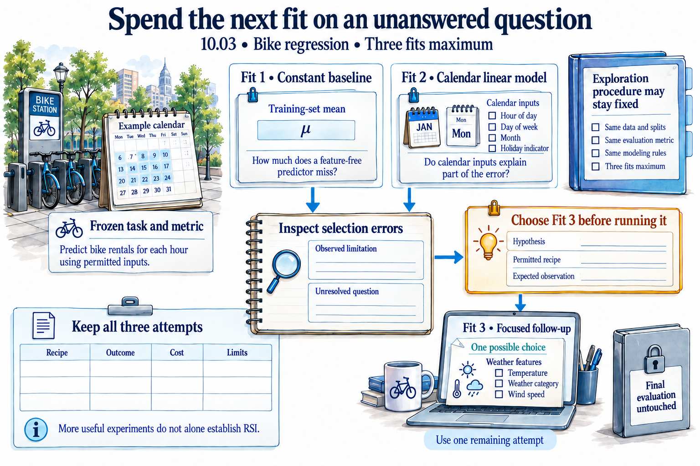

# A visual guide to the course

[Course](README.md) · [Start here](START-HERE.md)

Use these illustrations to preview an idea or revisit a distinction. Follow the [learning path](LEARNING-PATH.md) for the actual lesson order; this gallery does not replace the experiments, checks, or quizzes. Each figure links to the lab that explains its mechanism. Open dense figures at full size when reading on a phone.

These are conceptual illustrations. Measured results appear as separate plots with their data and execution records.

## Your route through all twelve themes

*Follow theme numbers 00–11. The branches group concepts; they are not execution dependencies or a universal maturity ladder. The research names are selected examples. Use the theme number on each lesson to locate it here. This map describes the planned route, not completed experiments.*

[Open the illustration at full size](assets/illustrations/course-mindmap-v2.png).

[The guided course map](COURSE-MAP.md).

## Inside the research studio

*Read group numbers 00–12 in order. The four areas organize questions; each method has its own mechanism and evidence limits. These miniature scenes are abridged explanations, not execution traces or paper results. The ScienceBuddy laptop activities use numerical and synthetic examples; they do not train an LLM. Follow the group links for the source, adaptation, and focused figure.*

[Open the illustration at full size](assets/illustrations/research-studio-map-v3.png).

[The research studio and its thirteen groups](10_research_studio/README.md).

## The capstones: build, test, and explain

*The portfolio connects the five activities. In 11.02, the changed rule is used in a provisional I1 trial before the keep-or-reject decision. Match starting artifacts and resources, keep the external comparison fixed, and record later behavior. Two generations and eight CPU fits are maxima, not a guarantee of useful results; also declare the inference limit. Empty portability boxes and illustrative records do not certify completed tests. Explain a gain, regression, or inconclusive result from actual evidence.*

[Open the illustration at full size](assets/illustrations/capstone-map-v3.png).

[The five capstone labs](11_capstones/README.md).

## From one experiment to RSI

*This is a conceptual path, not a measured success story. The last panel shows what an accepted revision would require: the later round reads I1 and uses its added counterexample check. Saving I1 alone is insufficient. Whether it helps requires a fair comparison; rejection remains a valid result.*

[Open the illustration at full size](assets/illustrations/main-overview-v2.png).

[Lab 09.01: Identify the solver, improver, and evaluator](09_recursive_self_improvement/step_01_three_objects/README.md).

## The answer hidden in an input

*The component counts already reveal the answer: casual + registered = total rentals. Keep them out of the input features. The checker still needs the observed total to measure error. This course uses observed weather for a retrospective teaching task; it does not assume that weather was known a day ahead.*

[Open the illustration at full size](assets/illustrations/target-leakage-v2.png).

[Lab 00.01: Meet the prediction task](00_start_here/step_01_meet_the_task/README.md).

## Before the first improvement loop

*Follow the numbered actions once. Train supplies the fitted median; the matching Selection labels identify the rows used for checking. Final stays reserved. The inspection checkmarks name work to complete, not proof about your run. Observed weather makes this a retrospective task, and the public data are not access-controlled. A checked baseline is the starting evidence for later improvement.*

[Open the illustration at full size](assets/illustrations/data-science-process-v4.png).

[Lab 01.01: Write the data science process](01_process_without_loops/step_01_describe_the_process/README.md).

## A loop needs memory and a way out

*The notebook survives the process. Read the remaining budget before another attempt, reserve that attempt before fitting, and preserve failures. A successful fit still needs checking. After interruption, reconcile any in-progress attempt before deciding what can run next; do not reset the allowance.*

[Open the illustration at full size](assets/illustrations/bounded-loop-v1.png).

[Lab 02.02: Give the loop state and a budget](02_loop_engineering/step_02_bounded_state/README.md).

## Workflow and domain meaning

*Read the left arrows as dependencies between actions. Read the right arrows as sentences about domain meaning. These are selected facts and one rule, not a complete ontology. Correct execution order cannot rescue a leaked feature or the wrong metric. A declared fact also needs evidence that the implementation follows it.*

[Open the illustration at full size](assets/illustrations/graph-ontology-v1.png).

[Lab 04.02: Connect data, models, and evidence](04_ontology_engineering/step_02_relations/README.md).

## Save the state. Check the handoff.

*Read steps 1, 2, and 3 in order: starting the fit requires running to be saved first. Matching C1 labels connect the scenes across the process boundary. The checkmarks illustrate a possible accepted handoff, not a new measured run. A missing check leaves work pending; a wrong candidate is refused. The coordinator remains fixed. Its read-only label describes the procedure, not an independently enforced permission boundary.*

[Open the illustration at full size](assets/illustrations/system-coordination-v3.png).

[Lab 05.04: Coordinate planning, execution, and checking](05_system_intelligence/step_04_coordinate/README.md).

## The builder and the system it builds

*In this example the builder stays fixed. It creates a package that must then run under the brief’s limits. Files alone do not show that the package works. A checked execution provides evidence about the generated harness; it does not establish that the builder improved itself.*

[Open the illustration at full size](assets/illustrations/meta-harness-v2.png).

[Lab 06.02: Generate a first harness](06_meta_harness_engineering/step_02_generate/README.md).

## Similar words, different changes

*These are examples of mechanisms, not mutually exclusive categories or a maturity ladder. A system can combine them. The self-play panel changes policy values under a fixed update rule; the modification panel changes active instructions without proving a benefit. The emergence drawing is a conceptual group-pattern analogy, not a measurement from the queue exercise. Ask what changed, what persisted, and how its effect was checked.*

[Open the illustration at full size](assets/illustrations/self-star-v2.png).

[Lab 07.08: Make a self-modification inspectable](07_understanding_self_star/step_08_modification/README.md).

## Two generations can use the same improver

*I0 remains the same in both rounds. Match the Generation 1 retained skill to the named parent of Generation 2. A rejected proposal never becomes that parent. The pictured decisions are unselected possibilities; these generation numbers do not demonstrate a changed improver or guaranteed improvement.*

[Open the illustration at full size](assets/illustrations/fixed-improver-v2.png).

[Lab 09.02: Run repeated improvement with an unchanged improver](09_recursive_self_improvement/step_02_fixed_improver/README.md).

## Change the rule that judges skill revisions

*This intentionally weak I0 is a classroom example. The added internal rule changes how task-skill proposals are tested; it does not change the external evaluation contract. Notebook marks identify actions, not successful measured fixture results. Keep both versions and compare actual decisions and overhead before making a benefit claim.*

[Open the illustration at full size](assets/illustrations/improver-proposal-v1.png).

[Lab 09.03: Propose a change to the improver](09_recursive_self_improvement/step_03_revise_improver/README.md).

## The next round must use the change

*The highlighted instruction appears in proposed I1, active I1, and the later executed check. That connection matters more than a new filename. The image shows a possible accepted path; the course’s two-generation comparison rejected both improver proposals. An inherited change can also perform worse. Keep version identity, observed use, and measured benefit as separate claims.*

[Open the illustration at full size](assets/illustrations/inherited-improver-v1.png).

[Lab 09.04: Use the revised improver in the next round](09_recursive_self_improvement/step_04_inherit/README.md).

## Compare what each improver produces

*Apply the declared retention rules during each round. The I0 and I1 labels on the descendant reports identify the producing improver; give task skills their own version identities. Compare retained results and all known costs, including failures. Separate folders do not establish independent contexts. Eight fits is a maximum; benefit, regression, and inconclusive outcomes are all possible.*

[Open the illustration at full size](assets/illustrations/improver-comparison-v1.png).

[Lab 09.05: Measure whether the revised improver helps](09_recursive_self_improvement/step_05_compare_improvers/README.md).

## A proposal is not the active parent

*A finished check does not by itself promote a proposal: record the keep-or-reject decision. On resume, read the saved active versions and cumulative budget. Preserve rejected proposals as evidence without activating them. The image is a procedure; the recorded course run rejected both improver revisions and did not demonstrate a successful changed-improver lineage.*

[Open the illustration at full size](assets/illustrations/bounded-lineage-v1.png).

[Lab 09.06: Run bounded recursive generations](09_recursive_self_improvement/step_06_bounded_generations/README.md).

## Three claims need different evidence

*Structural recursion needs executed later use of the changed improvement procedure. Benefit needs a fair comparison of what the procedures produce. Acceleration concerns an increasing progress rate across generations after accounting for resources and bottlenecks; a constant speed advantage or two favorable points is insufficient. The records are conceptual, not measured results.*

[Open the illustration at full size](assets/illustrations/claim-evidence-v1.png).

[Lab 09.07: State the result without overstating it](09_recursive_self_improvement/step_07_claim/README.md).

## Classify the mechanism, then test the benefit

*The three numbered panels are cases to inspect, not universal levels or a required ladder. The pictured task sheets and improver edits are examples; substitute your saved artifacts. The two question markers are reminders to ask for evidence, not passing verdicts. Reading a memory or testing candidate I1 does not establish a benefit. Map the actual retained state and later behavior to the chosen source definition, then assess effectiveness separately.*

[Open the illustration at full size](assets/illustrations/classify-the-mechanism-v1.png).

[Lab 10.01: Use a framework without turning it into a ladder](10_research_studio/00_reading_frontier_research/step_01_framework/README.md).

## Follow an announcement to its evidence

*The quotation is invented for teaching and is not attributed to a real author or lab. The 20 August–20 September 2026 window is the authoring example; roll it forward to the preceding month when you run the lab. Inspect available links and record missing ones. A blocked thread does not invalidate a separately accessible paper, but its contents remain unread. A reproduction has its own methods and limitations. Document the original release and any substantive revision separately from repost and crawl dates.*

[Open the illustration at full size](assets/illustrations/announcement-evidence-trail-v2.png).

[Lab 10.02: Audit a frontier announcement](10_research_studio/00_reading_frontier_research/step_02_announcements/README.md).

## Spend the next fit on an unanswered question

*The course predicts hourly bike rentals. Calendar and weather labels are examples from permitted groups, not the complete schema; weather category is not a precipitation measurement. The constant baseline learns its mean from training data. Choose the third recipe from actual selection errors before fitting, and record its question and cost. Observed weather is allowed by this teaching contract; it does not establish that the same inputs would be available in a real forecast. The exploration rule itself can remain fixed.*

[Open the illustration at full size](assets/illustrations/broad-probes-focused-test-v2.png).

[Lab 10.03: Choose experiments that reduce uncertainty](10_research_studio/01_memory_and_exploration/step_03_exploration/README.md).

## Check the result, then write the lesson

*The verdict concerns the task outcome. The actor still has to interpret it and can write an overbroad lesson. The notebook fields are our teaching aid, not a required paper format. This figure adapts RSIAgent’s responsibility split to the laptop ML exercise. It does not reproduce the paper’s environments or establish that the memory-writing procedure improved. Frozen evaluation memory is read without updates.*

[Open the illustration at full size](assets/illustrations/actor-memory-v2.png).

[Lab 10.04: Verify the outcome, then let the actor write memory](10_research_studio/01_memory_and_exploration/step_04_actor_memory/README.md).

## Freeze the memory, control who can read it

*This depicts the intended comparison, not established isolation or a measured memory benefit. Confirm what each arm can actually read, including prior conversation, files, and other retrieval sources. The hash equality is a condition to check after the run. If the agent cannot start separate controlled contexts, label the activity a shared-context demonstration and limit the claim. The crossed arrow below rejects a clean-ablation inference; it does not suggest that disabling writes erases earlier exposure.*

[Open the illustration at full size](assets/illustrations/frozen-memory-comparison-v1.png).

[Lab 10.05: Evaluate with memory frozen](10_research_studio/01_memory_and_exploration/step_05_frozen_memory/README.md).

## Carry the lesson, reset the run state

*Run A, run B, and the remaining-attempt values are constructed fixtures. They do not authorize fits in this no-fit lab. The green and red markers show expected retrieval decisions that the learner must verify. Replace generic evidence labels with actual source-run IDs and artifact links. An old candidate can remain in its historical record without becoming the new run's active candidate. Useful retrieval still needs correct application; keeping a lesson alone establishes no performance gain.*

[Open the illustration at full size](assets/illustrations/working-state-and-experience-v1.png).

[Lab 10.06: Separate working state from reusable experience](10_research_studio/01_memory_and_exploration/step_06_working_and_experience/README.md).

## A discovery tree records work that happened

*This is a record layout to fill from actual execution. A, B, and C consume at most three attempted fits, including failures. D's generic attachment icon is only a placeholder for a proposal record; its explicit no-fit label means no execution evidence exists. Record proposal costs even for ideas never fitted. The unscored R matches the source distinction between an initial workspace and trial outcomes. This simplified recipe-ancestry tree does not implement Dream-RSI's full online node-eligibility, concurrency, or replay transition rules.*

[Open the illustration at full size](assets/illustrations/discovery-tree-evidence-v1.png).

[Lab 10.07: Build a tree of attempted solutions](10_research_studio/02_dream_rsi/step_07_discovery_tree/README.md).

## Replay stops at the edge of the record

*The left panel is the record before another run. Replay can reuse its supported outcomes and failure status; it cannot supply D’s missing result. The right panel shows the additional execution needed to extend that record. This is a classroom mechanism inspired by Dream-RSI, not a reproduction of its benchmark or a claim that all counterfactual policies are covered.*

[Open the illustration at full size](assets/illustrations/replay-boundary-v2.png).

[Lab 10.08: Replay only what the history can answer](10_research_studio/02_dream_rsi/step_08_replay/README.md).

## A replay winner still needs fresh evidence

*The repeated P1 label links the earlier selection to the right-hand candidate; P0 remains the baseline. No online result is assumed. Frozen code can choose actions from new observations under its declared rule without rewriting itself. Record what makes the new work distinct, what the author or agent already knew, and any exposure that weakens the confirmation claim. Keep historical replay costs and new execution costs separate in the ledger, then report the full cost without double-counting shared work. This is a classroom plan, not a Dream-RSI reproduction.*

[Open the illustration at full size](assets/illustrations/replay-to-online-v2.png).

[Lab 10.09: Test the replay winner on fresh work](10_research_studio/02_dream_rsi/step_09_online/README.md).

## Repair a component. Check the system.

*The missing candidate ID is an original classroom example inspired by ModularRSI. A trace suggests a cause; the restricted edit still needs testing. Empty boxes mark checks to perform, not recorded passes. The same H1 identity appears before and after freezing for transfer. Keeping H1 is a possible outcome; rejection retains the prior harness. The next lab examines two edits and their interaction. This figure does not reproduce a paper benchmark.*

[Open the illustration at full size](assets/illustrations/modular-harness-v2.png).

[Lab 10.10: Localize a harness problem](10_research_studio/03_modular_harness_evolution/step_10_localize/README.md).

## Test the combination, not just its parts

*The units conflict is an illustrative fixture design, not a recorded diagnosis of the paper. Fill all observed-outcome cells from execution. The missing-field refusal is expected behavior to test; record whether the fit stub was actually avoided. The storage tray is illustrative: retain all four harness versions, including the baseline and combined A+B, along with all three fixtures and their hashes. A passing local check does not automatically establish transfer, and a single fresh fixture provides only narrow evidence.*

[Open the illustration at full size](assets/illustrations/integration-seven-checks-v1.png).

[Lab 10.11: Integrate edits and test transfer](10_research_studio/03_modular_harness_evolution/step_11_integrate/README.md).

## Label the procedure on every lineage edge

*A0, A1, and A2 identify agent versions, not scores or task conditions. The two strips illustrate possibilities; neither is assigned to DGM or HyperAgents. DGM reuses evolving coding agents for self-modification, so labelling it a fixed-operator system from this cartoon would be misleading. In the lower example, later use of O1 needs an actual trace; improved effectiveness needs an additional fair comparison. Read each original source and record which procedure, code, model, and evaluation components remain fixed.*

[Open the illustration at full size](assets/illustrations/agent-and-improver-lineages-v1.png).

[Lab 10.12: Compare agent evolution and improver evolution](10_research_studio/03_modular_harness_evolution/step_12_lineage/README.md).

## Improve the researcher, then test the improver

*R0 and R1 are classroom identities. The middle comparison tests research procedures; the right comparison tests what they produce in the improver role. Neither has a preselected winner. The latter is the separate ignition question discussed in Weco’s July report; its ignition efficiency comparison was not statistically significant. This diagram explains the distinction; it does not reproduce the published run or establish ignition.*

[Open the illustration at full size](assets/illustrations/nested-research-v2.png).

[Lab 10.14: Improve the inner researcher under a total budget](10_research_studio/04_aide2/step_14_outer_research/README.md).

## Improve the skill—and the way you revise it

*The notebook lines are classroom examples, not complete skills. The updater edits procedures; the task skills direct experiments. Match Activate U1 to Active U1, then follow the same new rule into the later check. Acceptance is a possible path, not a guaranteed gain. The four-line updater is a teaching simplification of MetaSkill-Evolve’s July method. Keep the external comparison fixed and measure later behavior; a saved revision or a slower schedule alone does not establish benefit.*

[Open the illustration at full size](assets/illustrations/meta-skill-schedules-v3.png).

[Lab 10.17: Update the skill updater on a slower schedule](10_research_studio/05_meta_skill_evolution/step_17_meta_skills/README.md).

## Turn a limitation into a tested claim

*This is a bike-task adaptation of the research stages. The pictured paper and records are illustrative. Each ablation recipe is fitted again; only its permitted feature group changes. Use development evidence for screening and refinement. A review can lead to a narrower or rejected claim, and agent review is not conference acceptance. The illustration does not demonstrate frontier discovery or an improved research procedure.*

[Open the illustration at full size](assets/illustrations/scientific-claim-v2.png).

[Lab 10.18: Turn a limitation into a scientific hypothesis](10_research_studio/06_scientist_two/step_18_hypothesis/README.md).

## Screen ideas, then test a contribution

*The four numbered fits exhaust the budget. The upper data cards describe shared training and evaluation roles; the bike-rental target is the value to predict, never a feature. Fit preprocessing only on the declared training subset. The selected component advances to Fit 3 and is removed in Fit 4. This tests its contribution under fuller conditions; it does not reveal the full-scale ranking of both screened ideas. Read labels rather than decorative calendar cells as the split specification.*

[Open the illustration at full size](assets/illustrations/screen-and-ablate-v2.png).

[Lab 10.19: Screen ideas and test their contributions](10_research_studio/06_scientist_two/step_19_screen_ablate/README.md).

## Answer a criticism with evidence

*This is an illustrative follow-up to the earlier linear-model study, not an already observed criticism or result. Predeclare the tree recipe and comparison, then retain both sets of predictions and errors. A one-pair follow-up can narrow the tested scope; it cannot establish universality across models or quantify all sources of variation. The outcome cards are alternatives. The main horizontal arrows show the reading order; write the response only after inspecting the evidence. Automated review is not human conference acceptance.*

[Open the illustration at full size](assets/illustrations/review-to-evidence-v1.png).

[Lab 10.20: Answer a criticism with evidence](10_research_studio/06_scientist_two/step_20_review_rebuttal/README.md).

## Track the discovery and its researcher

*A1 and A2 name retained-state records, not guaranteed new or better solutions. Rejection can preserve the previous artifact. An unchanged procedure hash says nothing by itself about changing memory, context, tools, or model versions, so record those too. The lower scene is the proposed comparison from the transfer exercise; this lab requires no new fits. Compare research outcomes under matched conditions before making a claim about a better research procedure.*

[Open the illustration at full size](assets/illustrations/discovery-and-researcher-v2.png).

[Lab 10.21: Distinguish better discoveries from a better scientist](10_research_studio/06_scientist_two/step_21_successive_results/README.md).

## Turn a correction into something you can check

*The miniature rows are illustrative placeholders, not saved course predictions. Their zero/one values represent derived class labels; the original wine-quality rating is not binary. Use your actual predictions and declared threshold in the activity. The pictured verdicts are expected fixture outcomes to verify. This request is a classroom construction, not a real researcher interview. The presence check detects an omission; validating metric computation and scientific meaning requires further evidence.*

[Open the illustration at full size](assets/illustrations/correction-to-rubric-v1.png).

[Lab 10.22: Turn a researcher correction into a task](10_research_studio/07_sciencebuddy/step_22_human_task/README.md).

## Change the reporting skill, then test its behavior

*Changing instructions can change outputs while model weights stay fixed. The parent text is an intentionally weak teaching example. Supply the same evidence packet to both versions within each column, and record actual outputs and context limits. An honest missing-evidence statement can satisfy a declared limitation criterion, but it does not supply the missing recall or earn a full evidence pass. The matrix remains unexecuted in this illustration; no candidate improvement is assumed.*

[Open the illustration at full size](assets/illustrations/reporting-skill-adaptation-v2.png).

[Lab 10.23: Adapt the harness to the rubric](10_research_studio/07_sciencebuddy/step_23_harness_adaptation/README.md).

## A reward becomes a relative learning signal

*The stabilizer makes the advantage magnitude 0.999998000004, shown approximately as one. For the pictured toy, start four softmax logits at zero and take gradient ascent on the displayed weighted log-probability objective with step size 0.1. “Weight” here means probability assigned to a toy action, not an LLM checkpoint. The wrong-reward card belongs to the separate edge case; rerun a four-item group with one corrupted score. The illustration specifies arithmetic to execute and is not full GRPO or evidence of scientific correctness.*

[Open the illustration at full size](assets/illustrations/grouped-rewards-v1.png).

[Lab 10.24: See what grouped rewards contribute](10_research_studio/07_sciencebuddy/step_24_grpo/README.md).

## Two ways to improve a scientific agent

*Track both versions because a harness and model can interact. First hold M0 fixed while changing the harness; then hold H1 fixed while changing weights. Keep training evidence separate from the cases used for the declared external comparison, and do not feed final results back into selection. This lab illustrates pair accounting with synthetic scores. It does not train an LLM or reproduce ScienceBuddy’s reported gains.*

[Open the illustration at full size](assets/illustrations/model-harness-v4.png).

[Lab 10.25: Track model–harness pairs across cycles](10_research_studio/07_sciencebuddy/step_25_coevolution/README.md).

## Read the metric beside the percentage

*Read these as paper-reported comparisons, not our reproductions. The primary result sections are 4.2, 4.3, and 4.4. Section 4.2’s heading says “Two-Cycle,” but its setup and Figure 8 describe three cycles; the course follows that explicit protocol. Preserve the distinctions among scientific task families, splits, attempt budgets, and feedback sources in your audit. The fixed reflector limits what can be claimed about improvement of the improvement procedure itself.*

[Open the illustration at full size](assets/illustrations/sciencebuddy-result-audit-v1.png).

[Lab 10.26: Read the ScienceBuddy results precisely](10_research_studio/07_sciencebuddy/step_26_audit_results/README.md).

## A failed edit can still teach us

*The notebook can contain lessons from earlier failures and receives the new result after checking. It is not rolled back with a rejected skill edit. In this controlled activity, the actor reads the active skill; the improver can consult the trace and notebook. Record actual reads: role instructions alone do not enforce isolation. The rejected S1 is illustrative, not a measured course result. This is a small WikiSkill-inspired exercise with two fixtures and no new model fit.*

[Open the illustration at full size](assets/illustrations/knowledge-stores-v1.png).

[Lab 10.27: Keep traces, knowledge, and active skills separate](10_research_studio/08_skills_and_procedures/step_27_wiki/README.md).

## Repair the route. Check the meaning.

*The left map explains conditional routing; the notebook isolates an example bug and its proposed repair. Test the target failure and a regression case before retaining a graph, then freeze that version for the fresh case. A rejected edit leaves the prior graph in place. The fourth fixture checks meaning: a target component can have the expected numeric type and still be forbidden as an input. The graph and domain rule have distinct jobs. All four fixtures use a fit stub; the figure records no successful test or model training.*

[Open the illustration at full size](assets/illustrations/procedure-graph-v1.png).

[Lab 10.28: Refine a procedure graph](10_research_studio/08_skills_and_procedures/step_28_procedural_graph/README.md).

## A plausible click is not a checked result

*The enlarged warning is a reader callout to information already present on the page. It was not observed in the pictured failed attempt and must not be added to that attempt’s critic packet. Supply only the declared visible trace, not the skill package or answer key. Use a separate critic context where available; otherwise label the shared context. The rule-check ticks name operations, not recorded passes. Compare the critic’s verdict with the executable result. This EvoSkill-inspired classroom task allows two actual UI attempts and no new model fits; the illustration is not an execution record.*

[Open the illustration at full size](assets/illustrations/gui-skill-repair-v1.png).

[Lab 10.29: Repair a skill for an experiment-results page](10_research_studio/08_skills_and_procedures/step_29_gui/README.md).

## Save work without losing the evidence

*This classroom change removes redundant report work; it is not an implementation of SoL-Pi’s four mechanisms. Both variants must meet the declared quality requirement before an efficiency conclusion is allowed. Fill the ledger with actual observations, include proposal and checking overhead, and keep unknown usage unknown. The failure tray represents recorded attempts whose costs remain in the ledger. The separate fit-stub example fails because required evidence is absent. The figure contains no measured saving or recursive compounding result.*

[Open the illustration at full size](assets/illustrations/quality-cost-v1.png).

[Lab 10.30: Reduce cost without hiding quality loss](10_research_studio/09_efficient_harnesses/step_30_cost_quality/README.md).

## Name the object that changes

*Read the two source panels separately. A source system’s name does not identify its changed object. The lower experiment evaluates a generated ML harness under an unchanged builder. Both H0 and H1 feed the matched check before a decision; checklist marks name operations, not successful measurements. The final strip proposes a different experiment for a builder claim: the same fresh briefs are inputs to both builders, and their generated systems must be evaluated. It is not a completed extension to this lab’s two-check-or-fit budget. No model-weight update or general builder improvement is established.*

[Open the illustration at full size](assets/illustrations/builder-and-artifact-v2.png).

[Lab 10.31: Compare harness generation and harness improvement](10_research_studio/09_efficient_harnesses/step_31_harness_builders/README.md).

## A shorter memory can lose the state

*These counts are a synthetic teaching example. After adding three and removing one, the checkpoint is two; adding two more gives four. The faulty summary omits the removal. Do not pre-fill the actor’s answer or supply the checker’s result in its input. The two extra-description conditions change wording, not state transitions. The drawn counters and tally frame are props; the explicit event tape defines the arithmetic. This external-memory exercise does not reproduce S3Gym’s game or training protocols, and a shorter representation is not presumed better.*

[Open the illustration at full size](assets/illustrations/memory-interface-v2.png).

[Lab 10.32: Compare raw history and summarized memory](10_research_studio/10_feedback_and_transfer/step_32_memory_interface/README.md).

## Help can change behavior without changing weights

*The dataset names and field values are illustrative form fixtures, not real dataset results. The task cards specify required values; they are distinct from the added hints. Use a genuinely fresh fixture for the unassisted attempt and record any shared-context exposure. The stale-hint case asks what the actor actually does; no recovery is assumed. Compare all four traces with executable checks. This inference exercise illustrates assistance types discussed in Environments as Scaffold; it does not reproduce reinforcement learning or demonstrate a parameter update.*

[Open the illustration at full size](assets/illustrations/feedback-scaffolds-v1.png).

[Lab 10.33: Compare action hints and richer observations](10_research_studio/10_feedback_and_transfer/step_33_scaffolding/README.md).

## A polished answer can break the interface

*The displayed verdicts are expected outcomes of these constructed format fixtures, not archived test results. Run all four checks. Accepting the field labels does not establish that candidate A is valid or that a task succeeded. The parser remains unchanged. The source study concerns broader planning compatibility and actual model training; the local field repair is only an analogy. Its separate training inset does not turn this four-check activity into an LLM-training experiment.*

[Open the illustration at full size](assets/illustrations/harness-compatibility-v1.png).

[Lab 10.34: Keep model training aligned with its harness](10_research_studio/10_feedback_and_transfer/step_34_model_harness_fit/README.md).

## Change the system and the rule that schedules changes

*The write-surface rows are separate examples, not one sequential run. The evidence panel compares two exact version sets and requires a fresh diagnosis after the harness changes. Q1’s interface rule is an original classroom example. Its accepted path shows structural inheritance; the checks and outcome still need execution and do not establish benefit. Preserve Q0 if the revision fails. This five-check simulation omits much of MetaRSI’s full architecture and does not train an LLM. The external evaluator and allowed write boundaries remain fixed.*

[Open the illustration at full size](assets/illustrations/operator-composition-v1.png).

[Lab 10.35: Compose changes to data, harness, and model](10_research_studio/11_composition_and_reference_learning/step_35_metarsi/README.md).

## A reference must show the work

*These are constructed trace fixtures. The usable-reference marks represent the example’s required execution evidence, not a completed source reproduction. Check the actual traces before diagnosis. The candidate must pass its quality check before proceeding to the two fixture evaluations; reject a failed quality check immediately. “Independent fixtures” means distinct current and prior cases, not proof of isolated agent contexts. The alternative orders are valid for this particular audit. The general instruction contains no case answer, and the final keep-or-reject result is unresolved.*

[Open the illustration at full size](assets/illustrations/checked-reference-v1.png).

[Lab 10.36: Diagnose failures with checked reference trajectories](10_research_studio/11_composition_and_reference_learning/step_36_harnessevolve/README.md).

## Compare the mechanism, then weigh the evidence

*The ledger is a template to fill, not a completed comparison. Link paper claims to their primary method and result sections; use raw execution records where available and mark missing evidence unresolved. Link local claims to the course’s actual records. The named folders carry no rank or inferred method assignment. The lower challenge needs two distinct checks: whether an improver changed and governed later work, and whether its downstream outcomes improved under a fair total-resource comparison. A task-score gain alone answers neither.*

[Open the illustration at full size](assets/illustrations/compare-research-systems-v1.png).

[Lab 10.37: Compare systems without flattening their differences](10_research_studio/12_evidence_and_open_questions/step_37_compare_systems/README.md).

## Faster proposals do not remove a slow check

*Use the explicit numbers, not the decorative clock faces, to read the example. The five scenarios are alternatives; they are not successive generations. Execution time is set to zero only for this teaching calculation. Restore measured execution, failures, retries, and other costs in a real ledger. The instant-proposal limit follows from the baseline and is not a sixth run. The gain units below are a separate illustration; an acceleration claim must also account for resources and difficulty. This is neither a forecast nor the economics paper’s calibrated model.*

[Open the illustration at full size](assets/illustrations/research-bottlenecks-v1.png).

[Lab 10.38: Reason about bottlenecks and acceleration](10_research_studio/12_evidence_and_open_questions/step_38_economics/README.md).

## From a new brief to a working harness

*Choose the scientific task before generating its harness. The two stations are tests to perform, not passed results. Record actual execution and a meaningful refusal. The tool-case checklist denotes components; it does not certify their behavior. Keep the required path within four CPU fits.*

[Open the illustration at full size](assets/illustrations/capstone-new-brief-v1.png).

[Lab 11.01: Build a harness for a new prediction brief](11_capstones/step_01_new_harness/README.md).

## Make a recursive experiment inspectable

*These are the evidence needed to inspect the experiment. Distinguish a candidate trial from retained use; promote only through the declared decision and trace whichever version actually governs the next round. Match starting artifacts and external comparison rules. Eight fits is the total maximum across the two-generation protocol, with agent-inference limits declared separately.*

[Open the illustration at full size](assets/illustrations/capstone-recursion-v1.png).

[Lab 11.02: Run and audit a bounded recursive experiment](11_capstones/step_02_recursive_experiment/README.md).

## Change one dimension. Test its consequences.

*Test these dimensions separately. Describe what changed in Task B; a different label does not establish task transfer. Choose two small tests you can actually run and leave other combinations explicitly untested. The pictured notebooks and machines are examples, not certified environments.*

[Open the illustration at full size](assets/illustrations/capstone-portability-v1.png).

[Lab 11.03: Test transfer and portability separately](11_capstones/step_03_portability/README.md).

## Turn a bold claim into a testable question

*A source announcement, supported result, and independent reproduction are different evidence. Record the source date, version, and what you actually read. State the strongest support and the main limitation, then propose an observation that could change your conclusion. No pictured source or experiment is a reported result.*

[Open the illustration at full size](assets/illustrations/capstone-audit-v1.png).

[Lab 11.04: Audit an unfamiliar RSI claim](11_capstones/step_04_external_audit/README.md).

## Let another person follow the evidence

*Keep the target out of model inputs; it belongs in the error check. Trace the added contrasting-case rule into an executed later action. The small strip can represent a candidate trial; it does not itself prove retention or benefit. Show the real comparison and decisions in the portfolio. The peer scene is illustrative: record a session only after it occurs and mark pending review honestly.*

[Open the illustration at full size](assets/illustrations/capstone-teach-back-v2.png).

[Lab 11.05: Teach the mechanism and defend the evidence](11_capstones/step_05_teach_back/README.md).

## Move the compute, preserve the evidence

*The backends are alternatives. Preserve the scientific contract when moving the same experiment; declare a new one when changing the task, data, or comparison. A candidate can have several submission attempts, so record both identities and all failures. Checkpoint resumption applies only when the job supports it. The course tests the local CPU path; accelerator and cluster adapters still need tests on the actual systems.*

[Open the illustration at full size](assets/illustrations/compute-contract-v2.png).

[The larger-compute guide](compute/README.md).
