# A visual guide to the course

[Course](README.md) · [Start here](START-HERE.md)

Use these illustrations to preview an idea or revisit a distinction. Follow the [learning path](LEARNING-PATH.md) for the actual lesson order; this gallery does not replace the experiments, checks, or quizzes. Each figure links to the lab that explains its mechanism. Open dense figures at full size when reading on a phone.

These are conceptual illustrations. Measured results appear as separate plots with their data and execution records.

## Your route through all twelve themes

*Follow theme numbers 00–11. The branches group concepts; they are not execution dependencies or a universal maturity ladder. The research names are selected examples. Use the theme number on each lesson to locate it here. This map describes the planned route, not completed experiments.*

[Open the illustration at full size](assets/illustrations/course-mindmap-v2.png).

[The guided course map](COURSE-MAP.md).

## Inside the research studio

*Read group numbers 00–12 in order. The four areas organize questions; each method has its own mechanism and evidence limits. These miniature scenes are abridged explanations, not execution traces or paper results. The ScienceBuddy laptop activities use numerical and synthetic examples; they do not train an LLM. Follow the group links for the source, adaptation, and focused figure.*

[Open the illustration at full size](assets/illustrations/research-studio-map-v3.png).

[The research studio and its thirteen groups](10_research_studio/README.md).

## The capstones: build, test, and explain

*The portfolio connects the five activities. In 11.02, the changed rule is used in a provisional I1 trial before the keep-or-reject decision. Match starting artifacts and resources, keep the external comparison fixed, and record later behavior. Two generations and eight CPU fits are maxima, not a guarantee of useful results; also declare the inference limit. Empty portability boxes and illustrative records do not certify completed tests. Explain a gain, regression, or inconclusive result from actual evidence.*

[Open the illustration at full size](assets/illustrations/capstone-map-v3.png).

[The five capstone labs](11_capstones/README.md).

## From one experiment to RSI

*This is a conceptual path, not a measured success story. The last panel shows what an accepted revision would require: the later round reads I1 and uses its added counterexample check. Saving I1 alone is insufficient. Whether it helps requires a fair comparison; rejection remains a valid result.*

[Open the illustration at full size](assets/illustrations/main-overview-v2.png).

[Lab 09.01: Identify the solver, improver, and evaluator](09_recursive_self_improvement/step_01_three_objects/README.md).

## The answer hidden in an input

*The component counts already reveal the answer: casual + registered = total rentals. Keep them out of the input features. The checker still needs the observed total to measure error. This course uses observed weather for a retrospective teaching task; it does not assume that weather was known a day ahead.*

[Open the illustration at full size](assets/illustrations/target-leakage-v2.png).

[Lab 00.01: Meet the prediction task](00_start_here/step_01_meet_the_task/README.md).

## Keep the course separate from your experiment

*The two folders are siblings. The slash in rsi-work / 00-02 shows the lab subfolder inside the learner workspace. Blank cells are evidence to collect, not passed checks. A skill list can be read from files; native skill discovery is not required. The blank frame stands for your generated plot; the measured author example appears below. A matching hash establishes file identity, not data quality or secrecy. Preserve the shared course files by following the workspace rule; this drawing does not establish access-control isolation.*

[Open the illustration at full size](assets/illustrations/inspectable-workspace-v2.png).

[Lab 00.02: Prepare a workspace you can inspect](00_start_here/step_02_prepare_the_workspace/README.md).

## Learn one number, then keep it fixed

*All values in the notebooks are invented to explain the calculation. Rows A, B, and C are different selection cases, not three more training points. The predictor learns the median from training only and does not use input features. Save the actual recipe, predictions, result, and trial ledger in your run; your measured full-partition MAE will differ from this toy value. One fit gives a baseline, not evidence of an improvement loop.*

[Open the illustration at full size](assets/illustrations/training-median-baseline-v1.png).

[Lab 00.03: Run one baseline](00_start_here/step_03_one_attempt/README.md).

## Check the number and the rows behind it

*The branches mean compare the recomputed value with each report; they do not rewrite either report. Expected match and mismatch apply to the invented example, not an unexecuted student run. For the actual baseline, preserve the original artifacts, alter only a labelled report copy, and save both checker outcomes. Use the report’s declared numerical precision when comparing rounded values. Verify the target unit as rentals per hour and establish the complete row set; a correct average alone cannot establish the right partition.*

[Open the illustration at full size](assets/illustrations/evidence-beyond-score-v1.png).

[Lab 00.04: Check the evidence behind the answer](00_start_here/step_04_check_the_evidence/README.md).

## Before the first improvement loop

*Follow the numbered actions once. Train supplies the fitted median; the matching Selection labels identify the rows used for checking. Final stays reserved. The inspection checkmarks name work to complete, not proof about your run. Observed weather makes this a retrospective task, and the public data are not access-controlled. A checked baseline is the starting evidence for later improvement.*

[Open the illustration at full size](assets/illustrations/data-science-process-v4.png).

[Lab 01.01: Write the data science process](01_process_without_loops/step_01_describe_the_process/README.md).

## A plan says what should happen. A trace records what did.

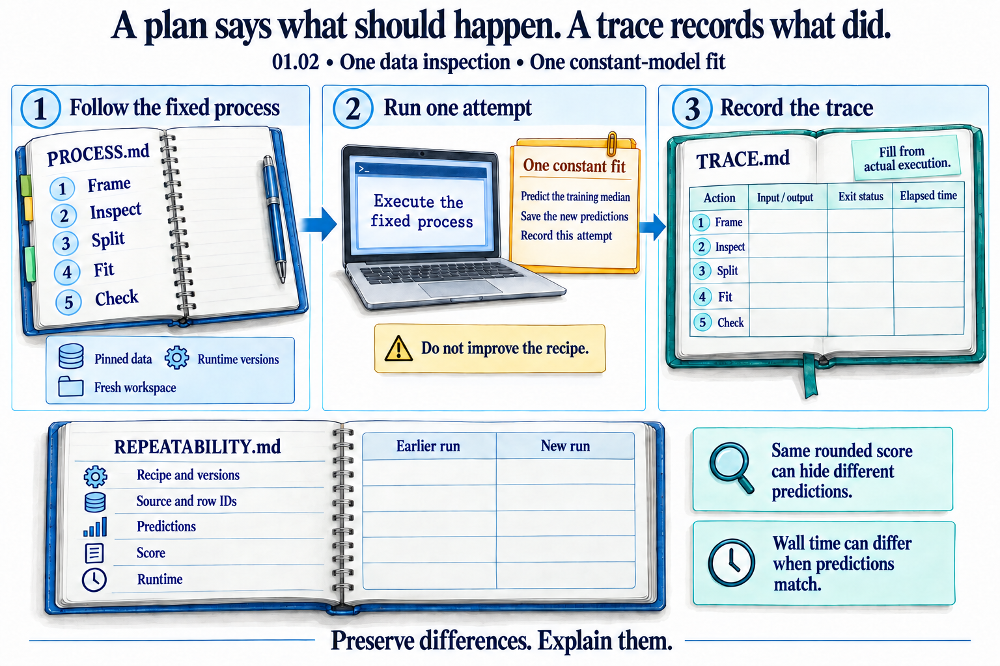

*The five numbered rows are actions to record, not evidence that they succeeded. Fill the trace as each action occurs and preserve failures. Compare the new run with the earlier recipe and artifacts after execution; never copy old predictions into the new run as if they were newly fitted. A matching rounded score alone does not establish matching predictions. The one-fit limit includes the attempt you record; this lab does not introduce search or recipe revision.*

[Open the illustration at full size](assets/illustrations/fixed-process-trace-v2.png).

[Lab 01.02: Run the process without changing it](01_process_without_loops/step_02_run_the_process/README.md).

## The skill guides. The agent acts. The tool runs.

*These are distinct responsibilities within one agent workflow, not independent security domains. The one fitted number is the training median. The learner skill must name actual dependencies and concrete refusal checks; the compact notebook is an outline, not a complete runnable skill. To confirm the one-fit budget, inspect the trial ledger and instruction-to-action trace as well as predictions. Blank checker results must be filled from execution. Preserve the canonical course skills.*

[Open the illustration at full size](assets/illustrations/skill-agent-tool-check-v2.png).

[Lab 01.03: Turn the process into a skill](01_process_without_loops/step_03_make_a_skill/README.md).

## A plausible score can belong to the wrong rows

*S1, S2, S3, and T1 are symbolic IDs. The red text in the altered table is an annotation, not a prediction value. Change only the ID in the real teaching copy; preserve prediction values and the original file. Both runs use the same checker code and reference inputs despite the different illustration colors. Check the full row set, duplicates, candidate identity, and targets from pinned data. The archive lock means preserve the original; it does not establish access control. Record actual verdicts and nonzero failure status.*

[Open the illustration at full size](assets/illustrations/row-identity-check-v1.png).

[Lab 01.04: Check outputs with a separate calculation](01_process_without_loops/step_04_separate_the_check/README.md).

## Carry the procedure across the session boundary

*The bridge shows the intended file-based handoff, not proven isolation. The new session must be able to read the exact skill and dependencies; a hash without the file is insufficient. Inspect imported conversation, host memory, and other exposure before describing the boundary. If the host cannot provide a fresh session, label the exercise a same-context demonstration. The earlier checkmarks depict prepared inputs; the output tray contains no measured result yet. Compare after execution, without supplying the old score as a target. Reusing the same skill establishes no adaptive improvement.*

[Open the illustration at full size](assets/illustrations/fresh-session-handoff-v2.png).

[Lab 01.05: Reuse the skill in a fresh session](01_process_without_loops/step_05_reuse_the_skill/README.md).

## Change one factor to test your explanation

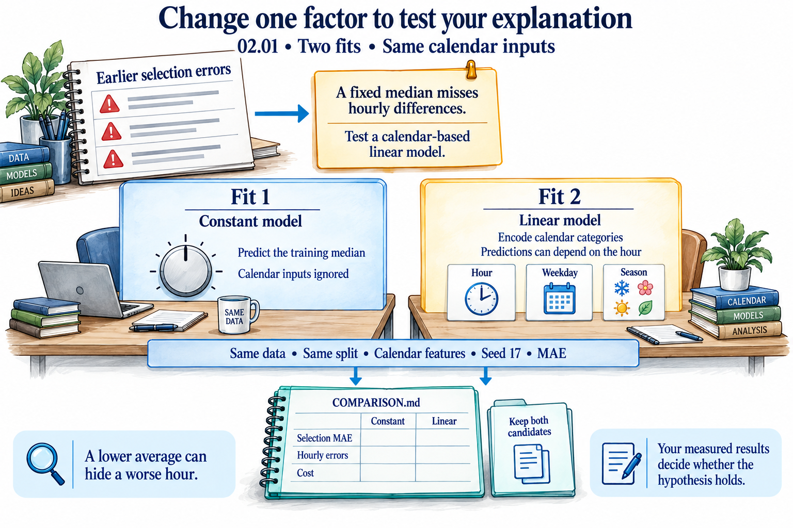

*Both recipes receive the same calendar feature group; the constant predictor ignores its inputs. Hour, weekday, and season illustrate some permitted calendar fields, not the entire schema. The shared strip names fixed conditions, and the lower arrows collect comparison evidence; it is not a fitting operation. Blank cells must come from your two new fits. Inspect hourly slices as well as the aggregate score, and keep both candidates if the proposed improvement fails.*

[Open the illustration at full size](assets/illustrations/one-factor-model-change-v1.png).

[Lab 02.01: Let a failure motivate a second attempt](02_loop_engineering/step_01_why_repeat/README.md).

## A loop needs memory and a way out

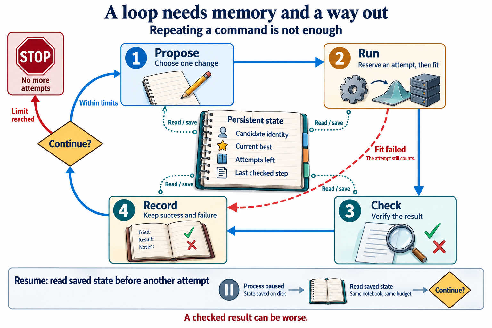

*The notebook survives the process. Read the remaining budget before another attempt, reserve that attempt before fitting, and preserve failures. A successful fit still needs checking. After interruption, reconcile any in-progress attempt before deciding what can run next; do not reset the allowance.*

[Open the illustration at full size](assets/illustrations/bounded-loop-v1.png).

[Lab 02.02: Give the loop state and a budget](02_loop_engineering/step_02_bounded_state/README.md).

## Feedback matters when it changes the next action

*The top report is the prerequisite candidate’s saved selection evidence. The two new fits form the controlled comparison in this lab. Report icons do not establish a weather-related cause: write the actual observation, alternative explanation, and proposed test. The right-hand recipe corresponds to the tool’s all feature group, which adds permitted observed weather to calendar fields. Record the decision before that fit; an explanation written afterward does not show feedback governed the action. Fill costs and outcomes from execution.*

[Open the illustration at full size](assets/illustrations/feedback-to-feature-choice-v1.png).

[Lab 02.03: Turn an error into a different action](02_loop_engineering/step_03_use_feedback/README.md).

## Stop a repeated idea before it becomes another fit

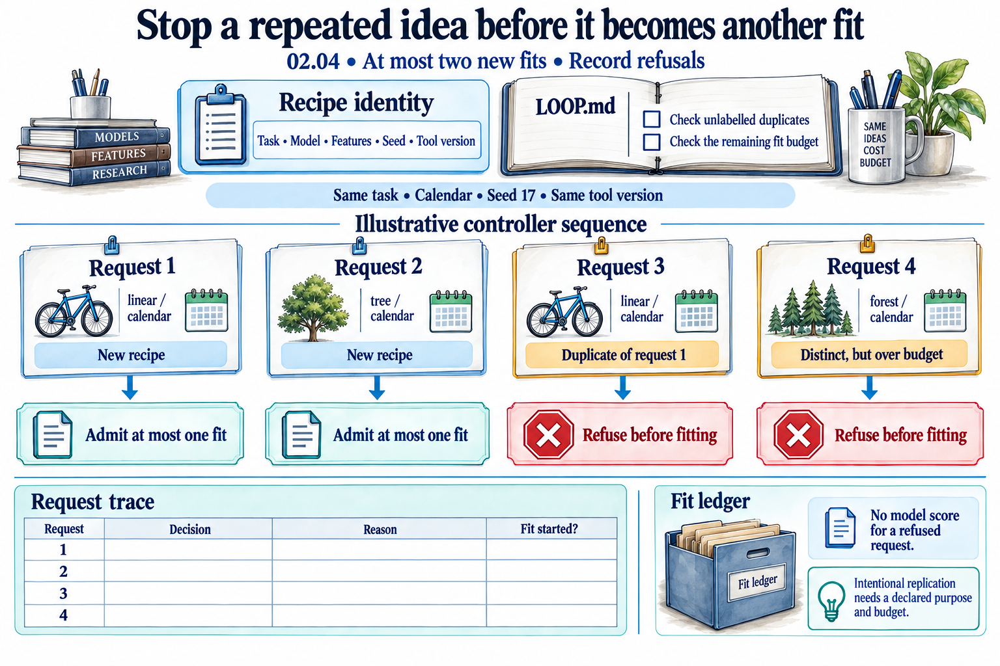

*This sequence assumes requests 1 and 2 have consumed the two allowed fit slots. Check duplicates before budget so request 3 records the duplicate reason; request 4 is distinct and demonstrates the budget refusal. The tree and forest drawings are mnemonics for model names. The request trace records admitted and refused work; the fit ledger records actual attempts. A refusal has no executed model score, but proposal and checking costs can still exist. The drawn gates state intended controller behavior, which you must test.*

[Open the illustration at full size](assets/illustrations/duplicate-and-budget-stops-v1.png).

[Lab 02.04: Stop repeated failure and oscillation](02_loop_engineering/step_04_stop_the_loop/README.md).

## A restart does not refill the experiment budget

*This depicts an orderly pause after trial-001, not interruption during its fit. The right-hand files represent the remaining possible attempt identities, not already successful results. Inspect live work and actual artifacts before resuming; a saved lock alone does not prove a process is active. An admitted attempt that is later interrupted still occupies its slot and keeps its known cost. Reconcile a stale progress note with the durable ledger rather than silently refilling the budget. A program restart does not itself establish a fresh agent context.*

[Open the illustration at full size](assets/illustrations/resume-shared-budget-v1.png).

[Lab 02.05: Resume without losing the experiment](02_loop_engineering/step_05_resume/README.md).

## Compare how two procedures spend the same attempts

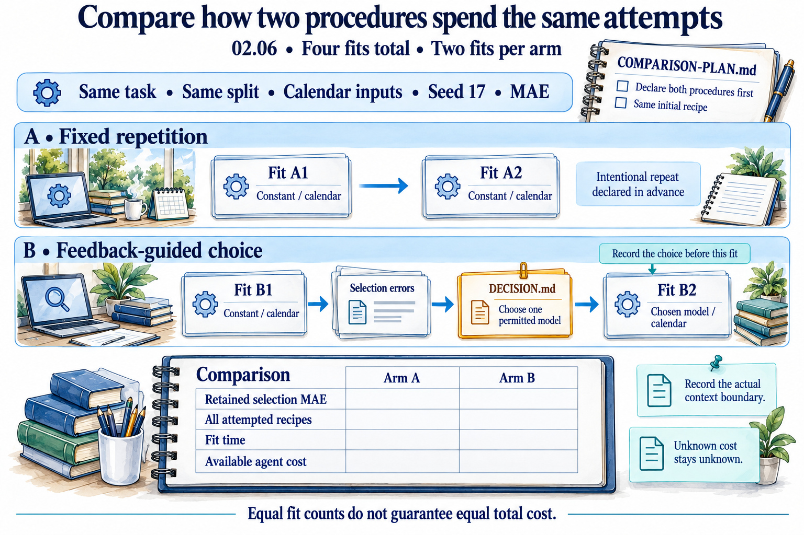

*The four fit cards are four actual attempts to execute in separate workspaces; arm B cannot reuse arm A’s first fit as its own. A1 to A2 shows execution order, not an updated baseline recipe. Predeclare the replication allowance for arm A so a duplicate guard does not change its method. The arm-B decision precedes B2, and neither a plausible diagnosis nor this drawing establishes a win. Record context exposure and costs beyond fitting. This small comparison tests two fixed search procedures, not an improver revising itself.*

[Open the illustration at full size](assets/illustrations/matched-search-budgets-v1.png).

[Lab 02.06: Compare two ways to spend the same attempts](02_loop_engineering/step_06_compare_loops/README.md).

## An arrow names something the next action needs

*Each edge names one dependency, not every input required by its destination. The fit also needs task data and a recipe; the checker also needs reference targets and row identities. A document shown at a desk can be an input being read or an output being written: follow the edge label to determine its role. Test ordering from an initial state without the candidate predictions, so a leftover file cannot conceal the invalid order. The small report icons are illustrative. This lab validates the graph without fitting another model.*

[Open the illustration at full size](assets/illustrations/artifact-dependencies-v2.png).

[Lab 03.01: Draw the dependencies](03_graph_engineering/step_01_dependencies/README.md).

## Missing evidence needs its own route

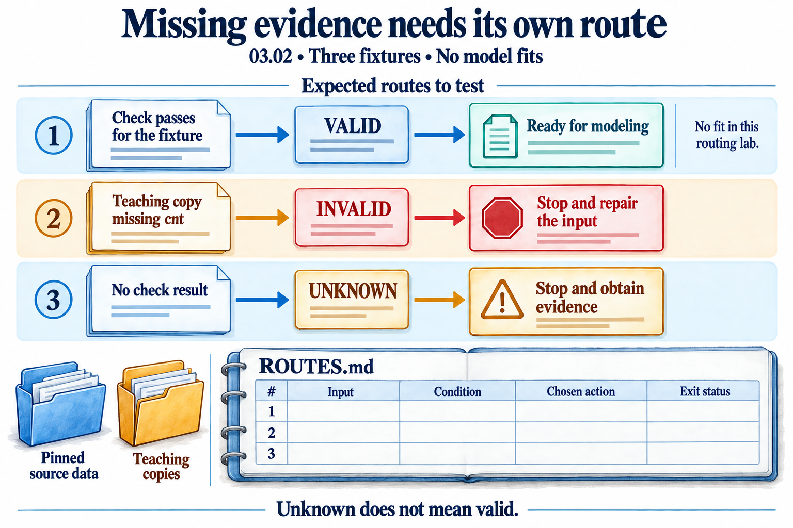

*Valid means passing the declared local fixture check, not proof of all possible data-quality rules. Missing cnt supplies evidence of a violation; no check result supplies no verdict. Both stop this route, for different reasons. Ready for modeling is a routing decision only: no model fits run in this lab. Keep mutated fixtures outside the pinned data and record all three actual routes, exit statuses, and refusal reasons.*

[Open the illustration at full size](assets/illustrations/valid-invalid-unknown-routes-v1.png).

[Lab 03.02: Route different failures differently](03_graph_engineering/step_02_branch/README.md).

## Two passes must describe the same candidate

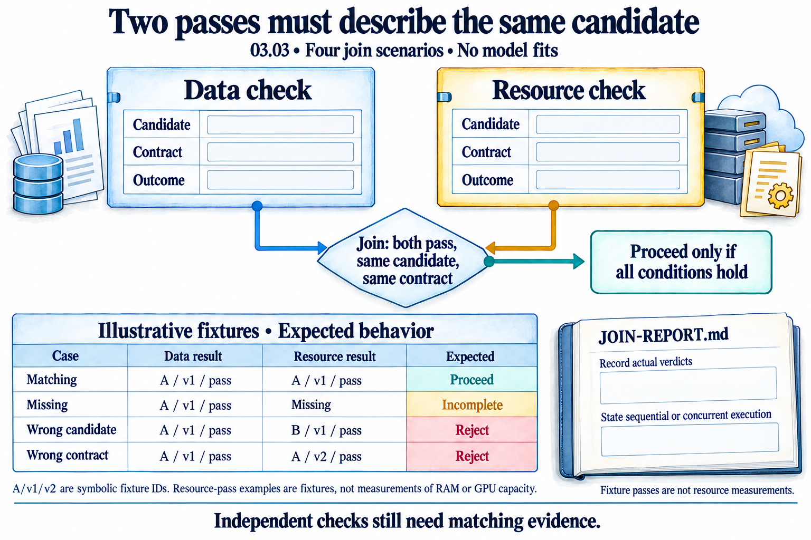

*A and B denote candidate identities; v1 and v2 denote contract versions. The table gives expected fixture behavior, not observed resource availability. Run all four cases and retain actual verdicts; the linked author walkthrough now includes all four. Missing evidence remains incomplete until the declared wait limit or stop rule applies. A matching pair can be processed sequentially; converging arrows do not prove concurrent execution or independent agent contexts.*

[Open the illustration at full size](assets/illustrations/join-matching-evidence-v1.png).

[Lab 03.03: Join independent checks](03_graph_engineering/step_03_join/README.md).

## Repair the artifact while keeping the rule fixed

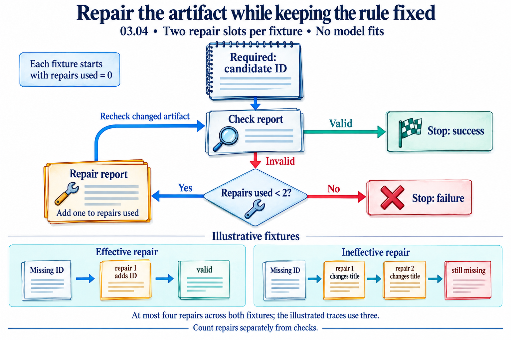

*The blue notebook supplies the unchanged validation rule; the return edge carries the changed report and accumulated counter. Reserve each repair attempt before running it, and keep failed attempts in that fixture’s count. Two repair slots apply to each fixture, with at most four across the two runs; the expected examples use three. The smaller strips omit intermediate checks for space, but the executable controller must recheck after every repair. A third ineffective repair is not permitted. Success and failure are expected paths to test, not new execution claims.*

[Open the illustration at full size](assets/illustrations/bounded-repair-cycle-v1.png).

[Lab 03.04: Put a bounded retry inside the graph](03_graph_engineering/step_04_cycle/README.md).

## Rerun the work whose inputs changed

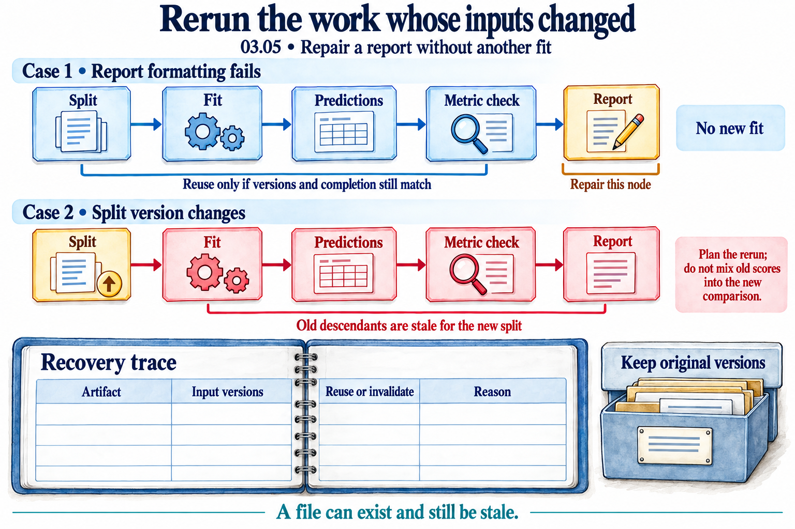

*These chains show dependencies among actions and artifacts; they are not claims that a node just executed. In the required recovery exercise, reuse the checked baseline predictions and repair the report without another fit. The changed-split case is a simulation that plans invalidation, not authorization to mix old evidence into a new task or quietly retrain. Old results remain valid records of their original inputs. Record hashes or other reliable input identities, completion state, reuse decisions, and the absence of an extra fit.*

[Open the illustration at full size](assets/illustrations/recover-affected-descendants-v1.png).

[Lab 03.05: Resume only the affected work](03_graph_engineering/step_05_recover/README.md).

## The plan, the files, and the events answer different questions

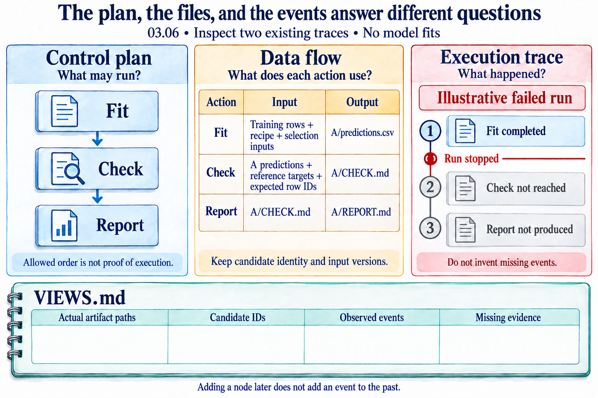

*Fit abbreviates the tool operation that fits on training rows and predicts for selection inputs; selection targets do not fit model parameters. A and its paths are illustrative identities to replace with the actual run’s records. The table states required flow, not proof that each file exists. The two gray trace entries mark actions not reached in this example, not fabricated executed events. For the real lab, inspect both completed and failed traces and confirm the relevant outputs before making a completion claim.*

[Open the illustration at full size](assets/illustrations/plan-flow-trace-views-v2.png).

[Lab 03.06: Read the plan, data flow, and trace](03_graph_engineering/step_06_three_views/README.md).

## Name the object before you claim it improved

*The fitted model shown here is the constant baseline: it learns the training median. Other model families learn different parameters. This runner keeps the fitted object in memory during execution and saves its recipe and predictions; the picture does not imply a saved weights file. A fitting event is the action, and its trace is evidence of that action. Fill the blank measurement fields from the actual report, with candidate, partition, unit, and metric definition. No new fit is needed.*

[Open the illustration at full size](assets/illustrations/name-experiment-objects-v2.png).

[Lab 04.01: Name the objects in an experiment](04_ontology_engineering/step_01_entities/README.md).

## Workflow and domain meaning

*Read the left arrows as dependencies between actions. Read the right arrows as sentences about domain meaning. These are selected facts and one rule, not a complete ontology. Correct execution order cannot rescue a leaked feature or the wrong metric. A declared fact also needs evidence that the implementation follows it.*

[Open the illustration at full size](assets/illustrations/graph-ontology-v1.png).

[Lab 04.02: Connect data, models, and evidence](04_ontology_engineering/step_02_relations/README.md).

## Pair each rule with a case that breaks it

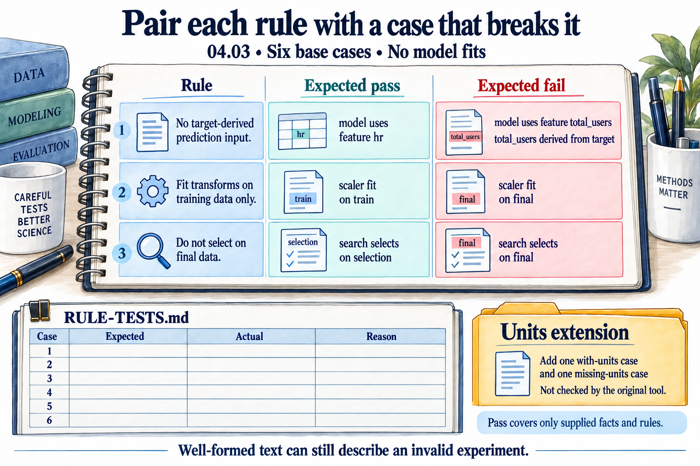

*The headings state expected behavior, not recorded verdicts. The leakage case needs both the feature-use fact and its direct derivation from the target. Absence of that fact does not prove an input is valid. The supplied checker does not infer missing facts, follow arbitrary chains of derivation, or verify the table against a real run. Execute all six base cases. Then test the separate units extension with one present-unit and one missing-unit case; the original tool does not enforce that rule.*

[Open the illustration at full size](assets/illustrations/three-domain-invariants-v1.png).

[Lab 04.03: State rules that must always hold](04_ontology_engineering/step_03_invariants/README.md).

## Changing the record does not repair an invalid run

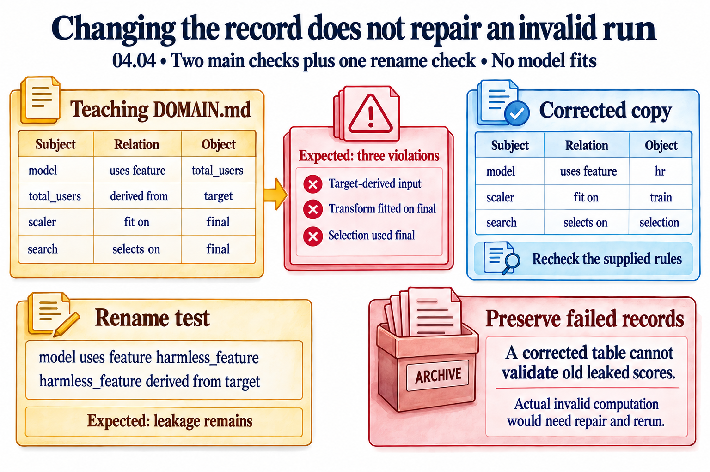

*The corrected-copy icon marks the intended repair; obtain an actual verdict by rechecking the table. Run the original failure, the corrected copy, and a separate renamed copy of the original: three checks, with no fits. Rename total_users in both related facts. The lower panel isolates those two facts; the full renamed table still contains the other two violations. Keep all reports. If the bad facts described an executed experiment, changing this document would not repair its model or validate its scores.*

[Open the illustration at full size](assets/illustrations/semantic-contradiction-repair-v1.png).

[Lab 04.04: Catch a plausible but invalid experiment](04_ontology_engineering/step_04_catch_contradictions/README.md).

## A new prediction time creates a new task contract

*Compare availability time with prediction origin, not with event time. A forecast can describe tomorrow and still be available today. These timestamps are synthetic examples in one time zone; a real source also needs release history, version identity, and the other task checks. The pinned bike data do not supply the required forecast archive. The exercise tests an availability rule and traces the impact of a changed definition; it does not train or score a day-ahead model. Preserve earlier results with their original task version.*

[Open the illustration at full size](assets/illustrations/task-definition-availability-v1.png).

[Lab 04.05: Change a definition without losing its consequences](04_ontology_engineering/step_05_evolve_vocabulary/README.md).

## Give each component a job you can check

*These are expected paths to execute, not a recorded success. The small tables show selected fields and blank rows, not a full schema or invented predictions. The constant task model learns one training median; that ordinary fit is separate from updating an LLM or an agent procedure. Reference selection targets and row identities belong to the output check, not model fitting. Record each component’s actual versions, inputs, outputs, and checks. Test the removed-guard extension with a dry-run stub and inspect any remaining protection.*

[Open the illustration at full size](assets/illustrations/fixed-components-system-v2.png).

[Lab 05.01: Combine fixed components into a useful system](05_system_intelligence/step_01_combine_components/README.md).

## Choose the procedure that matches the question

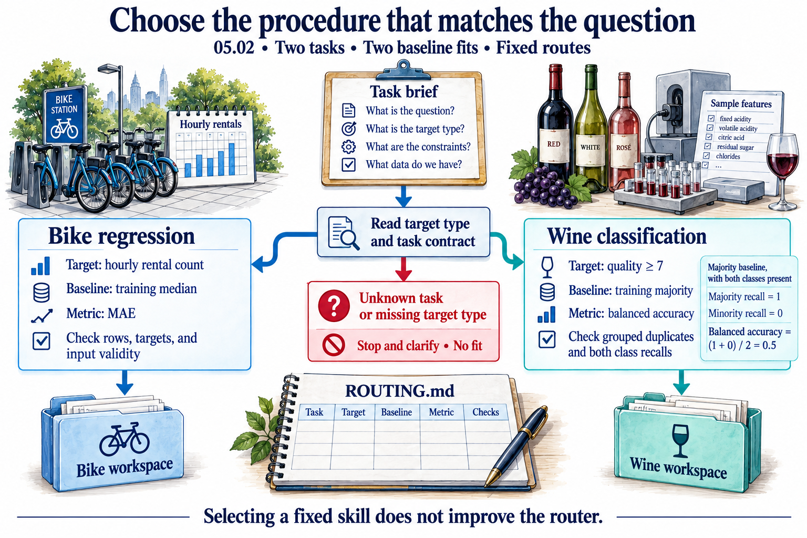

*The wine exercise uses the pinned red-wine dataset; the bottle collection is a laboratory motif, not a claim that white or rosé samples enter this task. The rental sketch is also illustrative. The recall calculation describes a constant majority-class predictor when both classes occur in evaluation; obtain your actual class counts and results from the separate wine run. Group identical wine feature rows within partitions. Execute one fit per task and preserve the unknown-task and missing-target-type refusals. The route table stays fixed.*

[Open the illustration at full size](assets/illustrations/fixed-task-routing-v1.png).

[Lab 05.02: Choose a skill for the task](05_system_intelligence/step_02_route_tasks/README.md).

## A useful summary keeps the right authority

*The budget example is specific to this two-attempt contract. Verify contract and run identity and reconcile active work before trusting the current ledger; a file called ledger is not automatically authoritative. Record the stale claim and its source without refunding past work. The context packet is a derived guide to those records. Keep wine metric instructions out of the bike task’s active instructions, and retain the input-availability rule needed for its scientific meaning. Execute both context checks without fitting another model.*

[Open the illustration at full size](assets/illustrations/context-rules-knowledge-state-v1.png).

[Lab 05.03: Retrieve what matters and retain task state](05_system_intelligence/step_03_context_and_state/README.md).

## Save the state. Check the handoff.

*Read steps 1, 2, and 3 in order: starting the fit requires running to be saved first. Matching C1 labels connect the scenes across the process boundary. The checkmarks illustrate a possible accepted handoff, not a new measured run. A missing check leaves work pending; a wrong candidate is refused. The coordinator remains fixed. Its read-only label describes the procedure, not an independently enforced permission boundary.*

[Open the illustration at full size](assets/illustrations/system-coordination-v3.png).

[Lab 05.04: Coordinate planning, execution, and checking](05_system_intelligence/step_04_coordinate/README.md).

## One removed check can hide behind another

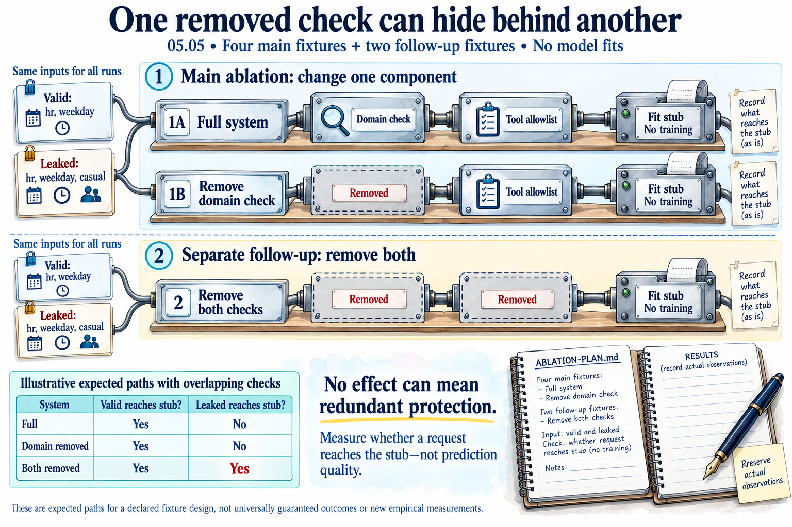

*The circuits show configured routes, not proof that an input traversed every module. Each fixture runs separately. The expected table applies to the depicted overlapping guards; preserve your actual outcomes even if they differ. Here casual is an outcome component excluded by the task contract. Four main executions isolate removal of the domain check. Two separate follow-up executions remove both protections and answer a different question. The red Yes means an invalid request reached the stub, not successful learning. No real fit or prediction-quality comparison occurs.*

[Open the illustration at full size](assets/illustrations/ablation-overlapping-checks-v1.png).

[Lab 05.05: Find which component makes the difference](05_system_intelligence/step_05_ablate_system/README.md).

## Define the experiment before you generate the harness

*This example brief permits calendar inputs and describes retrospective estimation. H1 and H2 mean the first and second halves of the year; the small split arrows mark chronological order, not permission to move final data into training. The final partition is reserved, not evaluated in this lab. Include resource and stop rules in the actual brief as well as the illustrated fields. Blank boxes invite a real ambiguity review. Ask the builder to review only; implementation and execution begin in the next lab.*

[Open the illustration at full size](assets/illustrations/readable-harness-brief-v1.png).

[Lab 06.01: Describe the harness you need](06_meta_harness_engineering/step_01_write_a_brief/README.md).

## The builder and the system it builds

*In this example the builder stays fixed. It creates a package that must then run under the brief’s limits. Files alone do not show that the package works. A checked execution provides evidence about the generated harness; it does not establish that the builder improved itself.*

[Open the illustration at full size](assets/illustrations/meta-harness-v2.png).

[Lab 06.02: Generate a first harness](06_meta_harness_engineering/step_02_generate/README.md).

## A requirement needs more than a sentence

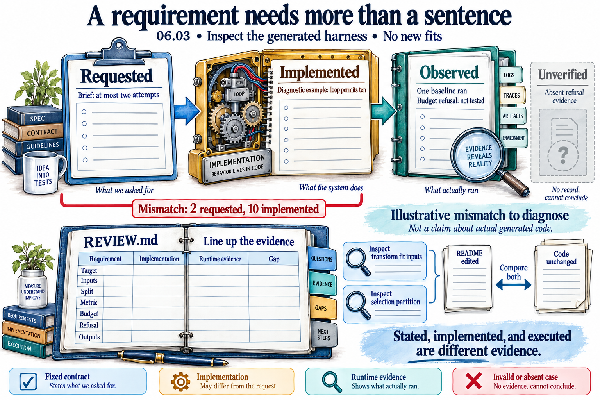

*The two-versus-ten mismatch is a diagnostic example, not a report that your generated code has that defect. One successful baseline cannot establish an attempt limit. Trace the actual requirement into code and its relevant records; leave unexecuted behavior unverified for the later refusal lab. A failing case and an absent case need different explanations, even though neither establishes acceptance. The documentation-only change leaves code untouched and should expose disagreement. Inspect real preprocessing inputs and selection partitions without another fit.*

[Open the illustration at full size](assets/illustrations/requirements-implementation-evidence-v1.png).

[Lab 06.03: Inspect what the builder decided](06_meta_harness_engineering/step_03_inspect_generated/README.md).

## A pass belongs to a specific request

*The fit-column icons denote one fit for the first request and zero for the other two; record actual counts and exit statuses. These are expected outcomes for this declared admitted-attempt policy. An invalid request can consume a slot even though no model fit starts. The old pass may remain valid for its original run; the red mark rejects its use for this request. Keep the unrelated-report and missing-ID fixtures separate from real model execution. These local checks do not establish isolation from a host agent that can edit the workspace.*

[Open the illustration at full size](assets/illustrations/request-bound-refusal-v1.png).

[Lab 06.04: Test the generated harness’s boundaries](06_meta_harness_engineering/step_04_test_refusal/README.md).

## Change the task brief while the builder stays fixed

*Keep the builder version fixed across this comparison. Class 1 means quality at least 7; class 0 is below that threshold. The pinned wine-v1 split keeps identical input vectors together; it does not establish independence of every near-duplicate. Fit preprocessing on training rows only and compare both candidates on the same selection partition. Fill the blank evidence table from checked predictions, including an unfavorable logistic result if it occurs. Changing the generated package to suit a new brief does not demonstrate improvement of the builder.*

[Open the illustration at full size](assets/illustrations/fixed-builder-new-task-v1.png).

[Lab 06.05: Generate a classification harness](06_meta_harness_engineering/step_05_second_task/README.md).

## Repeat execution before you claim reproducibility

*Create new output folders; the broom is a clean-state symbol, not an instruction to erase prior evidence. Package tabs identify required provenance and dependencies, which may include the course repository rather than a self-contained archive. Run one baseline and one wrong-task refusal per package; the refusal adds no model fit. Compare actual predictions, metrics, contracts, and environments without replacing the original result. The other two cards describe separate experiments: a fair builder comparison needs prespecified tasks, matched budgets, and candidate-specific evidence. A fresh output folder alone does not create an independent agent context.*

[Open the illustration at full size](assets/illustrations/repeat-saved-harnesses-v1.png).

[Lab 06.06: Recreate and compare generated harnesses](06_meta_harness_engineering/step_06_recreate/README.md).

## Correcting an answer does not rewrite the procedure

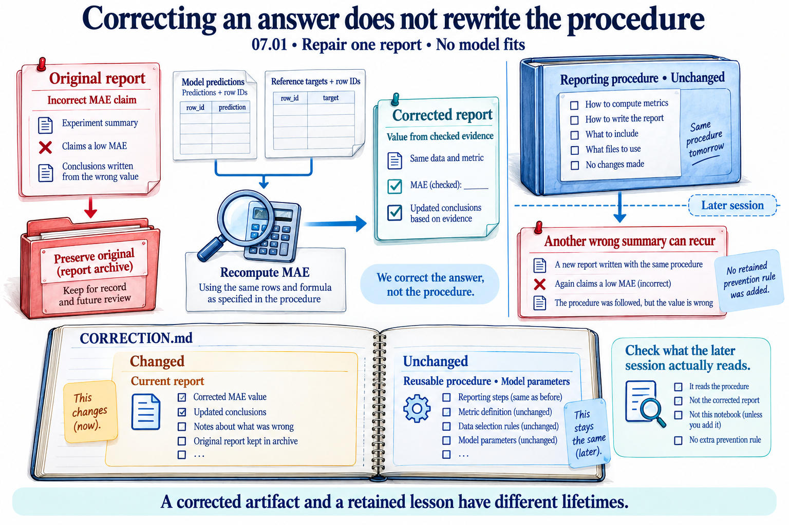

*The later-session panel depicts a conditional example in which only the unchanged procedure is reused. Inspect the host’s actual context, saved memory, and available files; a new process or chat is not proof that the correction was forgotten. The table headings name conceptual row identities and values, not the complete prediction-file schema. Recompute from the actual matched rows and reference targets, then correct conclusions that depended on the wrong number. The blank value is not an experimental result, and the illustration’s checkmarks show the intended corrected state.*

[Open the illustration at full size](assets/illustrations/local-output-correction-v1.png).

[Lab 07.01: Correct one result](07_understanding_self_star/step_01_correction/README.md).

## A convincing explanation still needs a test

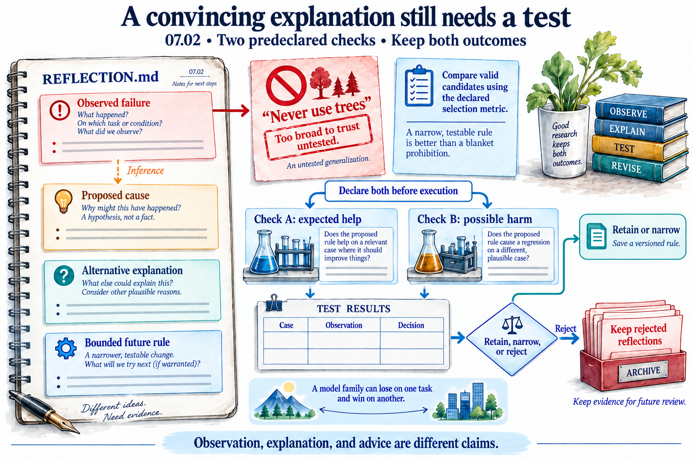

*Trees are a visual mnemonic for model families, not a claim about either pictured landscape. Use the actual trace for observations and label causal explanations as hypotheses. A helpful-case label predicts an outcome; it does not establish one. Compare the broad and narrow rules on the same two checked cases without extra undeclared fits. Reusing the cases that inspired the reflection is a replay, not fresh validation. Retaining a note does not guarantee future use or prevent repeated errors; both require their own evidence.*

[Open the illustration at full size](assets/illustrations/reflection-hypothesis-checks-v2.png).

[Lab 07.02: Test a reflection before trusting it](07_understanding_self_star/step_02_reflection/README.md).

## Saved, used, and useful need different evidence

*A new-session label describes the intended exercise, not proof of an independent context. Record what the host actually exposes. The with-memory and no-memory trays are evidence slots; an empty tray is not a measured control. Within this lab’s budget, compare with a suitable existing no-memory result or state the unrun alternative as a prediction. The separate scope fixture tests refusal when comparison requirements are missing or incompatible. This memory-based adaptation changes an external artifact; it does not update language-model weights or the procedure that creates memories.*

[Open the illustration at full size](assets/illustrations/memory-save-use-benefit-v1.png).

[Lab 07.03: Retain and use a lesson](07_understanding_self_star/step_03_persistent_learning/README.md).

## Improve the task skill while its improver stays fixed

*The constant baselines are separate charged fits under the two skill versions, not one shared free result. Predeclare the parent’s second choice and the child’s diagnosis-to-choice rule. Record the second choice before fitting it. Blank outcome and cost fields must come from execution; comparison checkmarks depict required checking, not a new observed win. Preserve failed proposals and state shared-context or unmeasured inference-cost limits. The dashed follow-up changes the target of a future experiment and is not an executed new improver here.*

[Open the illustration at full size](assets/illustrations/task-skill-fixed-improver-v1.png).

[Lab 07.04: Improve a task skill with a fixed procedure](07_understanding_self_star/step_04_self_improvement/README.md).

## Work can move without workers getting better

*The duration cards define this teaching fixture; ticks are simulation units, not wall-clock seconds. FCFS means first come, first served; with all jobs arriving together, the listed input order breaks the tie. Both workers can do the same jobs. The machines represent simulated workers, not launched coding agents. Define simultaneous-event tie handling before execution and preserve every job ID. A speed difference matters only after completion and correctness checks. An optional coordination-delay run changes a declared cost assumption and may reverse the result; it does not make the workers learn.*

[Open the illustration at full size](assets/illustrations/organization-shared-queue-v1.png).

[Lab 07.05: Let work reorganize under local rules](07_understanding_self_star/step_05_organization/README.md).

## A collective pattern is not automatically a benefit

*Either worker can process either type. Count neighboring jobs within each worker’s ordered trace, then divide the pooled same-type-pair count by the pooled adjacent-pair count; do not join the end of one worker’s trace to another’s start. FIFO means first in, first out. Use the same inputs and tie rules across the three main simulations and a fixed seed for randomized history. The urgent-job pair is a separate two-run fixture. Empty report fields are not results. A pattern produced by fixed local rules is not proof that a learning procedure improved.*

[Open the illustration at full size](assets/illustrations/emergence-pattern-and-cost-v2.png).

[Lab 07.06: Observe a collective pattern](07_understanding_self_star/step_06_emergence/README.md).

## Self-play changes the policy, not necessarily the trainer

*The X/O arrows denote table lookup, not separate player-specific tables. Each visited move is updated after the completed game from its mover’s return. The 0-to-0.2 example is arithmetic for a return of +1, not a new measured improvement; a loss gives a negative update from zero. Training explores with probability 0.2; otherwise it chooses a highest-valued legal move with random tie-breaking. Evaluation uses greedy selection with random ties and no exploration or updates. Equal seed schedules do not guarantee identical board trajectories. Fill counts from the actual run and verify unchanged policy hashes. The learned object is a tabular policy, not an LLM or its fixed trainer.*

[Open the illustration at full size](assets/illustrations/self-play-policy-and-trainer-v2.png).

[Lab 07.07: Learn what self-play does and does not provide](07_understanding_self_star/step_07_self_play/README.md).

## Similar words, different changes

*These are examples of mechanisms, not mutually exclusive categories or a maturity ladder. A system can combine them. The self-play panel changes policy values under a fixed update rule; the modification panel changes active instructions without proving a benefit. The emergence drawing is a conceptual group-pattern analogy, not a measurement from the queue exercise. Ask what changed, what persisted, and how its effect was checked.*

[Open the illustration at full size](assets/illustrations/self-star-v2.png).

[Lab 07.08: Make a self-modification inspectable](07_understanding_self_star/step_08_modification/README.md).

## Keep every planned pair, not just the best run

*The difference is forest MAE minus tree MAE, so a negative value favors the forest. Recipe families and complexity differ; seeds are paired within that comparison. The star on seed 29 is an arbitrary example of selective reporting, not the best seed in the archived run. Blank cells and checklist marks specify planned work, not new measurements. The lesson’s separate measured plot uses the actual recorded results. Three seeds do not establish transfer to other tasks or data splits.*

[Open the illustration at full size](assets/illustrations/paired-seeds-comparison-v1.png).

[Lab 08.01: Distinguish a result from a reliable comparison](08_measuring_improvement/step_01_repeat_measurement/README.md).

## Freeze the choice before you reveal the final score

*Use the original experiment workspace, not a new experiment with a reset selection history. The final operation permits a refit of the frozen recipe on original training rows only; it does not permit another selection fit or adding selection rows to training. Preserve the lock even if final scoring fails. The pictured lock is a cooperative local control over public data. Actual access isolation requires separate permissions and an evaluator; this course does not claim those controls exist. The recipe, reason, and contract belong in the decision record, not extra fields invented for FINAL-LOCK.md.*

[Open the illustration at full size](assets/illustrations/freeze-before-final-v2.png).

[Lab 08.02: Freeze selection before final evaluation](08_measuring_improvement/step_02_final_boundary/README.md).

## Count the work that produced the retained result

*Account for the full search effort, including work that failed or did not help. Wall time, tokens, fit time, and GPU-hours measure different resources; do not add overlapping durations or unlike units. The token counter is an instrument icon, not a zero-usage observation. Leave unavailable usage unknown. The 20+p versus 30+10 comparison is invented arithmetic with sequential stages and equal other costs. It is not a measured result from this course, and equal fit counts do not establish equal total cost.*

[Open the illustration at full size](assets/illustrations/research-cost-ledger-v1.png).

[Lab 08.03: Count the cost of research](08_measuring_improvement/step_03_cost/README.md).

## Test the combination, not only its parts

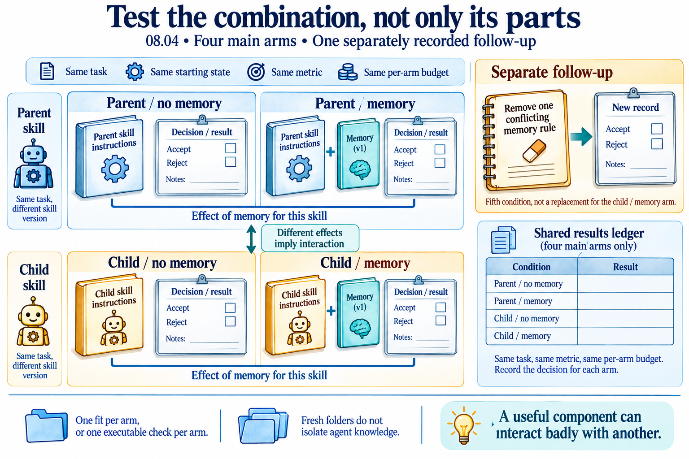

*Keep the same memory version in both memory-present arms and the same parent or child instructions across its row. The blank records do not assume the child wins or memory helps. Differences between the two memory effects describe an interaction in these observations; noisy results need uncertainty analysis before a broader claim. The four main checks or fits and the separate follow-up have distinct budgets. Fresh folders do not isolate agent knowledge. The lesson’s archived worked example replays deterministic decisions over cached predictions; it is not an LLM training experiment.*

[Open the illustration at full size](assets/illustrations/memory-skill-factorial-v1.png).

[Lab 08.04: Separate the effects of memory and procedure changes](08_measuring_improvement/step_04_ablation/README.md).

## Freeze the procedure before testing a new task

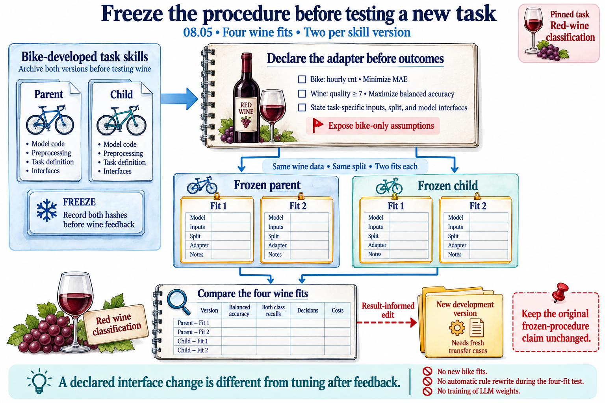

*The frozen objects are the research instructions and their declared interfaces. The left-hand cards list task-specific material those instructions operate on; do not reuse a fitted bike model as a wine classifier or treat model code as the skill itself. Declare target, inputs, split, model interface, and maximizing balanced accuracy before wine outcomes. Keep both class recalls and all four attempts. The author already knew the public wine task, so the archived exercise is a transfer replay, not a fresh unseen-task test. No result is filled in here.*

[Open the illustration at full size](assets/illustrations/frozen-skill-transfer-v1.png).

[Lab 08.05: Test whether the lesson transfers](08_measuring_improvement/step_05_transfer/README.md).

## Reject a win created by changing the metric

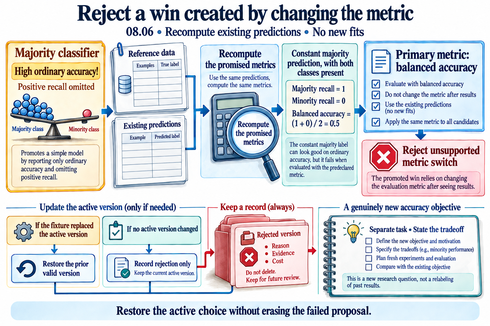

*The constant predictor has recalls one and zero when both classes occur, giving balanced accuracy 0.5. The failure concerns this fixture's unsupported promotion and omitted evidence; a majority baseline is not invalid for every task and is not automatically worse than every candidate. Checklist marks describe required checks, not a new execution. Restore the prior valid version only if the fixture replaced it. A new accuracy objective requires an explicit new task and tradeoff; it cannot relabel the earlier comparison.*

[Open the illustration at full size](assets/illustrations/metric-switch-and-rollback-v1.png).

[Lab 08.06: Reject a misleading win and roll back](08_measuring_improvement/step_06_rollback/README.md).

## Two generations can use the same improver

*I0 remains the same in both rounds. Match the Generation 1 retained skill to the named parent of Generation 2. A rejected proposal never becomes that parent. The pictured decisions are unselected possibilities; these generation numbers do not demonstrate a changed improver or guaranteed improvement.*

[Open the illustration at full size](assets/illustrations/fixed-improver-v2.png).

[Lab 09.02: Run repeated improvement with an unchanged improver](09_recursive_self_improvement/step_02_fixed_improver/README.md).

## Change the rule that judges skill revisions

*This intentionally weak I0 is a classroom example. The added internal rule changes how task-skill proposals are tested; it does not change the external evaluation contract. Notebook marks identify actions, not successful measured fixture results. Keep both versions and compare actual decisions and overhead before making a benefit claim.*

[Open the illustration at full size](assets/illustrations/improver-proposal-v1.png).

[Lab 09.03: Propose a change to the improver](09_recursive_self_improvement/step_03_revise_improver/README.md).

## The next round must use the change

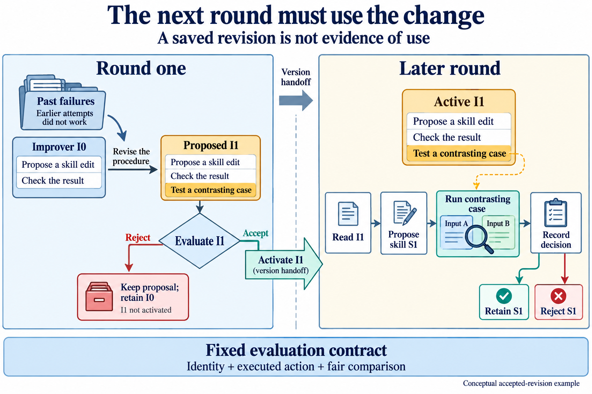

*The highlighted instruction appears in proposed I1, active I1, and the later executed check. That connection matters more than a new filename. The image shows a possible accepted path; the course’s two-generation comparison rejected both improver proposals. An inherited change can also perform worse. Keep version identity, observed use, and measured benefit as separate claims.*

[Open the illustration at full size](assets/illustrations/inherited-improver-v1.png).

[Lab 09.04: Use the revised improver in the next round](09_recursive_self_improvement/step_04_inherit/README.md).

## Compare what each improver produces

*Apply the declared retention rules during each round. The I0 and I1 labels on the descendant reports identify the producing improver; give task skills their own version identities. Compare retained results and all known costs, including failures. Separate folders do not establish independent contexts. Eight fits is a maximum; benefit, regression, and inconclusive outcomes are all possible.*

[Open the illustration at full size](assets/illustrations/improver-comparison-v1.png).

[Lab 09.05: Measure whether the revised improver helps](09_recursive_self_improvement/step_05_compare_improvers/README.md).

## A proposal is not the active parent

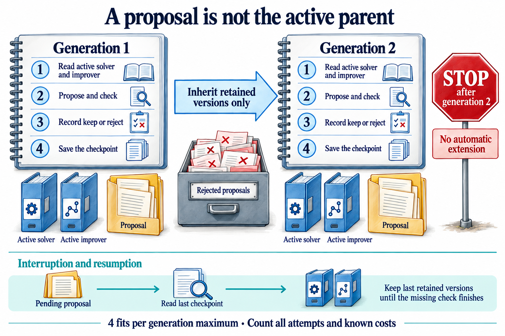

*A finished check does not by itself promote a proposal: record the keep-or-reject decision. On resume, read the saved active versions and cumulative budget. Preserve rejected proposals as evidence without activating them. The image is a procedure; the recorded course run rejected both improver revisions and did not demonstrate a successful changed-improver lineage.*

[Open the illustration at full size](assets/illustrations/bounded-lineage-v1.png).

[Lab 09.06: Run bounded recursive generations](09_recursive_self_improvement/step_06_bounded_generations/README.md).

## Three claims need different evidence

*Structural recursion needs executed later use of the changed improvement procedure. Benefit needs a fair comparison of what the procedures produce. Acceleration concerns an increasing progress rate across generations after accounting for resources and bottlenecks; a constant speed advantage or two favorable points is insufficient. The records are conceptual, not measured results.*

[Open the illustration at full size](assets/illustrations/claim-evidence-v1.png).

[Lab 09.07: State the result without overstating it](09_recursive_self_improvement/step_07_claim/README.md).

## Classify the mechanism, then test the benefit

*The three numbered panels are cases to inspect, not universal levels or a required ladder. The pictured task sheets and improver edits are examples; substitute your saved artifacts. The two question markers are reminders to ask for evidence, not passing verdicts. Reading a memory or testing candidate I1 does not establish a benefit. Map the actual retained state and later behavior to the chosen source definition, then assess effectiveness separately.*

[Open the illustration at full size](assets/illustrations/classify-the-mechanism-v1.png).

[Lab 10.01: Use a framework without turning it into a ladder](10_research_studio/00_reading_frontier_research/step_01_framework/README.md).

## Follow an announcement to its evidence

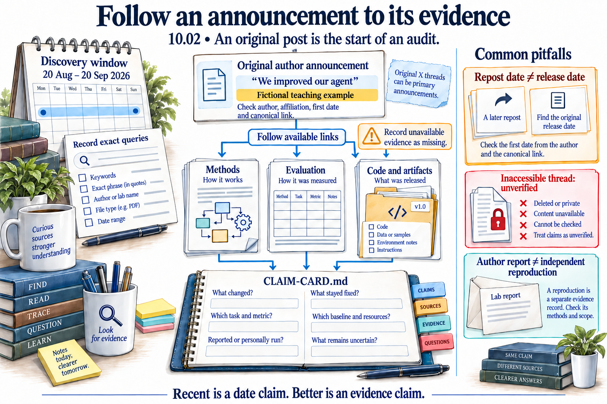

*The quotation is invented for teaching and is not attributed to a real author or lab. The 20 August–20 September 2026 window is the authoring example; roll it forward to the preceding month when you run the lab. Inspect available links and record missing ones. A blocked thread does not invalidate a separately accessible paper, but its contents remain unread. A reproduction has its own methods and limitations. Document the original release and any substantive revision separately from repost and crawl dates.*

[Open the illustration at full size](assets/illustrations/announcement-evidence-trail-v2.png).

[Lab 10.02: Audit a frontier announcement](10_research_studio/00_reading_frontier_research/step_02_announcements/README.md).

## Spend the next fit on an unanswered question

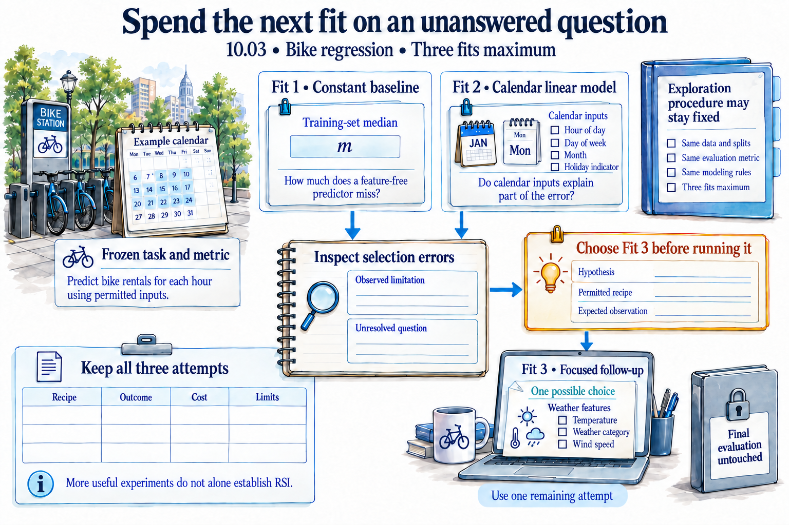

*The course predicts hourly bike rentals. Calendar and weather labels are examples from permitted groups, not the complete schema; weather category is not a precipitation measurement. The constant baseline learns its median from training data. Choose the third recipe from actual selection errors before fitting, and record its question and cost. Observed weather is allowed by this teaching contract; it does not establish that the same inputs would be available in a real forecast. The exploration rule itself can remain fixed.*

[Open the illustration at full size](assets/illustrations/broad-probes-focused-test-v3.png).

[Lab 10.03: Choose experiments that reduce uncertainty](10_research_studio/01_memory_and_exploration/step_03_exploration/README.md).

## Check the result, then write the lesson

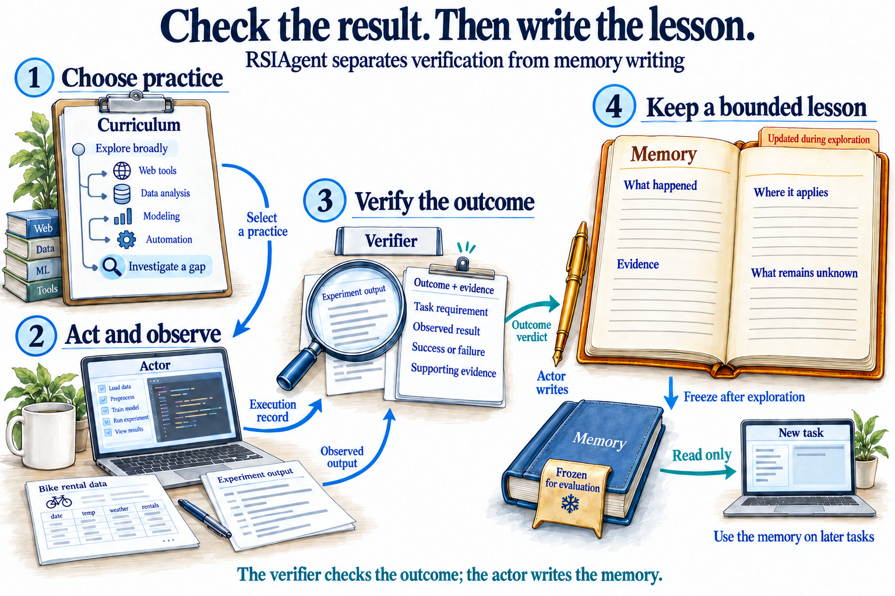

*The verdict concerns the task outcome. The actor still has to interpret it and can write an overbroad lesson. The notebook fields are our teaching aid, not a required paper format. This figure adapts RSIAgent’s responsibility split to the laptop ML exercise. It does not reproduce the paper’s environments or establish that the memory-writing procedure improved. Frozen evaluation memory is read without updates.*

[Open the illustration at full size](assets/illustrations/actor-memory-v2.png).

[Lab 10.04: Verify the outcome, then let the actor write memory](10_research_studio/01_memory_and_exploration/step_04_actor_memory/README.md).

## Freeze the memory, control who can read it

*This depicts the intended comparison, not established isolation or a measured memory benefit. Confirm what each arm can actually read, including prior conversation, files, and other retrieval sources. The hash equality is a condition to check after the run. If the agent cannot start separate controlled contexts, label the activity a shared-context demonstration and limit the claim. The crossed arrow below rejects a clean-ablation inference; it does not suggest that disabling writes erases earlier exposure.*

[Open the illustration at full size](assets/illustrations/frozen-memory-comparison-v1.png).

[Lab 10.05: Evaluate with memory frozen](10_research_studio/01_memory_and_exploration/step_05_frozen_memory/README.md).

## Carry the lesson, reset the run state

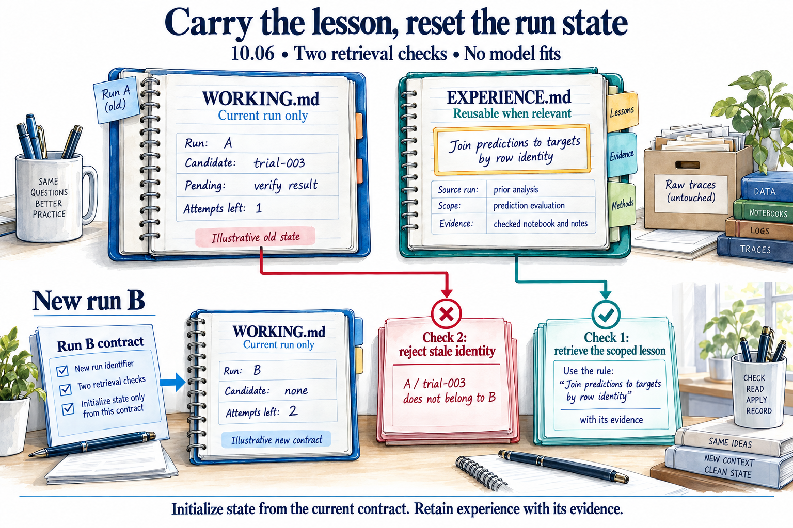

*Run A, run B, and the remaining-attempt values are constructed fixtures. They do not authorize fits in this no-fit lab. The green and red markers show expected retrieval decisions that the learner must verify. Replace generic evidence labels with actual source-run IDs and artifact links. An old candidate can remain in its historical record without becoming the new run's active candidate. Useful retrieval still needs correct application; keeping a lesson alone establishes no performance gain.*

[Open the illustration at full size](assets/illustrations/working-state-and-experience-v1.png).

[Lab 10.06: Separate working state from reusable experience](10_research_studio/01_memory_and_exploration/step_06_working_and_experience/README.md).

## A discovery tree records work that happened

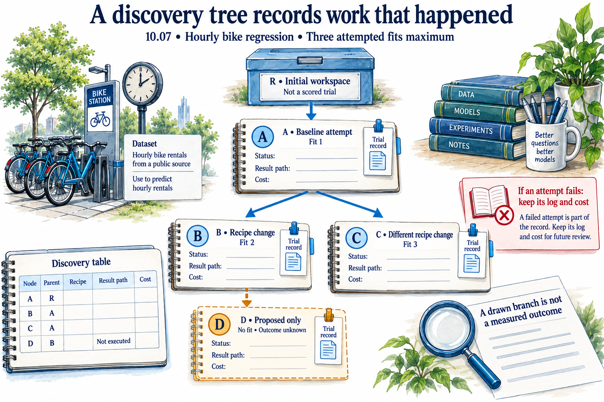

*This is a record layout to fill from actual execution. A, B, and C consume at most three attempted fits, including failures. D's generic attachment icon is only a placeholder for a proposal record; its explicit no-fit label means no execution evidence exists. Record proposal costs even for ideas never fitted. The unscored R matches the source distinction between an initial workspace and trial outcomes. This simplified recipe-ancestry tree does not implement Dream-RSI's full online node-eligibility, concurrency, or replay transition rules.*

[Open the illustration at full size](assets/illustrations/discovery-tree-evidence-v1.png).

[Lab 10.07: Build a tree of attempted solutions](10_research_studio/02_dream_rsi/step_07_discovery_tree/README.md).

## Replay stops at the edge of the record

*The left panel is the record before another run. Replay can reuse its supported outcomes and failure status; it cannot supply D’s missing result. The right panel shows the additional execution needed to extend that record. This is a classroom mechanism inspired by Dream-RSI, not a reproduction of its benchmark or a claim that all counterfactual policies are covered.*

[Open the illustration at full size](assets/illustrations/replay-boundary-v2.png).

[Lab 10.08: Replay only what the history can answer](10_research_studio/02_dream_rsi/step_08_replay/README.md).

## A replay winner still needs fresh evidence

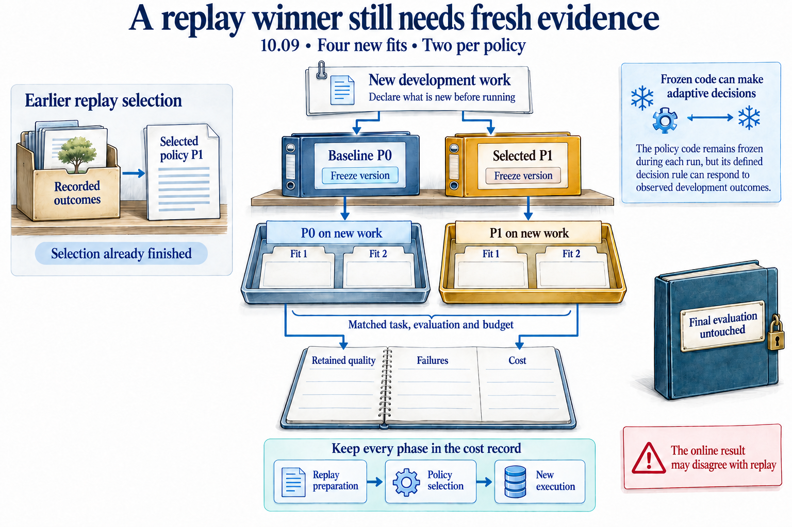

*The repeated P1 label links the earlier selection to the right-hand candidate; P0 remains the baseline. No online result is assumed. Frozen code can choose actions from new observations under its declared rule without rewriting itself. Record what makes the new work distinct, what the author or agent already knew, and any exposure that weakens the confirmation claim. Keep historical replay costs and new execution costs separate in the ledger, then report the full cost without double-counting shared work. This is a classroom plan, not a Dream-RSI reproduction.*

[Open the illustration at full size](assets/illustrations/replay-to-online-v2.png).

[Lab 10.09: Test the replay winner on fresh work](10_research_studio/02_dream_rsi/step_09_online/README.md).

## Repair a component. Check the system.

*The missing candidate ID is an original classroom example inspired by ModularRSI. A trace suggests a cause; the restricted edit still needs testing. Empty boxes mark checks to perform, not recorded passes. The same H1 identity appears before and after freezing for transfer. Keeping H1 is a possible outcome; rejection retains the prior harness. The next lab examines two edits and their interaction. This figure does not reproduce a paper benchmark.*

[Open the illustration at full size](assets/illustrations/modular-harness-v2.png).

[Lab 10.10: Localize a harness problem](10_research_studio/03_modular_harness_evolution/step_10_localize/README.md).

## Test the combination, not just its parts

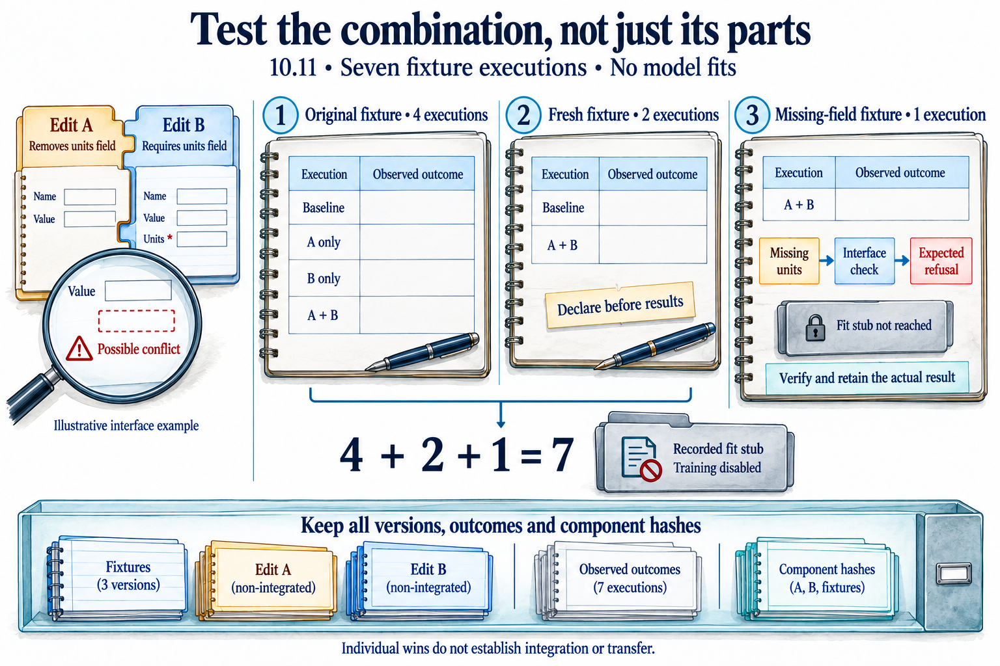

*The units conflict is an illustrative fixture design, not a recorded diagnosis of the paper. Fill all observed-outcome cells from execution. The missing-field refusal is expected behavior to test; record whether the fit stub was actually avoided. The storage tray is illustrative: retain all four harness versions, including the baseline and combined A+B, along with all three fixtures and their hashes. A passing local check does not automatically establish transfer, and a single fresh fixture provides only narrow evidence.*

[Open the illustration at full size](assets/illustrations/integration-seven-checks-v1.png).

[Lab 10.11: Integrate edits and test transfer](10_research_studio/03_modular_harness_evolution/step_11_integrate/README.md).

## Label the procedure on every lineage edge

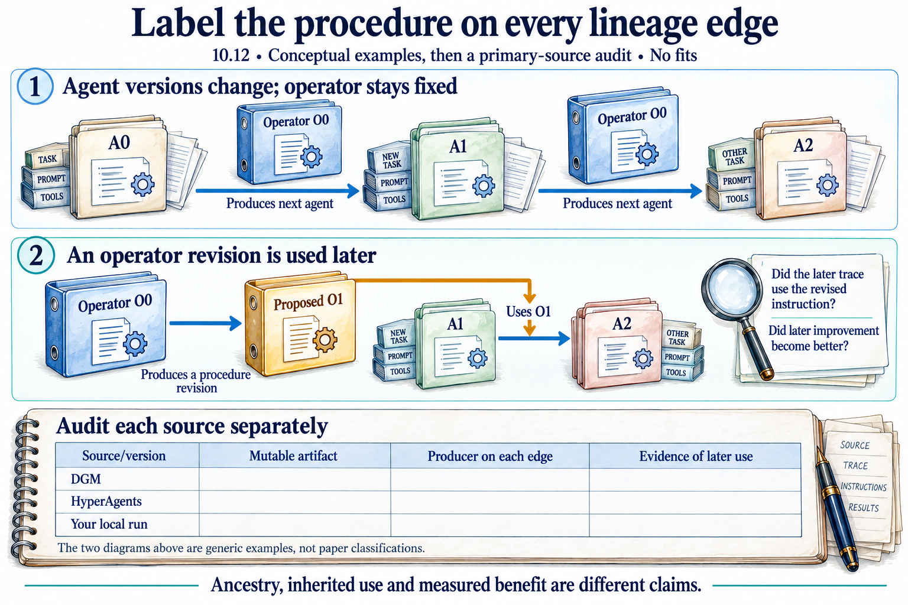

*A0, A1, and A2 identify agent versions, not scores or task conditions. The two strips illustrate possibilities; neither is assigned to DGM or HyperAgents. DGM reuses evolving coding agents for self-modification, so labelling it a fixed-operator system from this cartoon would be misleading. In the lower example, later use of O1 needs an actual trace; improved effectiveness needs an additional fair comparison. Read each original source and record which procedure, code, model, and evaluation components remain fixed.*

[Open the illustration at full size](assets/illustrations/agent-and-improver-lineages-v1.png).

[Lab 10.12: Compare agent evolution and improver evolution](10_research_studio/03_modular_harness_evolution/step_12_lineage/README.md).

## The researcher decides which experiment comes next

*The four tickets include failed attempts. Fill the ledger from actual execution and keep the retained recipe distinct from the best intermediate number. Calendar and permitted weather inputs follow the classroom hourly-bike contract; the figure adds no new features or dates. A fixed procedure can select different actions without rewriting itself. This local four-fit exercise does not reproduce the full AIDE² run.*

[Open the illustration at full size](assets/illustrations/inner-ml-researcher-v2.png).

[Lab 10.13: Inspect an inner ML researcher](10_research_studio/04_aide2/step_13_inner_research/README.md).

## Improve the researcher, then test the improver

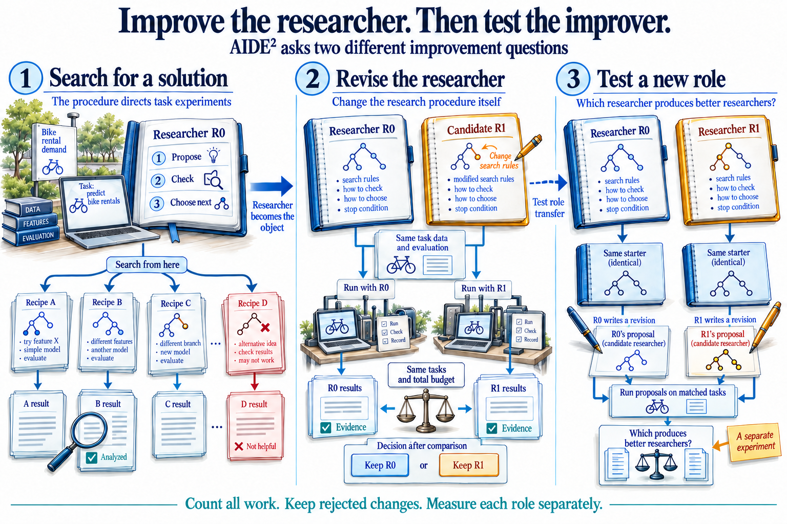

*R0 and R1 are classroom identities. The middle comparison tests research procedures; the right comparison tests what they produce in the improver role. Neither has a preselected winner. The latter is the separate ignition question discussed in Weco’s July report; its ignition efficiency comparison was not statistically significant. This diagram explains the distinction; it does not reproduce the published run or establish ignition.*

[Open the illustration at full size](assets/illustrations/nested-research-v2.png).

[Lab 10.14: Improve the inner researcher under a total budget](10_research_studio/04_aide2/step_14_outer_research/README.md).

## A better researcher may not be a better improver

*R0 and R1 are the producers; T0 is the object they revise. The pictured edits are examples subject to your declared allowed edits, not permission to change the evaluator. Fixtures execute the affected decisions without model fitting by default. Record both proposal and checking costs. Do not carry an earlier task-search score into this new comparison. Weco reported insufficient ignition evidence; this tiny role-transfer exercise cannot establish sustained recursive gains.*

[Open the illustration at full size](assets/illustrations/ignition-role-transfer-v1.png).

[Lab 10.15: Test the ignition claim separately](10_research_studio/04_aide2/step_15_ignition/README.md).

## Change the task skill while its updater stays fixed

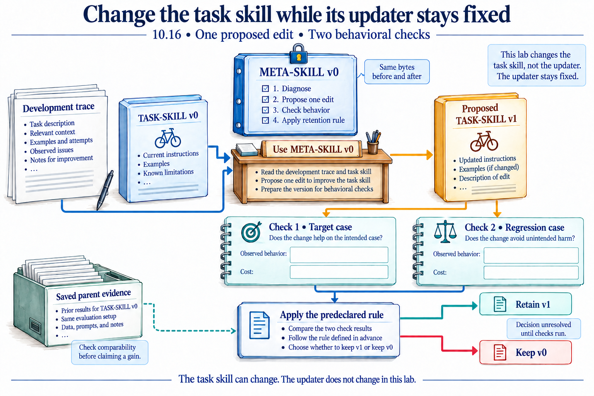

*The lock means the updater bytes must remain unchanged, which the agent checks before and after. The four responsibilities simplify the paper’s full pipeline. Regression case means a case that detects lost behavior, not necessarily an ML regression task. The two blank reports are child checks; saved parent evidence must be comparable before it can support a gain. A missing comparable parent result requires a revised claim or a separately declared budget, not hidden extra executions. Neither outcome is assumed.*

[Open the illustration at full size](assets/illustrations/fixed-meta-skill-v2.png).

[Lab 10.16: Improve task skills with a fixed pipeline](10_research_studio/05_meta_skill_evolution/step_16_task_skills/README.md).

## Improve the skill—and the way you revise it

*The notebook lines are classroom examples, not complete skills. The updater edits procedures; the task skills direct experiments. Match Activate U1 to Active U1, then follow the same new rule into the later check. Acceptance is a possible path, not a guaranteed gain. The four-line updater is a teaching simplification of MetaSkill-Evolve’s July method. Keep the external comparison fixed and measure later behavior; a saved revision or a slower schedule alone does not establish benefit.*

[Open the illustration at full size](assets/illustrations/meta-skill-schedules-v3.png).

[Lab 10.17: Update the skill updater on a slower schedule](10_research_studio/05_meta_skill_evolution/step_17_meta_skills/README.md).

## Turn a limitation into a tested claim

*This is a bike-task adaptation of the research stages. The pictured paper and records are illustrative. Each ablation recipe is fitted again; only its permitted feature group changes. Use development evidence for screening and refinement. A review can lead to a narrower or rejected claim, and agent review is not conference acceptance. The illustration does not demonstrate frontier discovery or an improved research procedure.*

[Open the illustration at full size](assets/illustrations/scientific-claim-v2.png).

[Lab 10.18: Turn a limitation into a scientific hypothesis](10_research_studio/06_scientist_two/step_18_hypothesis/README.md).

## Screen ideas, then test a contribution

*The four numbered fits exhaust the budget. The upper data cards describe shared training and evaluation roles; the bike-rental target is the value to predict, never a feature. Fit preprocessing only on the declared training subset. The selected component advances to Fit 3 and is removed in Fit 4. This tests its contribution under fuller conditions; it does not reveal the full-scale ranking of both screened ideas. Read labels rather than decorative calendar cells as the split specification.*

[Open the illustration at full size](assets/illustrations/screen-and-ablate-v2.png).

[Lab 10.19: Screen ideas and test their contributions](10_research_studio/06_scientist_two/step_19_screen_ablate/README.md).

## Answer a criticism with evidence

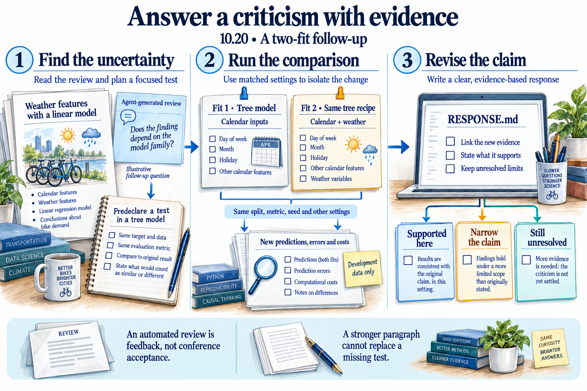

*This is an illustrative follow-up to the earlier linear-model study, not an already observed criticism or result. Predeclare the tree recipe and comparison, then retain both sets of predictions and errors. A one-pair follow-up can narrow the tested scope; it cannot establish universality across models or quantify all sources of variation. The outcome cards are alternatives. The main horizontal arrows show the reading order; write the response only after inspecting the evidence. Automated review is not human conference acceptance.*

[Open the illustration at full size](assets/illustrations/review-to-evidence-v1.png).

[Lab 10.20: Answer a criticism with evidence](10_research_studio/06_scientist_two/step_20_review_rebuttal/README.md).

## Track the discovery and its researcher

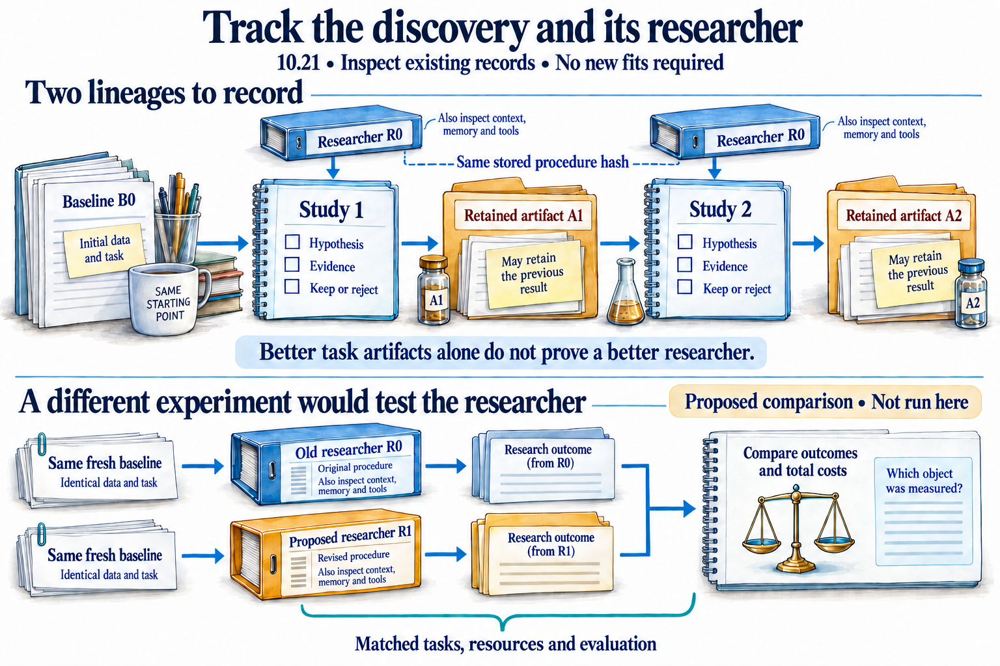

*A1 and A2 name retained-state records, not guaranteed new or better solutions. Rejection can preserve the previous artifact. An unchanged procedure hash says nothing by itself about changing memory, context, tools, or model versions, so record those too. The lower scene is the proposed comparison from the transfer exercise; this lab requires no new fits. Compare research outcomes under matched conditions before making a claim about a better research procedure.*

[Open the illustration at full size](assets/illustrations/discovery-and-researcher-v2.png).

[Lab 10.21: Distinguish better discoveries from a better scientist](10_research_studio/06_scientist_two/step_21_successive_results/README.md).

## Turn a correction into something you can check

*The miniature rows are illustrative placeholders, not saved course predictions. Their zero/one values represent derived class labels; the original wine-quality rating is not binary. Use your actual predictions and declared threshold in the activity. The pictured verdicts are expected fixture outcomes to verify. This request is a classroom construction, not a real researcher interview. The presence check detects an omission; validating metric computation and scientific meaning requires further evidence.*

[Open the illustration at full size](assets/illustrations/correction-to-rubric-v1.png).

[Lab 10.22: Turn a researcher correction into a task](10_research_studio/07_sciencebuddy/step_22_human_task/README.md).

## Change the reporting skill, then test its behavior

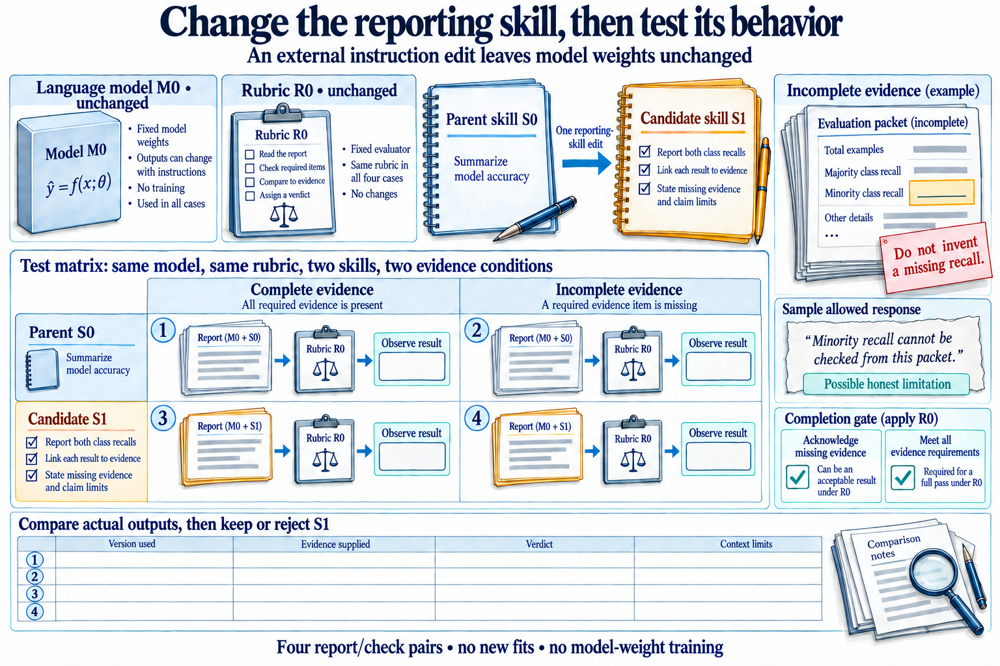

*Changing instructions can change outputs while model weights stay fixed. The parent text is an intentionally weak teaching example. Supply the same evidence packet to both versions within each column, and record actual outputs and context limits. An honest missing-evidence statement can satisfy a declared limitation criterion, but it does not supply the missing recall or earn a full evidence pass. The matrix remains unexecuted in this illustration; no candidate improvement is assumed.*

[Open the illustration at full size](assets/illustrations/reporting-skill-adaptation-v2.png).

[Lab 10.23: Adapt the harness to the rubric](10_research_studio/07_sciencebuddy/step_23_harness_adaptation/README.md).

## A reward becomes a relative learning signal

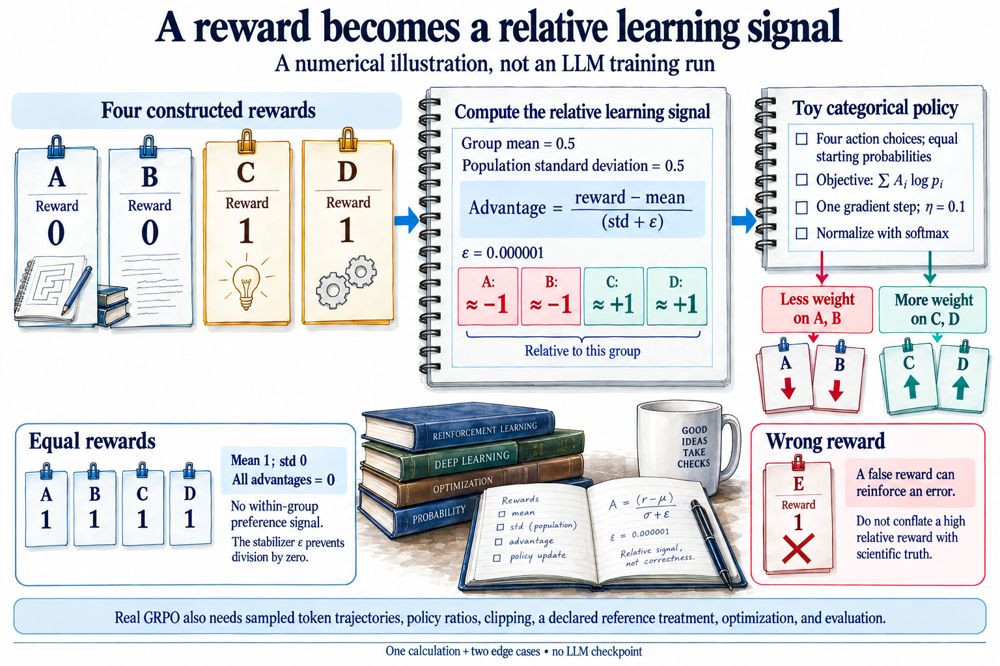

*The stabilizer makes the advantage magnitude 0.999998000004, shown approximately as one. For the pictured toy, start four softmax logits at zero and take gradient ascent on the displayed weighted log-probability objective with step size 0.1. “Weight” here means probability assigned to a toy action, not an LLM checkpoint. The wrong-reward card belongs to the separate edge case; rerun a four-item group with one corrupted score. The illustration specifies arithmetic to execute and is not full GRPO or evidence of scientific correctness.*

[Open the illustration at full size](assets/illustrations/grouped-rewards-v1.png).

[Lab 10.24: See what grouped rewards contribute](10_research_studio/07_sciencebuddy/step_24_grpo/README.md).

## Two ways to improve a scientific agent

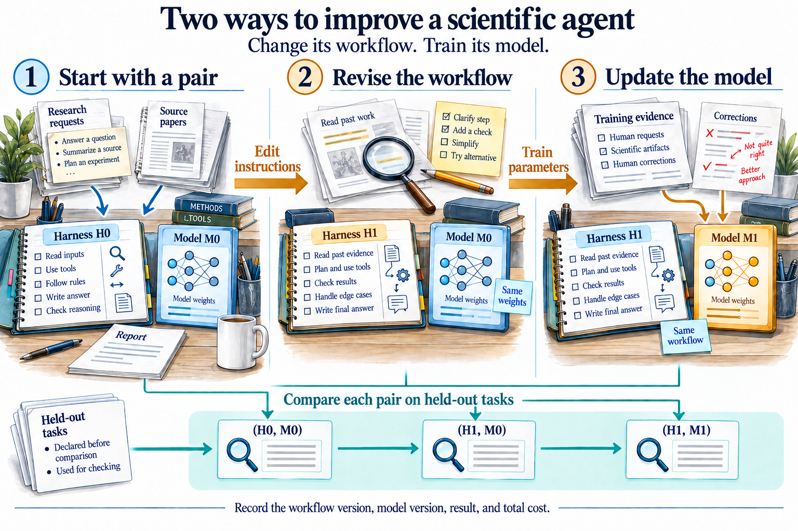

*Track both versions because a harness and model can interact. First hold M0 fixed while changing the harness; then hold H1 fixed while changing weights. Keep training evidence separate from the cases used for the declared external comparison, and do not feed final results back into selection. This lab illustrates pair accounting with synthetic scores. It does not train an LLM or reproduce ScienceBuddy’s reported gains.*

[Open the illustration at full size](assets/illustrations/model-harness-v4.png).

[Lab 10.25: Track model–harness pairs across cycles](10_research_studio/07_sciencebuddy/step_25_coevolution/README.md).

## Read the metric beside the percentage

*Read these as paper-reported comparisons, not our reproductions. The primary result sections are 4.2, 4.3, and 4.4. Section 4.2’s heading says “Two-Cycle,” but its setup and Figure 8 describe three cycles; the course follows that explicit protocol. Preserve the distinctions among scientific task families, splits, attempt budgets, and feedback sources in your audit. The fixed reflector limits what can be claimed about improvement of the improvement procedure itself.*

[Open the illustration at full size](assets/illustrations/sciencebuddy-result-audit-v1.png).

[Lab 10.26: Read the ScienceBuddy results precisely](10_research_studio/07_sciencebuddy/step_26_audit_results/README.md).

## A failed edit can still teach us

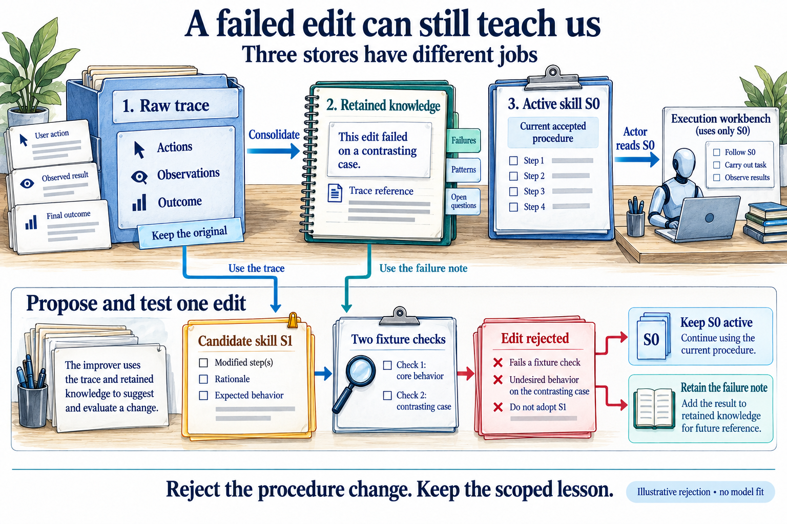

*The notebook can contain lessons from earlier failures and receives the new result after checking. It is not rolled back with a rejected skill edit. In this controlled activity, the actor reads the active skill; the improver can consult the trace and notebook. Record actual reads: role instructions alone do not enforce isolation. The rejected S1 is illustrative, not a measured course result. This is a small WikiSkill-inspired exercise with two fixtures and no new model fit.*

[Open the illustration at full size](assets/illustrations/knowledge-stores-v1.png).

[Lab 10.27: Keep traces, knowledge, and active skills separate](10_research_studio/08_skills_and_procedures/step_27_wiki/README.md).

## Repair the route. Check the meaning.

*The left map explains conditional routing; the notebook isolates an example bug and its proposed repair. Test the target failure and a regression case before retaining a graph, then freeze that version for the fresh case. A rejected edit leaves the prior graph in place. The fourth fixture checks meaning: a target component can have the expected numeric type and still be forbidden as an input. The graph and domain rule have distinct jobs. All four fixtures use a fit stub; the figure records no successful test or model training.*

[Open the illustration at full size](assets/illustrations/procedure-graph-v1.png).

[Lab 10.28: Refine a procedure graph](10_research_studio/08_skills_and_procedures/step_28_procedural_graph/README.md).

## A plausible click is not a checked result

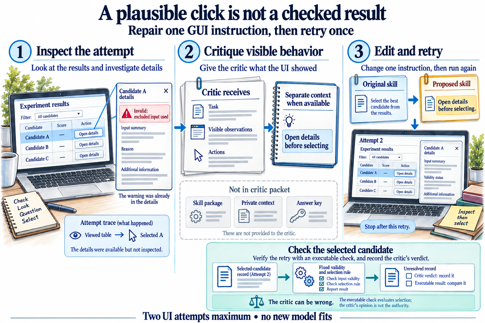

*The enlarged warning is a reader callout to information already present on the page. It was not observed in the pictured failed attempt and must not be added to that attempt’s critic packet. Supply only the declared visible trace, not the skill package or answer key. Use a separate critic context where available; otherwise label the shared context. The rule-check ticks name operations, not recorded passes. Compare the critic’s verdict with the executable result. This EvoSkill-inspired classroom task allows two actual UI attempts and no new model fits; the illustration is not an execution record.*

[Open the illustration at full size](assets/illustrations/gui-skill-repair-v1.png).

[Lab 10.29: Repair a skill for an experiment-results page](10_research_studio/08_skills_and_procedures/step_29_gui/README.md).

## Save work without losing the evidence

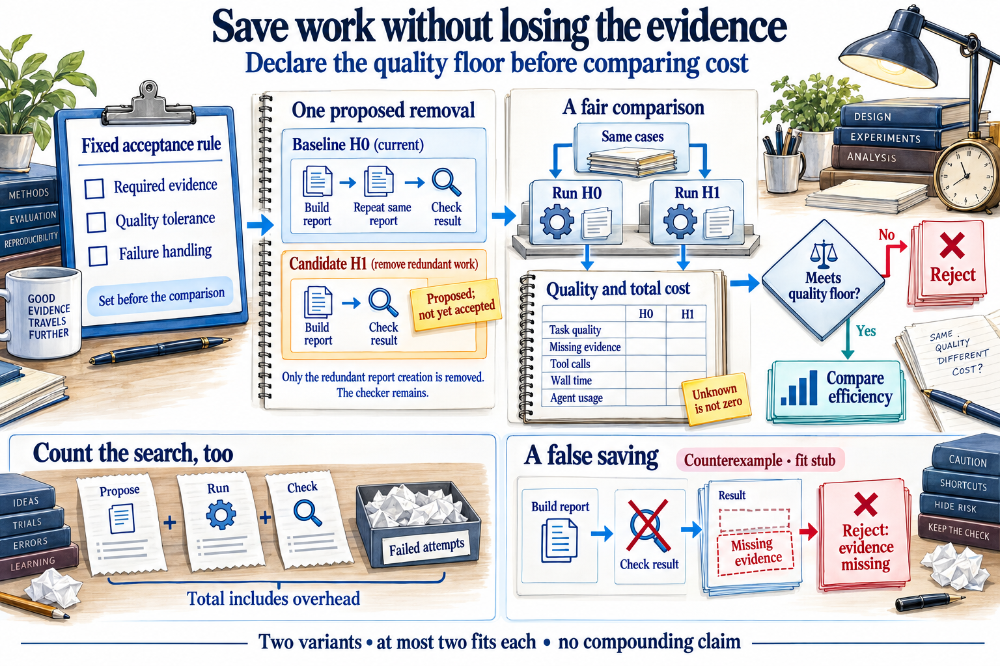

*This classroom change removes redundant report work; it is not an implementation of SoL-Pi’s four mechanisms. Both variants must meet the declared quality requirement before an efficiency conclusion is allowed. Fill the ledger with actual observations, include proposal and checking overhead, and keep unknown usage unknown. The failure tray represents recorded attempts whose costs remain in the ledger. The separate fit-stub example fails because required evidence is absent. The figure contains no measured saving or recursive compounding result.*

[Open the illustration at full size](assets/illustrations/quality-cost-v1.png).

[Lab 10.30: Reduce cost without hiding quality loss](10_research_studio/09_efficient_harnesses/step_30_cost_quality/README.md).

## Name the object that changes

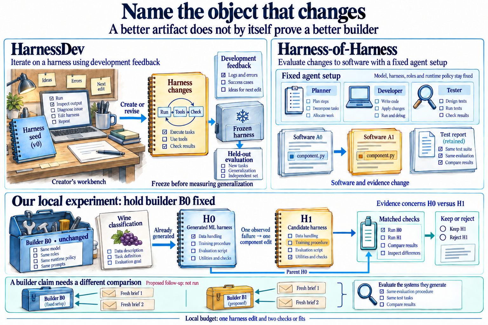

*Read the two source panels separately. A source system’s name does not identify its changed object. The lower experiment evaluates a generated ML harness under an unchanged builder. Both H0 and H1 feed the matched check before a decision; checklist marks name operations, not successful measurements. The final strip proposes a different experiment for a builder claim: the same fresh briefs are inputs to both builders, and their generated systems must be evaluated. It is not a completed extension to this lab’s two-check-or-fit budget. No model-weight update or general builder improvement is established.*

[Open the illustration at full size](assets/illustrations/builder-and-artifact-v2.png).

[Lab 10.31: Compare harness generation and harness improvement](10_research_studio/09_efficient_harnesses/step_31_harness_builders/README.md).

## A shorter memory can lose the state

*These counts are a synthetic teaching example. After adding three and removing one, the checkpoint is two; adding two more gives four. The faulty summary omits the removal. Do not pre-fill the actor’s answer or supply the checker’s result in its input. The two extra-description conditions change wording, not state transitions. The drawn counters and tally frame are props; the explicit event tape defines the arithmetic. This external-memory exercise does not reproduce S3Gym’s game or training protocols, and a shorter representation is not presumed better.*

[Open the illustration at full size](assets/illustrations/memory-interface-v2.png).

[Lab 10.32: Compare raw history and summarized memory](10_research_studio/10_feedback_and_transfer/step_32_memory_interface/README.md).

## Help can change behavior without changing weights

*The dataset names and field values are illustrative form fixtures, not real dataset results. The task cards specify required values; they are distinct from the added hints. Use a genuinely fresh fixture for the unassisted attempt and record any shared-context exposure. The stale-hint case asks what the actor actually does; no recovery is assumed. Compare all four traces with executable checks. This inference exercise illustrates assistance types discussed in Environments as Scaffold; it does not reproduce reinforcement learning or demonstrate a parameter update.*

[Open the illustration at full size](assets/illustrations/feedback-scaffolds-v1.png).

[Lab 10.33: Compare action hints and richer observations](10_research_studio/10_feedback_and_transfer/step_33_scaffolding/README.md).

## A polished answer can break the interface

*The displayed verdicts are expected outcomes of these constructed format fixtures, not archived test results. Run all four checks. Accepting the field labels does not establish that candidate A is valid or that a task succeeded. The parser remains unchanged. The source study concerns broader planning compatibility and actual model training; the local field repair is only an analogy. Its separate training inset does not turn this four-check activity into an LLM-training experiment.*

[Open the illustration at full size](assets/illustrations/harness-compatibility-v1.png).

[Lab 10.34: Keep model training aligned with its harness](10_research_studio/10_feedback_and_transfer/step_34_model_harness_fit/README.md).

## Change the system and the rule that schedules changes

*The write-surface rows are separate examples, not one sequential run. The evidence panel compares two exact version sets and requires a fresh diagnosis after the harness changes. Q1’s interface rule is an original classroom example. Follow the author walkthrough linked above for one executed case; the illustration itself is conceptual. Its accepted path shows structural inheritance, not a demonstrated empirical benefit. Preserve Q0 if the revision fails. This five-check simulation omits much of MetaRSI’s full architecture and does not train an LLM. The external evaluator and allowed write boundaries remain fixed.*

[Open the illustration at full size](assets/illustrations/operator-composition-v1.png).

[Lab 10.35: Compose changes to data, harness, and model](10_research_studio/11_composition_and_reference_learning/step_35_metarsi/README.md).

## A reference must show the work

*These are constructed trace fixtures. The usable-reference marks represent the example’s required execution evidence, not a completed source reproduction. Check the actual traces before diagnosis. The candidate must pass its quality check before proceeding to the two fixture evaluations; reject a failed quality check immediately. “Independent fixtures” means distinct current and prior cases, not proof of isolated agent contexts. The alternative orders are valid for this particular audit. The illustration leaves keep-or-reject open; use your actual gate results to decide.*

[Open the illustration at full size](assets/illustrations/checked-reference-v1.png).

[Lab 10.36: Diagnose failures with checked reference trajectories](10_research_studio/11_composition_and_reference_learning/step_36_harnessevolve/README.md).

## Compare the mechanism, then weigh the evidence

*The ledger is a template to fill, not a completed comparison. Link paper claims to their primary method and result sections; use raw execution records where available and mark missing evidence unresolved. Link local claims to the course’s actual records. The named folders carry no rank or inferred method assignment. The lower challenge needs two distinct checks: whether an improver changed and governed later work, and whether its downstream outcomes improved under a fair total-resource comparison. A task-score gain alone answers neither.*

[Open the illustration at full size](assets/illustrations/compare-research-systems-v1.png).

[Lab 10.37: Compare systems without flattening their differences](10_research_studio/12_evidence_and_open_questions/step_37_compare_systems/README.md).

## Faster proposals do not remove a slow check

*Use the explicit numbers, not the decorative clock faces, to read the example. The five scenarios are alternatives; they are not successive generations. Execution time is set to zero only for this teaching calculation. Restore measured execution, failures, retries, and other costs in a real ledger. The instant-proposal limit follows from the baseline and is not a sixth run. The gain units below are a separate illustration; an acceleration claim must also account for resources and difficulty. This is neither a forecast nor the economics paper’s calibrated model.*

[Open the illustration at full size](assets/illustrations/research-bottlenecks-v1.png).

[Lab 10.38: Reason about bottlenecks and acceleration](10_research_studio/12_evidence_and_open_questions/step_38_economics/README.md).

## From a new brief to a working harness

*Choose the scientific task before generating its harness. The two stations are tests to perform, not passed results. Record actual execution and a meaningful refusal. The tool-case checklist denotes components; it does not certify their behavior. Keep the required path within four CPU fits.*

[Open the illustration at full size](assets/illustrations/capstone-new-brief-v1.png).

[Lab 11.01: Build a harness for a new prediction brief](11_capstones/step_01_new_harness/README.md).

## Make a recursive experiment inspectable

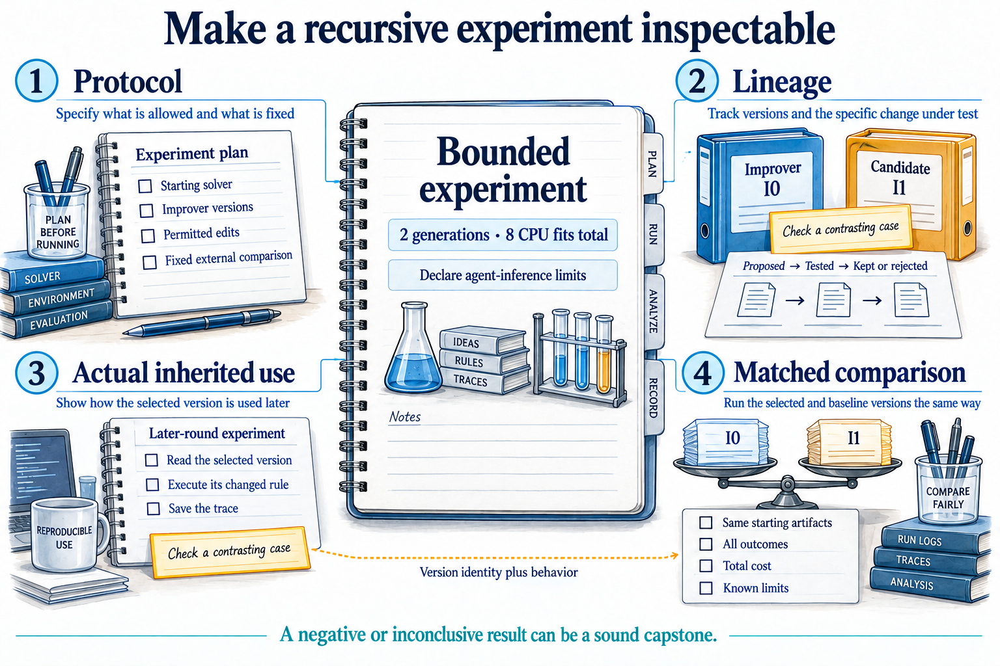

*These are the evidence needed to inspect the experiment. Distinguish a candidate trial from retained use; promote only through the declared decision and trace whichever version actually governs the next round. Match starting artifacts and external comparison rules. Eight fits is the total maximum across the two-generation protocol, with agent-inference limits declared separately.*

[Open the illustration at full size](assets/illustrations/capstone-recursion-v1.png).

[Lab 11.02: Run and audit a bounded recursive experiment](11_capstones/step_02_recursive_experiment/README.md).

## Change one dimension. Test its consequences.

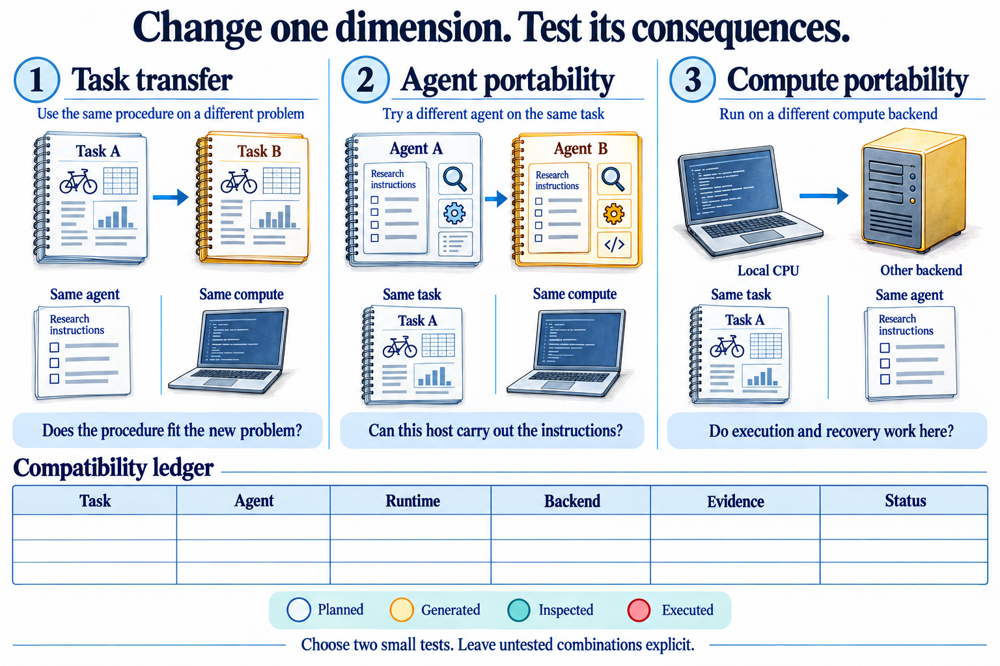

*Test these dimensions separately. Describe what changed in Task B; a different label does not establish task transfer. Choose two small tests you can actually run and leave other combinations explicitly untested. The pictured notebooks and machines are examples, not certified environments.*

[Open the illustration at full size](assets/illustrations/capstone-portability-v1.png).

[Lab 11.03: Test transfer and portability separately](11_capstones/step_03_portability/README.md).

## Turn a bold claim into a testable question

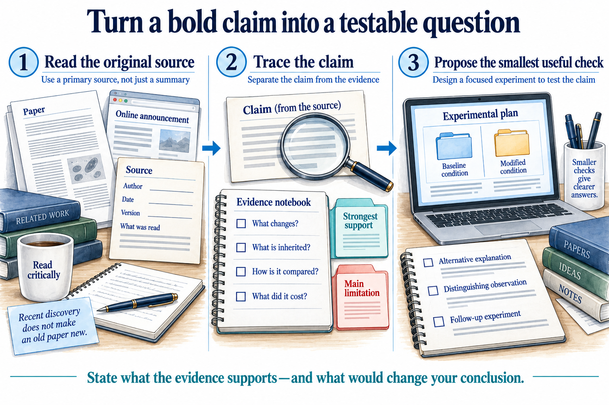

*A source announcement, supported result, and independent reproduction are different evidence. Record the source date, version, and what you actually read. State the strongest support and the main limitation, then propose an observation that could change your conclusion. No pictured source or experiment is a reported result.*

[Open the illustration at full size](assets/illustrations/capstone-audit-v1.png).

[Lab 11.04: Audit an unfamiliar RSI claim](11_capstones/step_04_external_audit/README.md).

## Let another person follow the evidence

*Keep the target out of model inputs; it belongs in the error check. Trace the added contrasting-case rule into an executed later action. The small strip can represent a candidate trial; it does not itself prove retention or benefit. Show the real comparison and decisions in the portfolio. The peer scene is illustrative: record a session only after it occurs and mark pending review honestly.*

[Open the illustration at full size](assets/illustrations/capstone-teach-back-v2.png).

[Lab 11.05: Teach the mechanism and defend the evidence](11_capstones/step_05_teach_back/README.md).

## Move the compute, preserve the evidence

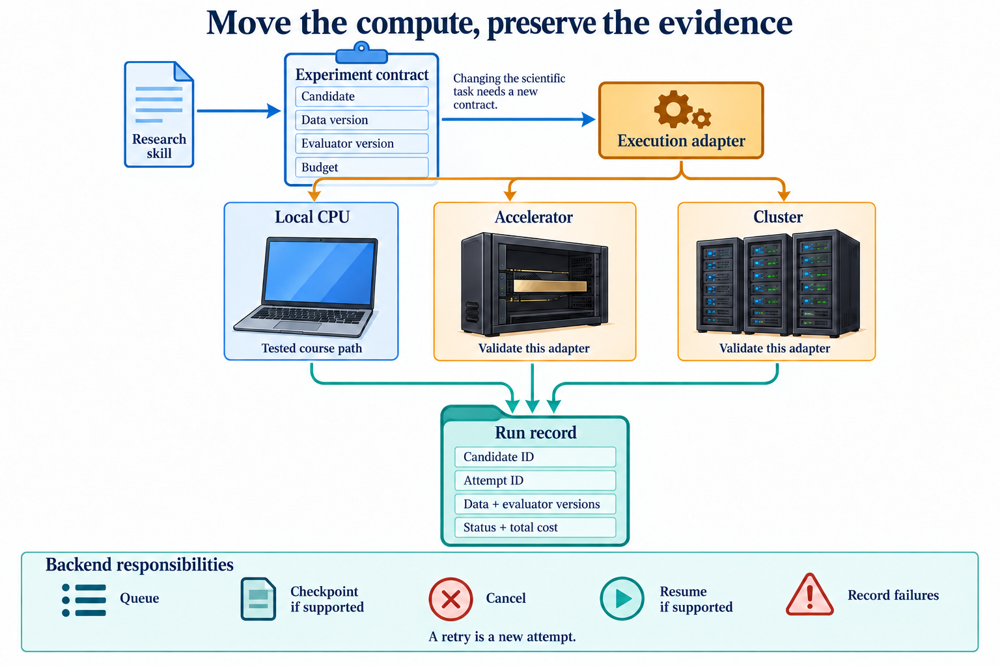

*The backends are alternatives. Preserve the scientific contract when moving the same experiment; declare a new one when changing the task, data, or comparison. A candidate can have several submission attempts, so record both identities and all failures. Checkpoint resumption applies only when the job supports it. The course tests the local CPU path; accelerator and cluster adapters still need tests on the actual systems.*

[Open the illustration at full size](assets/illustrations/compute-contract-v2.png).

[The larger-compute guide](compute/README.md).
