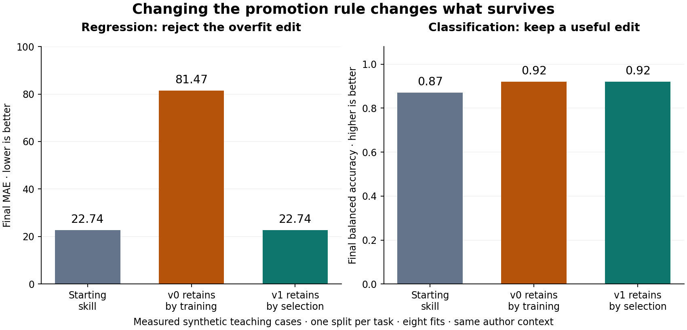

# Which change survives?

An unpruned tree fits every training row in these two synthetic tasks. That fact alone does not tell us whether to retain the research skill that chose it. This executed comparison changes one instruction in the improver: judge a proposed skill using training performance, or require better selection performance.

The author wrote both versions and the fixed tree proposal. Each version received identical data, parent and child task skills, and two fits per task. Eight fits ran in total. The matched candidates produced identical prediction bytes across the two arms. Different promotion decisions therefore come from the implemented rule, rather than different fitted candidates. This is a deliberately weak teaching control and a narrow revised gate, not a comparison of two general research agents.

## Read the result

| Task | Parent selection | Child selection | v0 retains | v1 retains |
|---|---:|---:|---|---|
| Synthetic regression, MAE ↓ | 24.20 | 71.88 | Tree skill | Linear skill |
| Synthetic classification, balanced accuracy ↑ | 0.86 | 0.88 | Tree skill | Tree skill |

The regression tree has training MAE 0. The old improver promotes it, even though it performs worse on selection rows. The revised improver refuses that edit. On the classification task, the tree improves both training and selection results, so both procedures retain it.

All four promotion decisions were [saved](FROZEN-DECISIONS.csv) and [hashed](FROZEN-DECISIONS.sha256) before final scoring. The already fitted models then produced these results; final scoring did not refit them.

| Task | Starting skill, final | v0 retained skill, final | v1 retained skill, final |
|---|---:|---:|---:|
| Regression MAE ↓ | 22.74 | 81.47 | 22.74 |
| Classification balanced accuracy ↑ | 0.87 | 0.92 | 0.92 |

The revised gate avoids a harmful edit in this regression case and permits a useful edit in this classification case. Avoiding a loss is useful, but it is not a gain over the starting solver. See the unrounded [results](FINAL-RESULTS.csv).

## Follow the three objects

The solver is the fitted ML pipeline. The [task skill](skills/TASK-SKILL-parent.md) tells the process which model family to fit and how to record its evidence. The proposed [child skill](skills/TASK-SKILL-child.md) changes that family to a tree. [Improver v0](skills/IMPROVER-v0.md) and [improver v1](skills/IMPROVER-v1.md) decide whether to retain that task-skill change.

The [change proposal](CHANGE-PROPOSAL.md) uses labelled numerical fixtures to motivate the revision. The actual ML cases are generated afterward from the seeds declared in the [protocol](PROTOCOL.md). Each later round reads the exact retained improver file before fitting. Inspect the regression v1 [before record](rounds/regression/v1/BEFORE.md) and [decision](rounds/regression/v1/DECISION.md): the changed instruction governs an actual rejection. File identity and changed behavior are both present.

The driver implements only these two explicit instruction choices. It is not a general Markdown executor. The author supplies the revision; the system does not discover or write its own improver here.

## Inspect or repeat

Ask your coding agent to read this page, the protocol, and the retained driver in the development record. Have it recompute the metrics from the prediction CSVs and compare row identities with the saved case tables. To repeat the experiment, it creates a new workspace and uses the recorded environment and seeds. The driver refuses to overwrite this workspace. Students do not type Python or configuration.

The data, skills, rejected child, locally serialized models, predictions, [nine child-command records](COMMANDS.csv), [fit costs](FIT-COSTS.csv), and [source identity](SOURCE.md) are retained. The chart was plotted from the measured results. Load serialized models only from the locally generated, recorded experiment; the prediction CSVs are sufficient for metric review.

## What remains uncertain

Two deliberately chosen task families and one split per task do not establish general superiority. These cases were fresh within the execution sequence; the author chose their structure to illustrate overfitting and nonlinear classification. The author also wrote both procedures in one context. Separate Python processes do not remove that shared context.

Final data is publicly readable to the host. Freezing decisions gives a cooperative workflow boundary, not a secret evaluation service. There is no autonomous revision, language-model weight update, repeated recursive lineage, acceleration result, or student assessment. Equal fit allowances do not imply equal total research cost: hosted inference and authoring costs are unavailable. See the [claim audit](CLAIM-AUDIT.md).

The lasting idea is simple: a research process must decide which changes deserve to survive. An improver can change that decision without changing the external task or evaluator. The decision still needs evidence beyond the case that inspired the revision.
