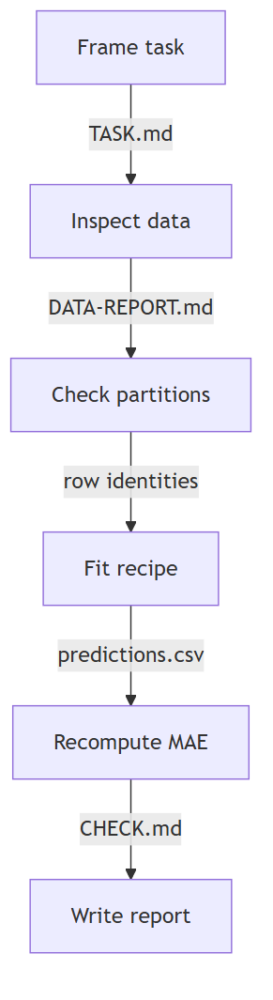

# Clean-workspace course walkthrough

The authoring agent cloned checkpoint `75e9988` from GitHub, installed the documented dependencies in a new environment, and worked in a separate sibling directory. These files are the actual outputs, copied into the course for review. All 257 copied files matched their original bytes before this index was added. Git may normalize text line endings; numerical content and source identity remain recorded.

This is a selected author walkthrough. It is not a completed run of all 101 labs or a study with students. New Python processes do not create independent agent contexts. Prediction, quiz, and teach-back checkpoints were not attempted by a learner.

## What ran

| Stage | Evidence | Result |
|---|---|---|
| Task and setup | [Task brief](00-01/TASK.md), [capabilities](00-02/CAPABILITIES.md), [data report](00-02/DATA-REPORT.md) | Fresh clone and environment; actual rows and data chart |
| One experiment | [Arithmetic check](00-04/HAND-CHECK.md), [baseline](00-03/trial-001/RESULT.md) | Actual predictions and recomputed MAE |
| Fixed process and skill | [Procedure](01-01/PROCESS.md), [skill](01-03/BASELINE-SKILL.md), [repeatability](01-02/REPEATABILITY.md) | New fits reproduced identical prediction bytes |
| Invalid evidence | [Checker refusal](01-04/REFUSAL.md) | A training-row ID substituted into selection predictions was rejected |
| Controlled changes | [Model comparison](02-01/COMPARISON.md), [feature comparison](02-03/COMPARISON.md) | Recorded gains and regressions under fixed scientific choices |
| Bounded loop and resume | [Checkpoint](02-05/CHECKPOINT-1.md), [requests](02-05/requests.csv), [comparison](02-05/COMPARISON.md) | Three attempts survived restart; fourth request refused |
| Graph and domain | [Checks](STRUCTURE-CHECKS.md), [repair trace](03-04/ineffective/TRACE.md), [recovery](03-05/RECOVERY.md) | 25 expected checks matched; no extra fit for report repair |
| Fixed system | [Invocation](05-01/EXECUTION.md), [leakage refusal](05-01/LEAKAGE-REFUSAL.md) | One checked baseline; leaked fixture stopped before fitting |

The foundation stage ran 16 model fits and 38 child commands. The graph/domain stage added one baseline fit. No final evaluation has run in this journey yet. [Command logs](COMMANDS.md) retain expected failures and wall time; candidate ledgers separately retain fit time. Hosted-agent cost remains unknown.

The diagram and actual data plot were rendered and visually inspected. A valid plan is still different from a trace of execution.

## What this pass found

The old shared comparison report displayed a twelve-attempt ceiling even when the lesson declared three. The maintainer obeyed the smaller budget, and the generated controller enforced it. The confusing early reports remain here as evidence. The shared tool was then changed in the authoring checkout to persist the lesson limit, recover it across processes, refuse a changed limit, and detect accidental contract edits. The new regression test passed as part of the 16-test suite. The clean clone stays on its original source so that existing experiment contracts remain valid.

Several progress notes were missing from the first driver output. They were added during artifact review and explicitly labelled as reconciled notes rather than contemporaneous checkpoints. The actual resume checkpoint was saved before its later fits. The typed availability examples are synthetic; the source bike table has no archived forecast issue times.

The route has not yet completed generated-harness or improver-comparison stages. Lab-by-lab coverage and remaining omissions are tracked in [the validation record](../../../../how-did-i-generate-it/rsi/validation/CLEAN-JOURNEY-RESULTS.md).
