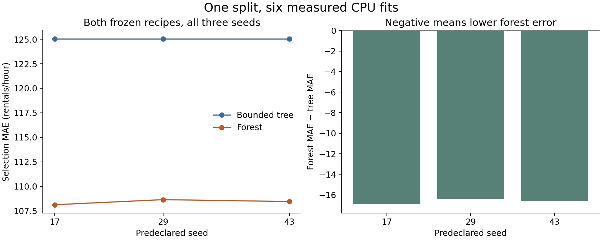

# Loop, routing, and repeated-measurement walkthrough

Thirteen CPU fits ran under a [protocol](PROTOCOL.md) pushed before execution at `c9f9cd9a6dd49b1187b8010dc71fd331a46fa7e9`. All 26 fit/check commands exited successfully. The exact driver, runtime, checker, plans, predictions, costs, and 146 original files are preserved and hashed in [the manifest](MANIFEST.csv). This index was written after the run.

Publication review found two broken relative links inside the unchanged copied data cards. Their original source-description files were added under `05-02/source/` afterward, with a separate [supplement manifest](PUBLICATION-SUPPLEMENTS.csv). They restore navigation; they are not additional experiment results. The original run files and manifest remain unchanged.

**Scope correction:** the original 05.04 driver constructed its transition table after the fit and check. Its handoff fixtures executed, but the table does not prove that saved state controlled those commands. The separate [correction protocol](../../../../how-did-i-generate-it/rsi/validation/LIVE-COORDINATOR-PROTOCOL.md) led to a [completed one-fit controller test](../live-coordinator/README.md). Do not infer live coordination from a retrospective trace.

## What actually ran

| Lab | Evidence | Measured observation |
|---|---|---|
| 02.06 | [Plan](02-06/COMPARISON-PLAN.md), [pre-fit choice](02-06/DECISION-B.md), [comparison](02-06/COMPARISON.md) | Two intentional baseline repeats retain MAE 159.947912. The feedback arm's second fit uses linear/calendar and retains 109.807668. Two fits per arm. |
| 05.02 | [Routes](05-02/ROUTING.md), [route checks](05-02/ROUTE-CHECKS.csv), [class and partition checks](05-02/COMPARISON.md) | The majority wine baseline has accuracy 0.871473 but positive recall 0 and balanced accuracy 0.5. All 1,359 unique input vectors stay within one partition. Unknown and missing-type requests trigger no fit. |
| 05.03 | [Context](05-03/CONTEXT.md), [two checks](05-03/CONTEXT-CHECKS.csv), [recovery](05-03/CONFLICT-AND-RECOVERY.md) | The real bike ledger has one charged fit in a two-attempt contract. A stale claim of three remaining attempts is rejected. The last attempt was not spent. |
| 05.04 | [Reconstructed transitions](05-04/TRANSITIONS.csv), [packets](05-04/CHECK-PACKETS.csv), [interpretation](05-04/INTERPRETATION.md) | One checked baseline and three handoff fixtures. A genuinely checked earlier candidate has identical predictions but wrong identity, so its handoff fails. Live state control requires the separate correction. |
| 05.05 | [Ablation plan](05-05/ABLATION-PLAN.md), [six outcomes](05-05/OUTCOMES.csv), [interpretation](05-05/INTERPRETATION.md) | Removing one of two overlapping guards has no effect on the leaked fixture. Removing both in a separate two-case follow-up reaches the dry-run stub. No leaked model is trained. |
| 08.01 | [Plan](08-01/REPETITION-PLAN.md), [all pairs](08-01/PAIRED-RESULTS.csv), [interpretation](08-01/INTERPRETATION.md) | Forest minus tree MAE is −16.920, −16.403, and −16.593 at the three predeclared seeds. All six fits remain in the result. |

The figure plots actual measurements and was inspected at full size. It is a scientific plot, not an Imagen illustration. The mean paired difference is about −16.638 rentals/hour. All pairs use one fixed split; this does not quantify uncertainty across datasets or future periods. The tree and forest differ in family and complexity.

## Costs and limits

The original run used 4.611563 recorded fit seconds, 77.637044 summed child-command wall seconds, and 83.428121 parent seconds through reporting. These timings overlap. See [costs](COST.md), [all fits](ALL-FITS.csv), [commands](COMMANDS.csv), and [source identities](SOURCE.md). Implementation, reasoning, and review costs are not fully metered.

The additional ten-fit unequal-budget experiment in 02.06 was discussed, not executed. The stale-note and component-removal exercises are controlled fixtures. The router is fixed code written by the agent. The author already knew several public baseline outcomes. No independent agent, learner quiz, LLM weight update, recursive improvement, final evaluation, GPU job, or cluster run is established.
