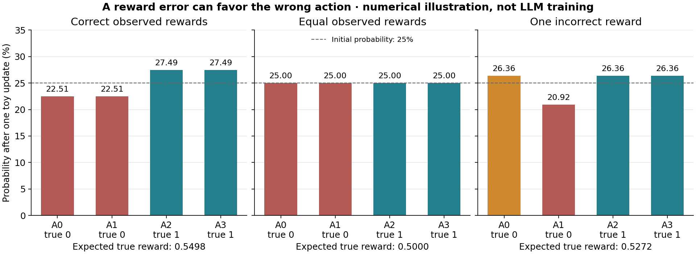

# Executed laptop activities for the ScienceBuddy sequence

This author run covers the local activities in labs 10.22–10.26. It reuses actual saved wine predictions, tests reporting procedures, calculates a small policy update, simulates paired state, and audits source-reported metrics. It performs **no new model fits and no LLM training**.

The [protocol](PROTOCOL.md) and [driver](driver.source.py) were [pushed before execution](https://github.com/dlmastery/simple-coding-harness/commit/367d333d750b791aedd8470683fdc6c3d1d0854f). The [command output](EXECUTION.txt) and [status](EXECUTION-STATUS.txt) record exit 0 and 3.133 seconds of shell wall time. The driver took 1.929 seconds inside that interval. Authoring and inference costs are unknown. All 63 workspace files were copied and hash-checked in the [manifest](COPY-MANIFEST.csv).

## Feedback becomes a check

The [request](10-22/REQUEST.md) is an explicitly synthetic classroom fixture. The [task](10-22/TASK.md) and [rubric](10-22/RUBRIC.md) make its requirements observable. A complete report passes; a copy without minority recall fails. Both verdicts and their criteria are retained.

The reused majority model has ordinary selection accuracy 87.15%, but zero recall on high-quality wines. The logistic model has lower ordinary accuracy, 73.67%, while its minority recall is 75.61% and balanced accuracy is 74.50%. These values come from the retained 319-row selection predictions, whose identities and targets were checked against the pinned data. They show why reporting only ordinary accuracy can hide the failure the fixture asks about.

The [conceptual GWAS note](10-22/GWAS-NOTE.md) completes the additional reading exercise with a labelled invented example; it is not a biological analysis.

## A reporting procedure changes

The [parent](10-23/REPORT-SKILL-parent.md) and [child](10-23/REPORT-SKILL-child.md) are external instructions interpreted by an author-written reporter. The child adds class-wise evidence, balanced accuracy, limits, and refusal of incomplete evidence. This is deterministic harness behavior, not an independent language-model prompt trial.

| Skill and evidence | Task complete | Interpretation |
|---|---|---|
| Parent, complete inputs | No | Required class results and limits are absent |
| Child, complete inputs | Yes | Values and source links satisfy the rubric |
| Parent, incomplete inputs | No | Partial evidence cannot complete the comparison |
| Child, incomplete inputs | No | The procedure correctly reports missing evidence |

An honest refusal is separate from task completion. Inspect [all six verdicts](REPORT-VERDICTS.csv), the [edit proposal](10-23/CHANGE-PROPOSAL.md), and the [unexecuted length-only variant](10-23/LENGTH-ONLY-VARIANT.md). The incomplete fixture deliberately removes all rows with a positive true label. The child does not recreate or invent them to pass.

## A toy policy follows its reward

The [objective](10-24/OBJECTIVE.md) uses four enumerated actions, softmax probabilities, and one explicit gradient step. The three cases retain every reward, advantage, gradient, logit, and probability. Central finite differences agree with the analytic gradient within 8e-11. Equal rewards produce no update.

In the wrong-reward case, a truly unrewarding action gains probability. Aggregate expected true reward still rises, but less than with correct rewards. Read the [interpretation](10-24/INTERPRETATION.md) and [values](10-24/SUMMARY.csv) before calling the entire update harmful. These calculations do not implement token-level GRPO or train a language model.

## Keep both versions in the result

The [four invented pair values](10-25/PAIR-VALUES.csv) and [transition trace](10-25/TRANSITIONS.csv) show a best harness changing after a model-label update. The placeholder causes no parameter learning. The fixed table is evaluated four times and cached; later selections reuse those values. [PAIRS.md](10-25/PAIRS.md) explains the constructed interaction.

The [primary-source audit](10-26/RESULTS-AUDIT.md) keeps the paper's different comparisons separate. Its [arithmetic](10-26/PAPER-ARITHMETIC.csv) is computed from published rounded inputs. Those values are not combined with the wine measurements or invented pair table. The [larger-training plan](LARGER-TRAINING-PLAN.md) specifies the missing scientific, resource, checkpoint, and backend work without launching anything.

## Scope of this check

The actual execution comprises six report checks, three numerical cases, four synthetic pair evaluations, and three source-result calculations. The explanatory, conceptual, source-audit, and extension notes were completed afterward from the outputs and inspected sources. Learner predictions, quizzes, and teach-back were unattempted. No domain expert, independent coding-agent context, new dataset, GPU, or distributed backend was tested. Passing the local rubric is not evidence of general scientific competence.
