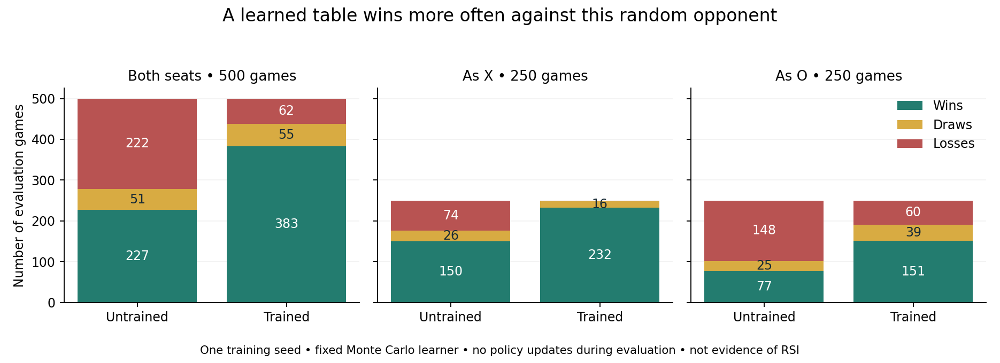

# Actual learning from a small self-play run

This author run executed 3,000 training games and 1,000 frozen evaluation games on 20 September 2026. A shared tabular policy played both sides of tic-tac-toe. The fixed Monte Carlo learner made 22,287 state-action value updates. No neural-network or language-model weights changed. No improvement procedure changed.

The [protocol](../../../../how-did-i-generate-it/rsi/validation/SELF-PLAY-PROTOCOL.md) was saved before execution. The [run contract](RUN-CONTRACT.md) records the source hash and fixed settings. The preceding interaction-only lesson remains in Git commit `e3428ec`; it was not a training run.

## What happened

| Policy | Wins | Draws | Losses | Games |
|---|---:|---:|---:|---:|
| Untrained | 227 | 51 | 222 | 500 |
| Trained | 383 | 55 | 62 | 500 |

Against this random opponent, the observed win fraction changed from 45.4% to 76.6%. The seat matters: the trained policy won 232 of 250 games as X, but 151 as O. It still lost 62 games overall. These are counts from one declared seed schedule, not a confidence claim across training seeds or opponents. Baseline and trained players use equal schedules but can visit different positions.

## Follow one update

In training game 0, X placed its first mark in the center. O eventually won. X's center-move value changed from 0 to −0.2: the old value moved 20% toward a terminal return of −1. O's first move changed from 0 to +0.2 because its return was +1. Inspect [training-updates.csv](training-updates.csv), then reconstruct that game from the saved boards and moves.

This does not mean the center is intrinsically bad. A Monte Carlo return reflects the whole subsequent trajectory, including both players' exploratory choices. Later games can revise the estimate. A single credited action is not a causal proof that the action caused the win or loss.

## Inspect the artifacts

| Artifact | Evidence |
|---|---|
| [Initial policy](initial-policy.csv) and [trained policy](trained-policy.csv) | Missing entries mean zero. The trained table stores 6,648 visited state-action values; 5,871 are nonzero. |
| [Training games](training-games.csv) and [updates](training-updates.csv) | Every terminal outcome, move, return, and before/after value. |
| [Untrained games](untrained-evaluation-games.csv) and [moves](untrained-evaluation-moves.csv) | Interaction without a retained update. |
| [Trained games](trained-evaluation-games.csv) and [moves](trained-evaluation-moves.csv) | Frozen learned behavior, including every failure. |
| [Counts](evaluation-counts.csv) and [policy hashes](evaluation-policy-hashes.csv) | Scores by seat and equal before/after evaluation hashes. |
| [Cost](cost.csv) | 0.515 seconds inside the runtime on this machine; the shell command took 1.46 seconds. This excludes authoring, tests, plotting, and inference. Inference cost is unknown. |
| [Source snapshot](self_play.source.py) | Exact implementation bytes used by the recorded run. |

Four separate behavior checks passed before the experiment in 0.20 seconds of pytest time. They cover game validity, player-relative updates, tiny-run repeatability, frozen evaluation, and refusal to overwrite evidence. Those fixtures are outside the 4,000-game experimental budget. The checks do not certify an adversarially isolated evaluator.

## What this establishes

The policy retained parameter changes caused by self-generated game experience. Those changes improved its observed results against the declared random opponent. This is a small executed self-play learning example under a fixed trainer. It does not establish optimal play, SQL-Zero reproduction, broad task transfer, autonomous agent training, or recursive self-improvement. This is one author's execution, not a student assessment or independent replication.
