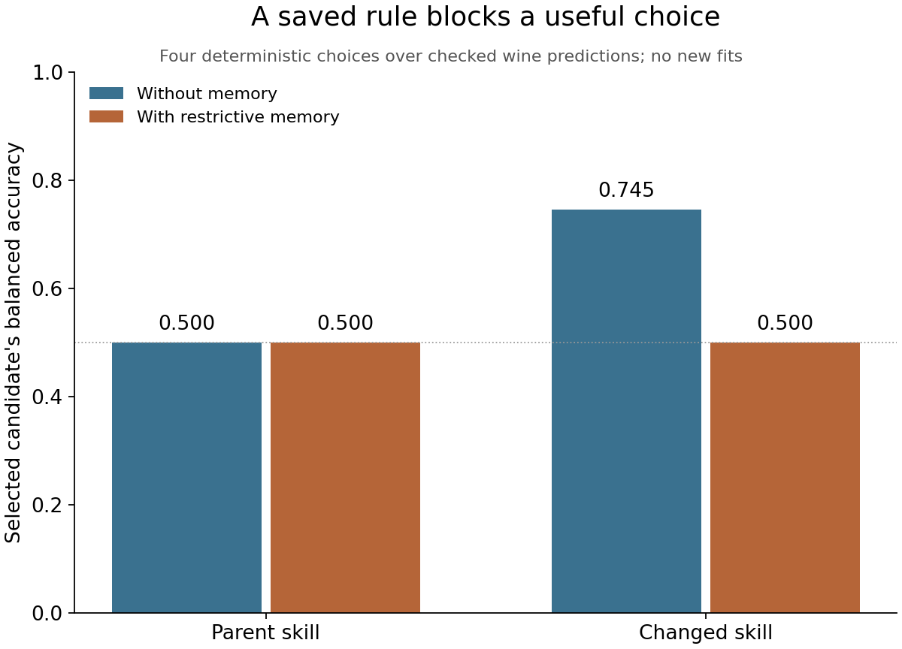

# What changed, and what did it improve?

This author walkthrough separates output correction, reflection, external memory, task-skill changes, direct instruction modification, and evaluation. Eight new CPU fits ran. Other activities explicitly replay checked predictions or exercise fixed decision rules. No LLM weights changed.

The [protocol](PROTOCOL.md) and corrected driver were pushed at `d2d3488a156b917b68b0e8688f8641c1e4351bf7` before execution. An [earlier attempt](../self-star-first-attempt/FAILURE.md) stopped before fitting because its regression target equality check was too strict for decimal round trips. The [precision audit](SELF-STAR-PRECISION-AUDIT.md) explains the measured difference and the limited correction. The failed attempt remains intact.

## Follow the distinctions

| Lab | Executed activity | What the evidence supports |
|---|---|---|
| 07.01 | [Corrected report](07-01/CORRECTED-REPORT.md), [unchanged procedure](07-01/FIXED-REPORTER.md), [later trace](07-01/LATER-TRACE.md) | MAE 1 was corrected to 159.947912 from saved predictions. The unchanged weak reporter repeats another supplied wrong score in a later process. An output correction does not automatically change a future procedure. |
| 07.02 | [Reflection](07-02/REFLECTION.md), [two replay checks](07-02/TWO-CHECKS.csv), [retention](07-02/RETENTION.md) | The tree loses on regression selection MAE but wins on classification balanced accuracy. Replayed evidence challenges both “always use a tree” and “never use a tree.” These are known cases, not fresh validation. |
| 07.03 | [Retained memory](07-03/MEMORY-v1.md), [decision](07-03/DECISION.md), [outcomes](07-03/OUTCOMES.csv), [scope refusal](07-03/SCOPE-CHECK.csv) | A later process reads the saved rule and the metric direction. It selects the cached linear candidate instead of the deliberately weak numerical control's majority choice. Incompatible metric names trigger clarification. This is a constrained interpreter, not measured LLM learning. |
| 07.04 | [One proposed edit](07-04/CHANGE-PROPOSAL.md), [frozen identities](07-04/FROZEN-SKILLS.csv), [four-fit comparison](07-04/COMPARISON.csv) | Parent retains bike MAE 125.049488; child retains 109.807668. Only the task skill changes; the canonical improver hash stays fixed. |
| 07.08 | [Two cases under both versions](07-08/TWO-CASE-CHECKS.csv), [active version](07-08/ACTIVE.md) | The modified reporter recomputes the score, repairs the wrong summary, and preserves the valid result. Same predictions and external evaluator; no new fits. |
| 08.03 | [Actual costs](08-03/ACTUAL-COSTS.csv), [accounting and break-even illustration](08-03/COST.md) | Both bike procedures use two fits and two checks. Counting only the retained candidate would omit one attempt per arm. Total inference and authoring cost remains unknown. |
| 08.04 | [Four arms](08-04/FOUR-ARMS.csv), [interaction](08-04/INTERPRETATION.md), [separate fifth check](08-04/SEPARATE-FOLLOWUP.csv) | A restrictive memory has no effect on the parent but blocks the changed skill's useful choice. Removing it in a separate follow-up restores that choice. Outcomes reuse actual cached predictions. |
| 08.05 | [Frozen interface map](08-05/INTERFACE-MAP.md), [four wine fits](08-05/COMPARISON.csv), [decision](08-05/DECISION.md) | Parent retains balanced accuracy 0.632611; child retains 0.744955. The skills are unchanged and both class recalls are retained. The author knew prior wine outcomes, so this is a transfer replay. |
| 08.06 | [Metric audit](08-06/METRICS.csv), [rejection and restoration](08-06/PROMOTION.md), [separate objective](08-06/NEW-ACCURACY-TASK.md) | Majority accuracy 0.871473 coexists with positive recall 0 and balanced accuracy 0.5. A labelled invalid active instruction is replaced with the exact prior valid instruction. No evaluator is changed to manufacture a win. |

The four bars show decisions over the same checked candidates. They are not four additional fits or an experiment on LLM prompt conflicts. The declared interpreter applies the restrictive memory after the skill's proposed choice. The chart was generated from the retained CSV and visually inspected. It is a scientific plot, not an Imagen illustration.

## Inspect the actual skill change

The [parent task skill](07-04/skills/PARENT.md) uses a constant first and a tree second. The [child](07-04/skills/CHILD.md) replaces only that second-choice rule with a residual-slice diagnosis. Both retain the better of two candidates under the declared metric.

For bike, the child compares errors across hours. For wine, its predeclared adapter groups by alcohol quartiles computed from training features. Wine's lowest-error group has no baseline errors, so the frozen positive-over-zero rule gives an infinite ratio and chooses linear. This is an explicit teaching heuristic. Grouped ordinary classification errors and balanced accuracy can emphasize different failures; the replay does not prove the heuristic is optimal.

An [improver revision](07-04/UNEXECUTED-IMPROVER-PROPOSAL.md) and a [new development proposal](08-05/NEXT-DEVELOPMENT.md) remain unexecuted. Neither is silently promoted into the completed comparison. A better task skill is not evidence that the method for improving skills became better.

## Provenance and limits

All 18 child commands returned exit 0. The eight new fits used 0.812581 recorded fit seconds. Summed child wall time is 39.233176 seconds; the parent recorded 41.616836 seconds through reporting. These timings overlap. The earlier pre-fit failure and subsequent author review add overhead that is not fully metered. See [costs](COST.md), [all fits](ALL-FITS.csv), [commands](COMMANDS.csv), and [source identities](SOURCE.md).

All 160 original execution files were copied and hash-verified using [the manifest](MANIFEST.csv). The plot and plotting source were added afterward and have a [separate manifest](POST-RUN-MANIFEST.csv). [Copied inputs](INPUTS.csv) point back to prior evidence. No closed workspace was reopened.

The fixed interpreters test specific rules, not arbitrary language-model behavior. No new native coding-agent context, fresh transfer test, private evaluation service, final evaluation, student quiz, teach-back, GPU job, cluster job, autonomous improver revision, or recursive acceleration is established.
