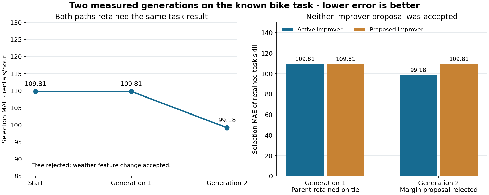

# Two generations, with no accepted improver revision

This author walkthrough ran twelve real bike-demand fits: four under a fixed improver and eight in matched comparisons of proposed improver revisions. It exercised labs 09.02 and 09.06, including proposal checkpoints, resumption, rejection, ancestry checks, and stopping. **The task skill improved; the active improver did not change.**

The [protocol](PROTOCOL.md) and both runner sources were [pushed before execution](https://github.com/dlmastery/simple-coding-harness/commit/3fa50ec7ea34b81abaa67f3e19583d4535d34e10). Earlier public bike results motivated the cases. These are new executions of known teaching choices, not a blind evaluation. The author initially expected the tree to expose training-based overfitting. Its actual training result contradicted that expectation. No rule, case, or budget was changed to obtain an improver promotion.

## What happened

| Generation | Task-skill proposal | Training MAE, parent → child | Selection MAE, parent → child | Result |
|---|---|---:|---:|---|
| 1 | Calendar linear model → calendar tree | 55.728 → 65.184 | 109.808 → 125.049 | Both promotion partitions reject the tree |
| 2 | Calendar linear model → calendar and weather linear model | 55.728 → 53.041 | 109.808 → 99.176 | The unchanged strict-improvement rule accepts the child |

The source tree is depth-limited and has a minimum leaf size. It does not interpolate training data. A tree need not have lower training error than a linear model with its particular preprocessing and features. Inspect actual measurements before assuming a model will illustrate overfitting.

The proposed selection-based improver in generation 1 retained the same task skill as the active training-based improver. The fixed outer rule retained the parent improver on that tie. Generation 2 therefore inherited the original training-based improver. Its proposed descendant added a 15% relative-improvement requirement. The weather change reduced training MAE by about 4.82%, so that descendant rejected a task-skill change that the active rule accepted. The outer selection comparison rejected the margin proposal. Neither proposed improver became active.

The left panel shows the same retained-task trajectory for both paths. The right panel compares the task skills retained by each improver arm. These are selection measurements on one known public task. No confidence interval, independent generalization result, or recursive acceleration is implied.

## Follow the evidence

| Record | What it establishes |
|---|---|
| [Lineage](LINEAGE.md), [results](RESULTS.csv), and [state](STATE.csv) | Proposed and retained objects remain distinct across the two generations |
| [Fixed-round decisions](baseline/generation-1/ARM-DECISIONS.csv) and [second round](baseline/generation-2/ARM-DECISIONS.csv) | The same improver hash governs both rounds |
| [First proposal checkpoint](recursive/checkpoints/0-proposed.md) and [second proposal checkpoint](recursive/checkpoints/1-proposed.md) | A process exited after proposing; the active pointer still named the accepted parent |
| [First resume](outer-commands/05-resume-status-1.md) and [second resume](outer-commands/08-resume-status-2.md) | A later process loaded those states before comparison |
| [Generation-2 inherited instruction](recursive/generation-2/active/BEFORE.md) | The accepted parent was actually read before the later fits and decision |
| [First improver decision](recursive/generation-1/DECISION.csv) and [second decision](recursive/generation-2/DECISION.csv) | Both candidate revisions remained inactive |
| [Invalid active-pointer check](diagnostics/ACTIVE-POINTER-REFUSAL.md) and [rejected-child replay](diagnostics/REJECTED-CHILD-REPLAY.md) | Ancestry contradictions were detected without changing real active state |
| [Third baseline generation](outer-commands/10-refuse-fixed-generation-3.md) and [third recursive proposal](outer-commands/11-refuse-recursive-generation-3.md) | Requests beyond the declared limits were refused before fitting |
| [Fit ledger](FITS.csv), [costs](COSTS.csv), and [outer commands](outer-commands/COMMANDS.csv) | Twelve reserved attempts and every recorded command, including expected refusals |
| [Copy manifest](COPY-MANIFEST.csv) and [source hashes](SOURCE-HASHES.csv) | All 153 original workspace files were copied and hash-checked |

Each fit folder retains training and selection predictions, recomputed checks, scores, and cost. Matched arms produced identical prediction bytes. Local fitting took 2.113 seconds in total; child fit processes took 49.622 seconds including startup. Fit time is part of child-process time. Outer command time also contains those children; do not add these overlapping totals. Authoring and inference costs are unknown.

The clean exit after a proposal tests resumption between completed operations. It does not test forced termination during a fit or recovery of a live lock. The protocol and initial state predate execution; this explanatory README and the consolidated lineage were written afterward from the retained artifacts.

## What this supports

The run supports bounded task-skill improvement under a fixed improver, matched testing of improver proposals, correct rejection, and retention of accepted ancestry. It does **not** demonstrate an accepted revised improver governing the next generation. The directory named `recursive` identifies the planned experiment arm, not a successful RSI result.

The external comparison uses the same selection partition as one internal rule. It is development evidence, not an independent evaluation of improver effectiveness. No final predictions were generated. The author chose the edits and the schedule; a constrained interpreter executed their declared instructions. A fixed outer controller performed improver selection. No autonomous invention, model-weight learning in the coding agent, independent agent context, student assessment, or acceleration is established.

For a positive inherited-revision example, inspect the separate [matched improver study](../clean-journey/09-05/README.md) and [inherited-instruction check](../inherited-improver/README.md), including their limits. They do not turn this run's rejected proposals into accepted ones. Any further two-generation study needs a separate protocol and must retain this outcome.
