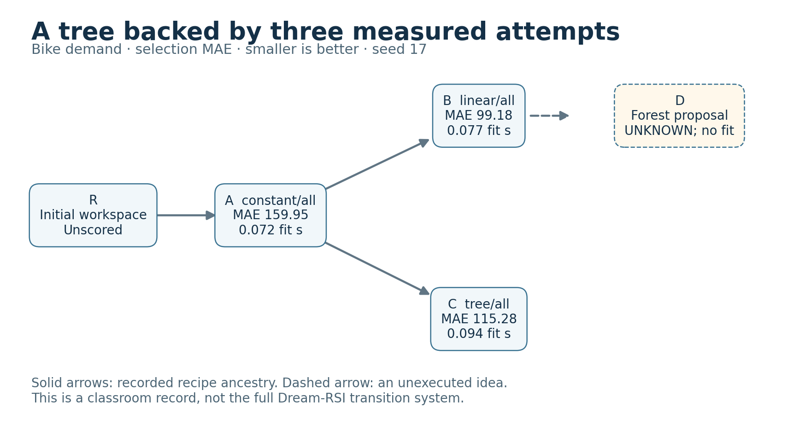

# Discovery, replay, and a return to real fitting

Author walkthrough for labs 10.07–10.09, executed on 21 September 2026. Three bike fits created a recorded search tree. Replay compared two fixed policies without fitting. Four fits then compared those policies on newly generated regression data.

**The baseline policy won both comparisons. No revised policy was promoted.** This is evidence for the executed classroom mechanism, not a demonstration of successful recursive policy improvement.

## Three measured nodes

Before fitting, the [plan](discovery/PLAN.csv) left every outcome blank. A used the training median. After inspecting it, the actor recorded [two branch choices](discovery/BRANCH-DECISION.md): linear and tree models, each with the same permitted inputs and seed 17. Their conceptual parent is baseline A. Three fits and three result checks completed; no bike final evaluation ran.

*Values come from the [frozen tree](discovery/TREE.csv). Smaller selection MAE is better. D remains an idea with no fit or score. These parent links record recipe ancestry; they do not implement the source paper's saved-workspace and node-eligibility transitions. The [first rendering and correction](discovery/FIGURE-REVIEW.md) remain available.*

| Node | Recipe | Bike selection MAE | Fit seconds |
|---|---|---:|---:|
| A | Training-median baseline, all inputs | 159.947912 | 0.072169 |
| B | Linear, all inputs | 99.175924 | 0.076807 |
| C | Tree, all inputs | 115.284257 | 0.094210 |
| D | Proposed forest | Unknown | No fit |

The author already knew this public dataset and had prior result exposure. The branches were planned before A; this is a bounded execution record, not blind discovery. A failed fit would remain an attempted node. No fit failed in this run.

## Replay and its missing coverage

[P0](replay/P0.md), the declared baseline, visits A then B. [P1](replay/P1.md) visits A then C. Each has two recorded attempt units. The [read-only replay tool](replay-discovery.py) reveals only supported measured nodes after their parent is available. It reports historical fit cost separately from replay computation and launches no model training.

| Recorded coverage | P0 best MAE | P1 best MAE | Lower-error policy |
|---|---:|---:|---|
| Original tree | 99.175924 | 115.284257 | P0 |
| Copy with B removed | 159.947912 | 115.284257 | P1 |

The original [selection](replay/SELECTED.md) retained P0. The [absent-node query](replay/absent/TRACE.csv) returned unknown for E; it did not invent a score. Removing B in a [separate coverage copy](replay/COVERAGE.md) reversed the apparent ranking without producing any new model outcome. The unsupported P0 continuation leaves only its earlier A result available.

Two primary policy replays, one unsupported query, and two coverage-copy replays ran. All used zero new fits. Each primary policy reused two recorded outcomes; those are not measured counterfactual savings. Fixed order policies do not inspect hidden scores to choose their next node, but the author can inspect the entire archive.

## Frozen policies on new data

The [online contract](online/CONTRACT.md) changed the task to a constructed continuous response with six normal inputs, seed 61009, and 600 new rows. Its split was 360 training, 120 selection, and 120 evaluation. The target has a linear signal and Gaussian noise; the author knew this formula. Host-readable evaluation rows are a cooperative boundary, not a secret benchmark.

Both policies kept their original order and two-fit allowance. P0 was both baseline and replay winner, while P1 remained the challenger. The [interpretation recorded before online execution](replay/SELECTION-INTERPRETATION.md) preserves that identity. Four actual fits completed; each arm selected its lower-selection-MAE candidate. Both [choices were frozen](online/CHOICES-FREEZE.md) before evaluation predictions from the retained models.

| Policy | Retained node | Selection MAE | Evaluation MAE |
|---|---|---:|---:|
| P0: median then linear | B | 2.261870 | 2.090288 |
| P1: median then tree | C | 12.036461 | 12.318138 |

Policies, inputs, and choices kept their hashes. Evaluation row IDs, targets, and MAE recomputation agreed. There were no evaluation refits. These are [new measured outcomes](online/RESULTS.csv), but the changed synthetic task and author's knowledge limit transfer claims. MAE values across the bike and synthetic tasks are not directly comparable.

The author then wrote an [unexecuted next-policy proposal](online/NEXT-POLICY-PROPOSAL.md). It would need its own budget and fresh confirmation conditions. It did not alter this comparison or create another result.

## Cost and inspection

Seven fits ran across the two tasks. Discovery fitting took 0.243186 seconds; online fitting took 0.0061063 seconds. The fifteen recorded subprocesses took 15.913408 seconds in total, including checks and process startup; replay and coverage subprocesses accounted for 0.566109 seconds. Fit time is already inside subprocess time, so do not add it twice. Author reasoning, rendering, archive checks, and parent-process overhead are outside that total. Agent proposal and inference costs are unknown. See [cost accounting](COSTS.md) and the [command ledger](COMMANDS.csv).

The [declared protocol](PROTOCOL.md), [driver](run-dream-labs.py), actor notes, predictions, models, source hashes, replay traces, and both measured-diagram versions are preserved. The [manifest](MANIFEST.csv) covers 100 original files, verified against the working workspace and archive. The manifest and this README are outside that manifest. The original workspace was `rsi-work-2026-09-21-dream-labs`, next to the repository; do not reopen it as a fresh budget.

For the scientific distinction, read the [selected-method audit](SOURCE-AUDIT.md). This exercise uses simpler policy and replay rules. It does not reproduce the paper, evaluate independent coding-agent behavior, measure learner understanding, or establish a successful recursive gain. All existing lesson infographics are preserved; the chart above adds actual measurements.
