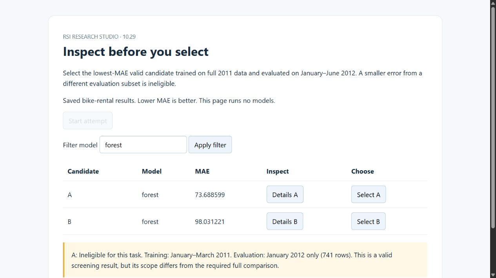
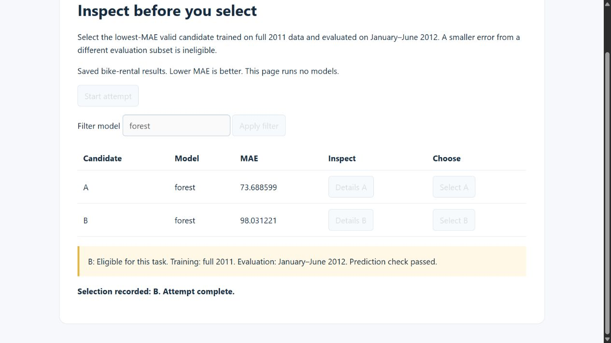

# Inspect the scope before choosing a score

[Lab 10.29](../../../10_research_studio/08_skills_and_procedures/step_29_gui/README.md) now has two live browser attempts using real saved bike-rental metrics. A screening score looks better, but cannot win a comparison that requires full-development results.

| Attempt | What the browser did | Fixed check |
|---|---|---|
| 1: deliberately deficient skill | Applied the forest filter; selected A without opening details | [Failed](attempt-1/CHECK.md) |
| 2: revised inspection instruction | Applied the same filter; opened A and B details; selected B | [Passed](attempt-2/CHECK.md) |

Candidate A's MAE is 73.688599 on a January-only selection subset. Candidate B's MAE is 98.031221 on January–June selection after full-2011 training. Candidate C uses the same full scope and scores 99.175924. These are [copied measured values](CANDIDATES.csv), not synthetic chart numbers. A is valid for screening, but ineligible for this task.

*Actual browser capture. The warning was present in the frozen page before either attempt. It differs from the lesson infographic's conceptual excluded-input example.*

*Actual final UI state. The separate checker confirms the selection; the page's selection message alone is not proof of validity.*

Inspect the [first trace](attempt-1/TRACE.csv), [first screenshot](attempt-1/selection.png), [second trace](attempt-2/TRACE.csv), [visible-trace critique](CRITIQUE.md), [instruction revision](REVISION.md), and [warning-exposure audit](WARNING-EXPOSURE.md). The critic said the first selection was unverified from visible evidence. It did not pretend to have seen A's hidden warning.

This was a planned negative control followed by a bounded repair. The same author built the page, acted, critiqued, and wrote the checker. The packet excluded privileged artifacts, but the conversation did not. The result demonstrates a working local interface and skill-following example; it does not establish blind critique, autonomous discovery, general transfer, or source-paper reproduction. Read the [full report](GUI-REPORT.md), [protocol](PROTOCOL.md), [source audit](SOURCE-AUDIT.md), and [resource limits](COST.md). Learner assessment remains [unattempted](LAB-NOTE.md).

The [manifest](MANIFEST.csv) covers 52 original files, verified against the sibling workspace and this archive. It preserves source copies, input hashes, page/controller code, skill snapshots, an unexecuted draft correction, observations, screenshots, and results. This guide and the manifest itself are outside that file list. The temporary tab and loopback server are closed.

To run your own activity, use the lesson's natural-language prompt in a new sibling workspace. The agent can use the canonical [page/controller generator](../../../../how-did-i-generate-it/rsi/scripts/run-gui-skill.mjs) to prepare and serve a new local page. The [archived page](index.html) is source evidence; GitHub's file view does not execute its local evidence server. Do not reopen an archived attempt or count HTML reading as GUI execution.
