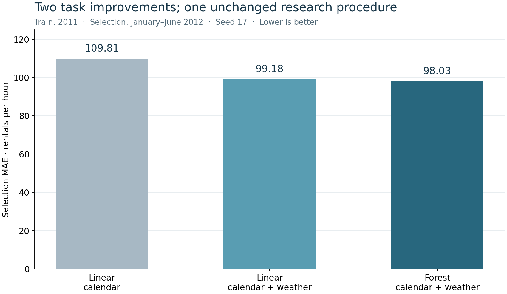

# Follow a claim from hypothesis to review

This author walkthrough covers [10.18](../../../10_research_studio/06_scientist_two/step_18_hypothesis/README.md) through [10.21](../../../10_research_studio/06_scientist_two/step_21_successive_results/README.md). It uses eight real small-model fits on the bike task. The questions, selection rule, and follow-up plan were saved before their respective fits. The author had already seen results on these public development data, so this is an exposed-data walkthrough, not blind discovery.

## A hypothesis that can fail

The [starting error slices](starting-evidence/error-by-hour.csv) show large commuting-hour errors for the calendar-only linear model. The [hypothesis](10-18/HYPOTHESIS.md) predicts at least a 5% reduction in overall selection MAE after adding permitted observed weather fields, with the linear recipe fixed.

The two fits give MAE 109.807668 for calendar-only inputs and 99.175924 with weather, a reduction of about 9.68%. Both separate prediction checks pass. The [conclusion](10-18/CONCLUSION.md) meets the declared threshold but remains conditional on this recipe, period, metric, and dataset. It does not establish a causal effect of weather or advance forecasting accuracy.

## A cheap screen allocates the next two fits

The next study tests two estimator replacements for the retained linear/all recipe. The [screening plan](10-19/SCREENING-PLAN.md) trains each on 2,067 January–March 2011 rows and evaluates the same 741 January 2012 rows. Each candidate fits preprocessing only on the training subset.

| Screening idea | Selection MAE | Recorded fit/prediction seconds |
|---|---:|---:|
| Tree/all | 79.259566 | 0.017600 |
| Forest/all | 73.688599 | 0.170601 |

Lower proxy MAE advances forest. Read the [saved advancement decision](10-19/ADVANCEMENT.md), [subset row list](10-19/screen/forest/TRAIN-ROWS.csv), and [separate screen check](10-19/screen/forest/CHECK.md). No linear screen baseline was fitted, so these results rank the two ideas without establishing their gains over a subset baseline. Selecting only by [fastest screen](10-19/FASTEST-SCREEN.md) would instead choose tree; that alternative was not given extra fits.

Under fuller conditions, forest/all reaches MAE 98.031221 and its linear/all ablation 99.175924. Both use all 2011 training rows and the fixed January–June 2012 selection period. The [contribution](10-19/CONCLUSION.md) is small: about 1.15%, with greater fit cost. The ablation removes the estimator replacement; it keeps weather inputs. Tree has no full-condition result in this study.

Do not interpret the forest's screen MAE and fuller MAE as a controlled before/after change: the training and scoring periods differ.

## A review leads to a new comparison

The [agent review](10-20/REVIEW.md) identifies a concrete limit: a small stochastic-model gain from one seed. The [frozen follow-up plan](10-20/FOLLOWUP-PLAN.md) allocates two fits at seed 29 with all other conditions unchanged.

Forest/all then obtains MAE 97.953587; linear/all obtains 99.175924. Both prediction checks pass. The [response](10-20/RESPONSE.md) says the direction repeated at one additional seed. It does not turn two observations into a significance test, fresh-task validation, or general robustness claim. A [restatement-only response](10-20/RESTATE-ONLY.md) shows why repeating the original claim would not address the criticism.

## Better results under one recorded researcher

*Measured from [the saved plot data](10-21/PLOT-DATA.csv). The zero-based axis preserves the modest size of the second gain. These are task results on exposed selection data, not measurements of an improving research procedure.*

The [discovery lineage](10-21/DISCOVERY-LINEAGE.md) connects linear/calendar → linear/all → forest/all. Each edge has the same researcher hash. The context accumulates results, so an unchanged Markdown file does not prove that all state stayed fixed. The [proposed researcher comparison](10-21/PROPOSED-RESEARCHER-COMPARISON.md) remains unexecuted; it would compare old and revised procedures from matched fresh starts.

The [source audit](SOURCE-AUDIT.md) distinguishes ScientistTwo's method results, automated manuscript assessments, separate human study, and successive discoveries. Our [claim audit](CLAIM-AUDIT.md) applies those distinctions to the local work. No independent reviewer, conference acceptance, source-paper reproduction, or protected evaluation occurred here.

## Inspect the cost and archive

All eight fits and eight separate prediction checks completed. Recorded fit-related time totals 2.030666 seconds, with slightly different timing scope for standard and screening fits. Sixteen subprocess calls took 23.764638 seconds; the fit-related time is included, not added again. [Cost accounting](COST.md) leaves author and provider costs unknown. No final model evaluation occurred. Learner assessment and larger-backend checks remain separate.

The [manifest](MANIFEST.csv) covers 122 original files, verified against the original workspace. The manifest and this guide are publication additions outside that file list. All scripts, hypotheses, screen outcomes, decisions, predictions, checks, reviews, and the measured chart are preserved. Start your own lesson in a new sibling workspace.
