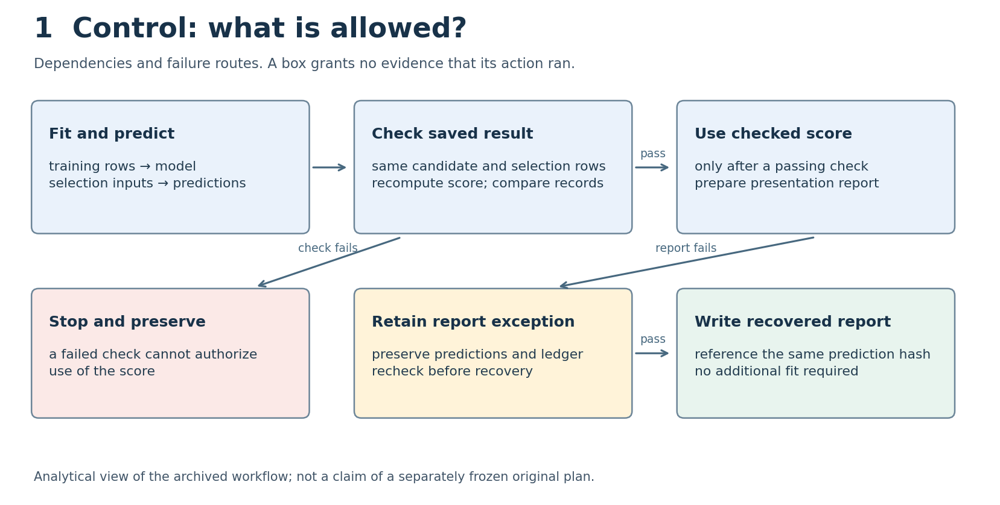
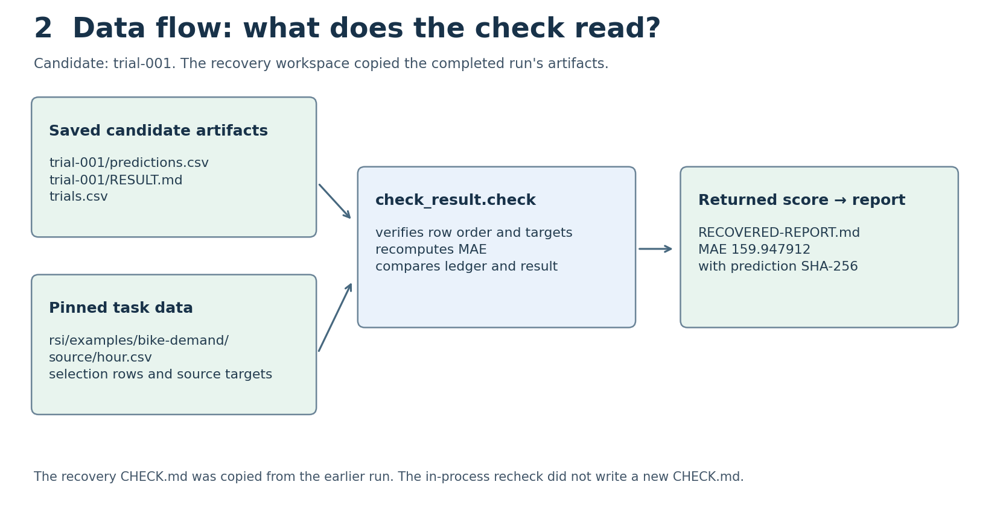
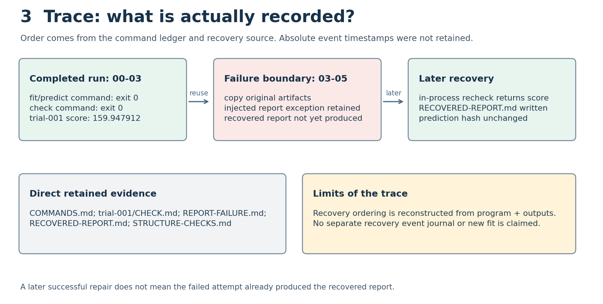

# Three views of one candidate's work

The completed run is `00-03/trial-001`: a constant bike-demand model with calendar features, seed 17. The later `03-05/diagnostic` workspace copied that run before injecting a report failure. Its predictions and ledger did not change during recovery. This audit reads both records without running another fit or check.

## Control view

This analytical plan distinguishes fitting, checking, and reporting. It is derived from the archived procedures; it is not an independently preserved, preregistered control graph. See [editable source](control-plan.mmd).

## Artifact view

Workspace paths below are relative to `rsi/evidence/2026-09-20/clean-journey/`. The pinned dataset path in the diagram is relative to the repository.

| Action | Reads | Produces |
|---|---|---|
| Original fit/predict | pinned bike data, recipe and fixed split | 00-03/trial-001/predictions.csv, RESULT.md, trials.csv |
| Original check command | those predictions, result and ledger; pinned data | 00-03/trial-001/CHECK.md |
| Recovery copy | the original completed workspace | 03-05/diagnostic, including its already existing CHECK.md |
| Recovery in-process check | diagnostic/trial-001/predictions.csv and RESULT.md; diagnostic/trials.csv; pinned data | returned numeric score; **no new CHECK.md** |
| Recovery report write | returned score and prediction hash | diagnostic/RECOVERED-REPORT.md |

The checker reads pinned source targets; a stored target column alone is not its authority. The contract describes the experiment, but this particular check function does not itself consume CONTRACT.md. Do not draw a file-read edge just because a file sounds relevant.

## Trace view

| Relative order | Evidence | Interpretation |
|---|---|---|
| 1 | 00-03 fit/predict entry in COMMANDS.md exits 0 | One original model execution completed |
| 2 | 00-03 check entry exits 0; CHECK.md passes | That saved candidate passed the supplied checker |
| 3 | recovery program copies 00-03 | Diagnostic workspace inherits these artifacts |
| 4 | REPORT-FAILURE.md records the injected exception | The attempted report did not complete normally |
| 5 | recovery program calls check_result.check; recovered report contains its score | A subsequent in-process check supports recovery |
| 6 | RECOVERED-REPORT.md records score and prediction hash | A later report was written with unchanged predictions |

The first two events are directly listed commands. Recovery event order is reconstructed from the retained program and outputs, not a separate timestamped journal. No per-event duration or process exit is invented for the in-process recovery calls. The source hashes are in [SOURCES.csv](SOURCES.csv).

## Failure audit

At the saved exception boundary, the later recheck and recovered report had not executed. They cannot be credited to the failed report attempt. The completed recovery has its own evidence. A copied CHECK.md must not be mistaken for an output emitted by that later recheck.

The injected error is a deliberate teaching failure. It is not evidence of a naturally occurring renderer outage. These artifacts support the described local sequence; they do not supply a tamper-proof event history.

## Change the plan, not the past

[The revised plan](revised-plan.mmd) adds a new MAE unit-label check before report use. It has not executed. The original data, predictions, command log, and checker output retain their hashes. No old result therefore gains a passed unit check. A new execution record would be needed to make that claim.
