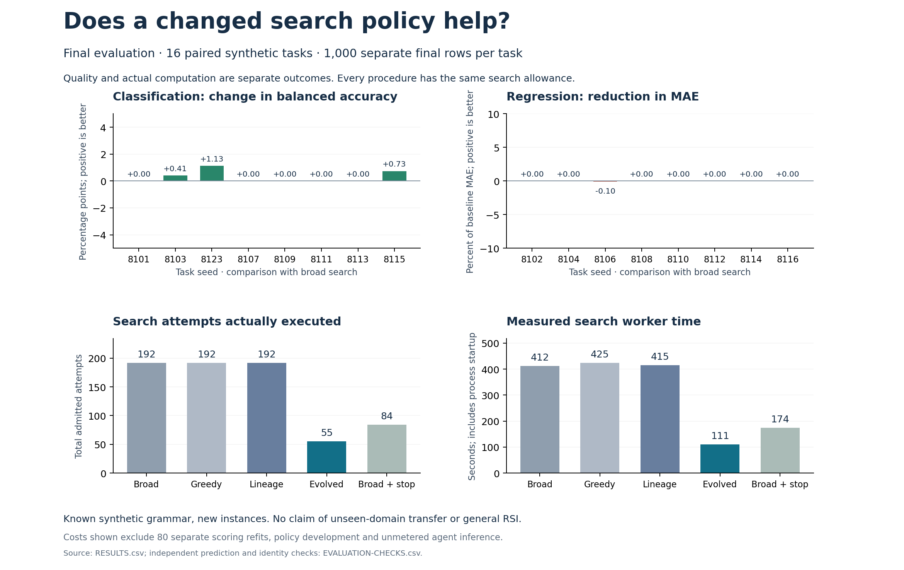

# Fewer actual fits on sixteen new tasks

The evolved discovery policy used **55 search fits**, compared with **192**
for the original broad search: 71.4% fewer fits. Separate final-row quality
improved on three tasks, tied on twelve and worsened on one. The quality
difference is uncertain; this study does not establish a predictive gain.

This is the completed prospective comparison following the
[four-task shakedown](../discovery-shakedown/README.md). No policy or threshold
changed between those phases. A disclosed host interruption required one
task replacement, described below.

The top panels compare the evolved policy with broad search. Positive values
favor the evolved policy. The bottom panels count executed work, rather than
calling already completed fits “saved.” Chart costs exclude separate scoring,
development, unmetered inference and the host-interrupted case.

## The five procedures

Every procedure receives the same data, pipeline builder, proposer, model seed
and maximum allowance: twelve attempts and 120 worker-process seconds per task.
Each task has 1,200 training rows, 800 selection rows and 1,000 separate final
rows. All eighty selected candidate identities were frozen before final scoring.

| Procedure | Search fits | Mean normalized final loss | Search worker seconds |
|---|---:|---:|---:|
| Broad search | 192 | 0.156857 | 412.041 |
| Greedy search | 192 | 0.182729 | 424.636 |
| Lineage-first search, no early stop | 192 | 0.156857 | 415.007 |
| Evolved policy | 55 | 0.154037 | 110.920 |
| Broad search with the learned stop threshold | 84 | 0.155744 | 173.959 |

Lower normalized loss is better. Classification uses twice the error in
balanced accuracy. Regression uses MAE relative to a training-median predictor.
[RESULTS.csv](RESULTS.csv) retains each task's raw balanced accuracy or MAE,
fit time, process time, proposal time, selected code identity and final score.

The evolved policy saved 137 fits against broad search. Adding the learned
stop threshold to broad search saved 108; changing branch allocation saved
29 more. Thus stopping explains much of the measured effect, and the ablation
also supports an additional allocation benefit in this sample. The evolved
policy matched the stopping ablation's final quality on fifteen tasks and
improved it on one. These controls keep a simple stop rule visible.

## Quality and uncertainty

The primary mean normalized final-loss change, evolved minus broad, is
**−0.002820**. Its paired task-bootstrap 95% interval is
**[−0.006548, +0.000010]**. The interval includes zero. The small mean improvement
therefore does not establish a reliable predictive advantage.

For concrete examples, task 8123 rose from 0.901803 to 0.913071 balanced
accuracy. Task 8106 worsened from 0.245790 to 0.246037 MAE. Twelve tasks tied.
Both outcomes belong in the report. The [complete contrasts](PAIRED.csv)
separate predictive loss, attempts, worker time and the prespecified combined
tradeoff; a combined utility win is not an accuracy win.

These are new instances of three known synthetic signal families. The policy
developer knows the generator. This is not unseen-domain or industry-benchmark
transfer, a full Dream-RSI reproduction, improvement of the updater, or evidence
of recursive acceleration. The inner proposer is deterministic; the coding
agent authored the policy revisions. Local file separation is a procedural
evaluation boundary, not protection from a hostile agent.

## The interrupted task and full cost

Windows Modern Standby interrupted task 8105 during the second broad-stop
attempt. Its original tree retains the timeout, the failed independent budget
check and partial unaccepted worker output. It was not silently repaired.

Before final scoring or replacement generation, the maintainer
[declared a deviation](../../../../how-did-i-generate-it/rsi/validation/DISCOVERY-STANDBY-DEVIATION.md):
exclude that whole task and use seed 8123 with the same task kind and signal
family. All previously completed tasks, methods, budgets and comparison rules
were retained. The original order, data, power events and decision remain in
[standby-recovery](standby-recovery/DEVIATION.md).

The completed paired study executed **715 search fits and 80 scoring refits**,
all successful. The excluded case adds **two admitted attempts**, one of which
timed out. Total incurred model attempts for this phase are **797**. Its
6,368.914 recorded worker seconds include the host's long standby interval;
they are retained separately and are not active model-compute time.

[INCURRED-COSTS.csv](INCURRED-COSTS.csv) separates these categories. Development,
the earlier shakedown, orchestration and unmetered agent inference are additional.
The paired search-cost result is not a net total research-cost saving.

## Follow the evidence

- [Protocol](../../../../how-did-i-generate-it/rsi/validation/DISCOVERY-EVALUATION-PROTOCOL.md),
  [source freeze](SOURCE-FREEZE.csv) and [execution order](ORDER.csv).
- [Frozen choices](SELECTED.csv) and [selection closure](SELECTION-CLOSED.md).
- [Results](RESULTS.csv), [contrasts](PAIRED.csv) and [annotated report](REPORT.md).
- [1,628 independent checks](EVALUATION-CHECKS.csv), which recompute final
  metrics and verify row identity, source identity, selection, costs and the
  task-replacement record. Every scoring refit reproduced its selection predictions.
- [Archive manifest](ARCHIVE-MANIFEST.csv): 10,449 byte-verified copied files,
  including candidates, ancestry, predictions, source snapshots and failures.
  Only regenerable Python caches are excluded. This README is a publication addition.

The figure was inspected for label visibility and consistency with the CSVs.
The lesson is concrete: a retained procedural revision can reduce executed
search without establishing a better predictor. Next, test whether changing
the inner harness's feature-building capability improves predictions under
a separately declared comparison. The remaining memory and updater experiments
are still open.
