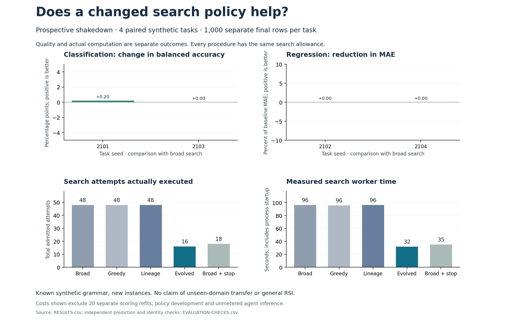

# A first paired check on new tasks

The evolved discovery policy used **16 search fits**, compared with **48** for
the original broad policy, across four new synthetic task instances. Separate
final-row quality tied on three tasks and improved slightly on one. That small
quality difference does not establish a reliable predictive gain.

This is the declared prospective shakedown, not the final sixteen-task study.
No policy or threshold is being tuned from these results.

| Task | Original broad search: final score | Evolved policy: final score | Search fits: broad / evolved |
|---|---:|---:|---:|
| 2101 · linear classification | 0.953634 balanced accuracy | 0.955660 balanced accuracy | 12 / 1 |
| 2102 · curved regression | 0.269606 MAE | 0.269606 MAE | 12 / 12 |
| 2103 · interaction classification | 0.922435 balanced accuracy | 0.922435 balanced accuracy | 12 / 2 |
| 2104 · linear regression | 0.238252 MAE | 0.238252 MAE | 12 / 1 |

Lower MAE and higher balanced accuracy are better. Each final score uses 1,000
new rows from its latent task, outside the search workspace. All twenty
procedure/task choices were frozen before any final-row scoring.

## What the other controls tell us

Five procedures ran online on every task. The lineage-only policy used 48 fits
and matched broad search's final quality. Broad search with the learned stop
threshold used 18 fits and matched the evolved policy's final quality. Most
of the observed savings therefore come from stopping; branch allocation saved
two additional attempts on these four tasks. The greedy control also used 48
fits and had worse mean normalized final loss in this small sample.

The complete comparison executed **178 search fits and 20 separate scoring
refits**, all successful. Each refit reproduced its selected model's selection
predictions before final scoring. Search worker time was 96.393 seconds for
broad search and 31.622 seconds for the evolved policy. Actual model-fit time
was 11.307 and 3.143 seconds respectively; process startup accounts for much
of worker time. Development and agent-inference costs are additional.

The mean evolved-minus-broad normalized final-loss difference is −0.001013.
Its four-task bootstrap interval is [−0.003038, 0]. The sample is small and
contains only known signal families. Do not use this result to claim broad
transfer, net total-cost savings or recursive acceleration.

## Inspect and reproduce

- [Protocol](../../../../how-did-i-generate-it/rsi/validation/DISCOVERY-EVALUATION-PROTOCOL.md)
  specifies procedures, budgets, data roles and analysis before execution.
- [Source freeze](SOURCE-FREEZE.csv), [task execution order](ORDER.csv) and
  [selected models](SELECTED.csv) connect intent to actual execution.
- [All results](RESULTS.csv) and [paired contrasts](PAIRED.csv) retain quality
  and cost separately. Each rollout retains candidate code and predictions.
- [451 independent checks](EVALUATION-CHECKS.csv) validate final predictions,
  row identities, frozen choices, actual attempts and reported contrasts.
- [The report](REPORT.md) gives the five-arm summary. Source snapshots and
  individual logs are retained beside it.

The [archive manifest](ARCHIVE-MANIFEST.csv) verifies 2,608 copied run files,
excluding only regenerable Python caches. This README and the corrected v2
chart are publication additions. The original chart remains preserved: its
regression x-axis incorrectly said “evolved minus broad” although the plotted
quantity, y-axis and values correctly showed MAE reduction. V2 uses the neutral
“comparison with broad search”; data and calculations are unchanged.

These task seeds are now exposed teaching examples. The next step is the
already declared sixteen-task comparison with unchanged policies. The other
RSI method repairs and the requested PowerPoint remain in progress.
