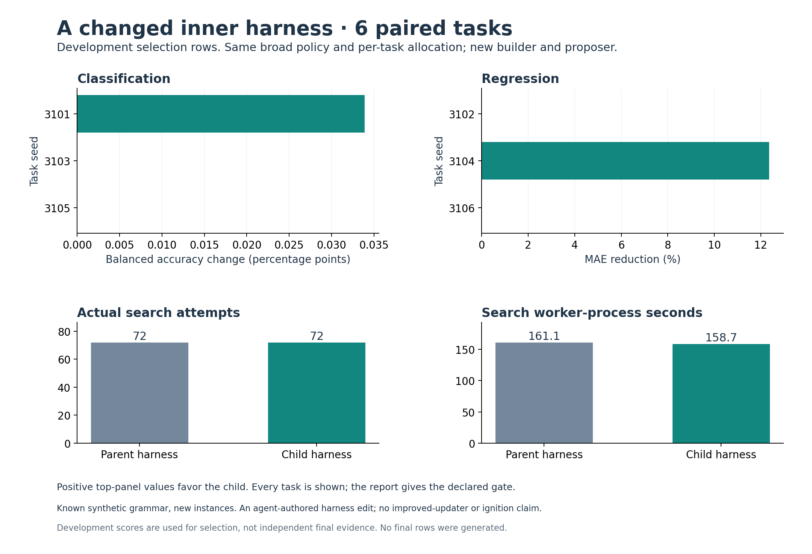

# A useful local change that did not pass the overall gate

The agent-authored child harness improved two of six development tasks and
tied four. It **failed the prespecified promotion gate**. The parent remains
active, and the conditional twelve-task final comparison was not started.
All 144 search fits completed successfully; no final rows were created or scored.

The classification change is only **0.034 percentage points**. The regression
change is **12.36% lower selection MAE on one task**. The top panels use different
units and scales; equal bar lengths would not mean equal-sized effects.

## What changed

The parent offers raw, pairwise and quadratic features. The child adds a
training-fitted spline basis to its quadratic linear-model branch. It also
tries the existing quadratic model one step earlier, replacing one pairwise
regularization probe. The remaining model proposals and broad search policy
are unchanged. Read [the source and teaching guide](../../../experiments/harness-revision/README.md)
and [the original proposal](../../../experiments/harness-revision/CHANGE-PROPOSAL.md).

The changed builder and proposer execute in actual candidate processes. Every
child workspace inherits the original builder as `parent_engine.py` as well
as the revised `engine.py`. Complete source identity matters because a candidate
file can remain unchanged while its imported builder changes.

## All development outcomes

| Task | Kind and known signal family | Parent score | Child score |
|---|---|---:|---:|
| 3101 | Curved classification | 0.930681 | 0.931020 |
| 3102 | Interaction regression | 0.250861 | 0.250861 |
| 3103 | Linear classification | 0.946429 | 0.946429 |
| 3104 | Curved regression | 0.288790 | 0.253088 |
| 3105 | Interaction classification | 0.940839 | 0.940839 |
| 3106 | Linear regression | 0.233866 | 0.233866 |

Classification reports balanced accuracy; higher is better. Regression reports
MAE; lower is better. These are selection scores, not independent final results.
Both arms used twelve attempts per task: 72 each. Parent and child search
worker times were 161.145 and 158.672 seconds. These small timing differences
include process and host variation; no speed benefit is claimed.

The [declared gate](../../../../how-did-i-generate-it/rsi/validation/HARNESS-REVISION-DEVELOPMENT-PROTOCOL.md)
requires a mean normalized selection-loss reduction of at least 0.01, no worse
task-kind mean and no additional failures. The observed mean change was
**−0.003831**. Both task-kind means improved and failures tied at zero, but
the overall improvement threshold was not met. The gate was not changed.

## Why more capacity had a small average effect

The parent already represents much of this simple signal grammar. A subsequent
[privileged noise diagnostic](noise-diagnostic/README.md) reconstructs the known
clean signal on the same development rows with zero fits. Regression's expected
absolute noise is about 0.2394. Two parent regression scores are already close
to that level; the added smooth basis mainly helps the remaining curved case.

This diagnostic is not a learned competitor or a sample-level lower bound.
It did not alter the experiment, gate or predictions. It gives a concrete reason
to improve benchmark diversity rather than repeatedly draw similar seeds and
hope for a dramatic average gain.

## Inspect the record

- [Original gate result](GATE.md), [all results](RESULTS.csv) and
  [paired differences](PAIRED.csv).
- [417 independent checks](EVALUATION-CHECKS.csv) verify sources, data,
  executable inheritance, actual attempts, selection and the unchanged gate.
- [Source freeze](SOURCE-FREEZE.csv), [task order](ORDER.csv) and individual
  rollout trees, predictions and checks.
- [Archive manifest](ARCHIVE-MANIFEST.csv): 2,040 byte-verified original files,
  excluding only regenerable Python caches. This README and the clearly
  retrospective noise diagnostic are publication additions.

The measured figure was visually inspected. No final-test claim, AIDE2
reproduction, improved-updater result or ignition follows. A later proposal
needs its own development protocol. The failed revision and unexecuted
[conditional final protocol](../../../../how-did-i-generate-it/rsi/validation/HARNESS-REVISION-FINAL-PROTOCOL.md)
remain available for teaching how a promotion rule controls actual work.
