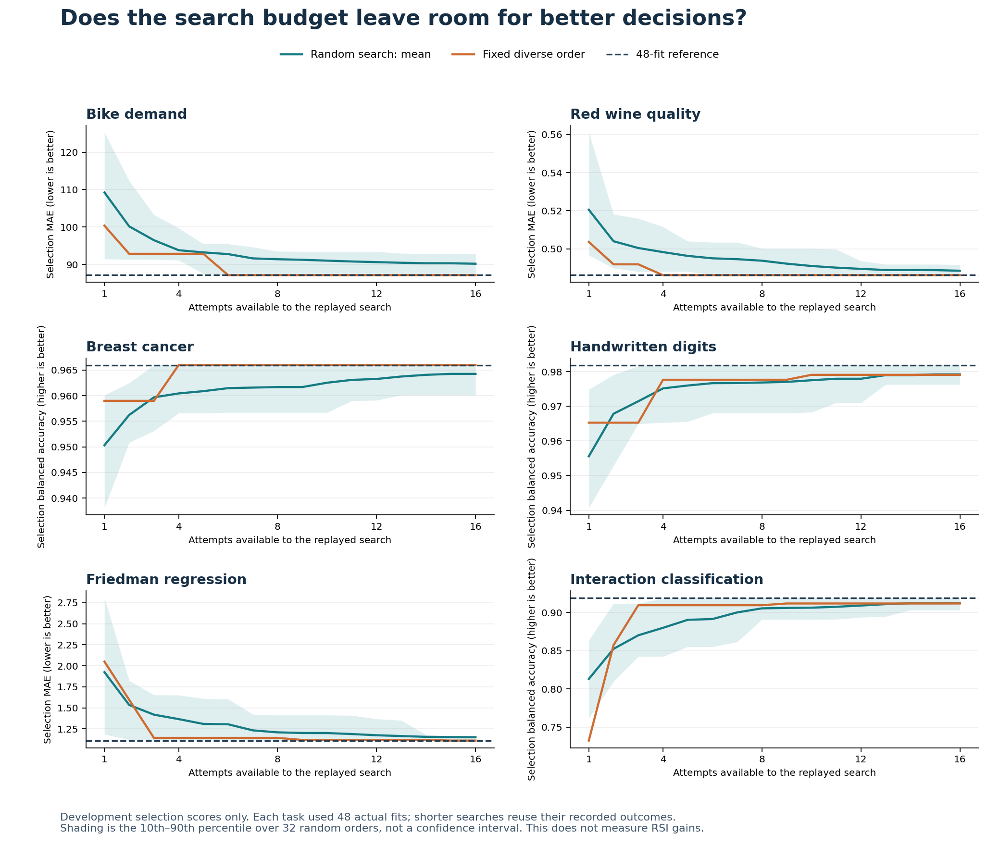

# Does a larger recipe grid solve the zero-gain problem?

**No. This pilot shows that expanding the grid alone is insufficient.** We executed 288 CPU fits: 48 pipelines on each of six development tasks. A sensible eight-attempt fixed search already found the best tested candidate on three tasks. The remaining gaps were modest. This is a diagnostic result that changes the repair plan, not a successful RSI experiment.

The solid lines replay shorter searches over completed fits. The dashed line is the best selection score among the 48 tested pipelines. The shaded band shows variation over 32 random orders, not statistical confidence. None of these curves comes from an evolved policy or final test set.

## What ran

The [protocol](../../../../how-did-i-generate-it/rsi/validation/BENCHMARK-REPAIR-PROTOCOL.md) and [pilot source](../../../../how-did-i-generate-it/rsi/scripts/benchmark_headroom.py) were committed and pushed at `2ceba97` before fitting. Each task used regularized linear models, random forests, histogram gradient boosting, RBF support-vector machines, nearest neighbours and extra trees, with eight configurations per family. Training transformations were fitted inside each pipeline. Each attempt had a 60-second subprocess timeout and one numerical-library thread.

All 288 attempts finished successfully; no worker emitted stderr. Total recorded estimator-fit time was **35.618 seconds**, prediction time **3.811 seconds**, and subprocess time **618.901 seconds**. Python startup dominates this prototype. These intervals do not include the complete project, orchestration, analysis or agent inference costs. Two archived analyses represent the same 288 fits, not 576 separate executions.

The existing public bike and wine sources use their established training/selection boundaries. Historical final rows are excluded. These partitions are already exposed development material. Breast cancer and digits are scikit-learn datasets; the remaining two tasks are generated diagnostic controls. See the [task rows and identities](raw/tasks.csv), [environment](raw/ENVIRONMENT.md), [bike data card](../../../examples/bike-demand/DATA-CARD.md), [wine data card](../../../examples/wine-quality/DATA-CARD.md), [breast cancer source documentation](https://scikit-learn.org/stable/modules/generated/sklearn.datasets.load_breast_cancer.html), and [digits source documentation](https://scikit-learn.org/stable/modules/generated/sklearn.datasets.load_digits.html).

## Observed headroom at eight attempts

These are selection scores on one split per task. Classification values below are percentages of balanced accuracy. The reference uses six times the candidate budget and is selected on the same development rows; it is not a fair-budget competitor or a test result.

| Task | Metric | Fixed diverse search: 8 attempts | Reference: 48 attempts | Remaining selection gain |
|---|---|---:|---:|---:|
| Bike demand | MAE, lower is better | 87.124258 | 87.124258 | 0 |
| Red wine quality | MAE, lower is better | 0.486231 | 0.486231 | 0 |
| Breast cancer | Balanced accuracy, higher is better | 96.598108% | 96.598108% | 0 percentage points |
| Digits | Balanced accuracy, higher is better | 97.767668% | 98.192053% | 0.424384 percentage points |
| Generated Friedman | MAE, lower is better | 1.142092 | 1.110106 | 0.031986 lower MAE |
| Generated interactions | Balanced accuracy, higher is better | 90.941328% | 91.911670% | 0.970342 percentage points |

The fixed search begins with conventional configurations across different families. Its good early performance is retained; we do not weaken it to make a new method look better. At eight attempts it also beats the mean random-search score on all six tasks. The random-search distribution remains in [the full replay table](count-corrected/headroom-replays.csv).

An eight-attempt budget has meaningful *ordering* opportunities against uniform random search, but the present catalogue offers little further predictive headroom against the sound fixed control. This supports keeping these tasks for foundations while expanding the advanced proposal interface to feature transformations, pipeline structure and diagnostic-driven changes. That expansion and its effectiveness are still pending.

## A scoring defect and its correction

The pilot initially omitted the course rule that rental-count predictions must be nonnegative. Eighteen bike candidates produced 1,702 negative values. We found this after observing development results. The [raw analysis](raw/results.csv) remains unchanged.

A [separate correction](count-corrected/CORRECTION.md) clips all bike predictions at zero without refitting or selecting which candidates receive the correction. All other predictions remain unchanged. The [transformation ledger](count-corrected/COUNT-CORRECTION.csv) records old/new scores and prediction hashes. The figure and table above use the corrected predictions. This correction did not change the eight-attempt winner or the 48-attempt reference for bike. It is a recorded post-observation repair, not a claim that the original pilot followed the count rule.

## Checks and reproducibility

The independent [prediction audit](../../../../how-did-i-generate-it/rsi/scripts/check_headroom.py) recomputed regression errors and class-wise recalls from saved predictions, checked row IDs and prepared-data identities, and reconstructed replay choices and costs. **4,413 checks pass in each analysis.** These checks establish arithmetic and record consistency, not generalization or secure evaluator isolation.

- [Raw records and predictions](raw/results.csv)
- [Corrected scores](count-corrected/results.csv)
- [Replay aggregates](count-corrected/headroom-summary.csv)
- [Values behind the plotted curves](count-corrected/plotted-curves.csv)
- [Raw checks](raw/CHECKS.csv) and [corrected checks](count-corrected/CHECKS.csv)
- [Archive byte identities](ARCHIVE-MANIFEST.csv)

The manifest covers 2,916 source and evidence files whose copied bytes were checked. One regenerable Python bytecode-cache file is excluded from publication; source code and all experiment outputs are retained.

To reproduce through a coding agent, open the repository and ask:

> Read the headroom-pilot protocol and its known scoring correction. Create a fresh sibling workspace. Run the recorded 288-attempt development pilot within its per-attempt timeout. Preserve all attempts and predictions. Audit the raw results, derive the separate nonnegative-count correction without new fitting, then audit and plot that analysis. Do not use final task rows or report these curves as RSI improvement. Explain whether the sound fixed baseline leaves useful room for a better procedure.

The agent uses the canonical `benchmark_headroom.py` prepare/run/summarize actions, followed by `check_headroom.py`, `correct_headroom_counts.py`, a second independent check and `plot_headroom.py`. The actual command sequence is in [COMMANDS.md](COMMANDS.md). Existing workspaces must be preserved. This reference is an author experiment; learner prediction and teach-back checkpoints were not tested.

## What remains

The pilot closes the first diagnostic run, not the whole repair. Complete the richer candidate interface, actual method-specific improvement cycles, separate task evaluation, lesson integration and the requested presentation. The [method checklist](../../../../how-did-i-generate-it/rsi/validation/REPAIRED-METHOD-REQUIREMENTS.md) preserves all seven original comparisons. No effective RSI, ignition or acceleration is established by this pilot.
