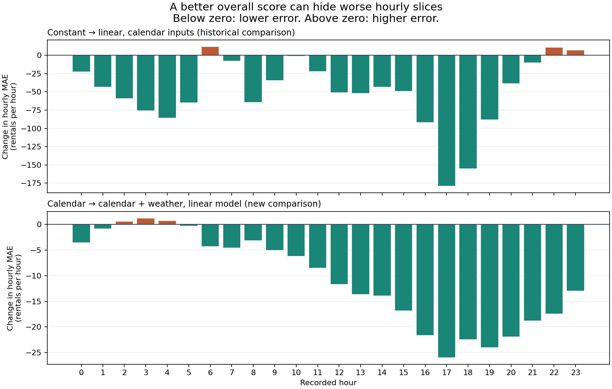

# A loop must read its memory before it acts

This author walkthrough adds three state-driven fits for lab 02.02 and two feedback-driven fits for lab 02.03. Each saved decision precedes its action. Five separate prediction checks pass. No final evaluation runs.

| Activity | Evidence to inspect |
|---|---|
| 02.02: declare the loop | [Plan](LOOP.md), [initial state](02-02/STATE-INITIAL.md) and [protocol](PROTOCOL.md) |
| 02.02: use state before each action | State read before attempts [one](02-02/STATE-READ-1.md), [two](02-02/STATE-READ-2.md) and [three](02-02/STATE-READ-3.md); next choices [one](02-02/NEXT-1.md), [two](02-02/NEXT-2.md) and [three](02-02/NEXT-3.md) |
| 02.02: retain the best, then stop | [Final state](02-02/STATE.md), [comparison](02-02/COMPARISON.md) and [refused fourth request](02-02/stop-command.txt) |
| 02.02: predict a one-attempt run | [Separate unexecuted plan](ONE-LIMIT-PLAN/LOOP.md); no extra fit |
| 02.03: connect feedback to a choice | [Feedback](FEEDBACK.md), decisions [one](DECISION-1.md) and [two](DECISION-2.md), and [recorded use before the second fit](02-03/FEEDBACK-USE-2.md) |
| 02.03: compare the feature intervention | [Comparison](02-03/COMPARISON.md), [hourly changes](HOURLY-CHANGES.csv) and [weak-feedback counterexample](WEAK-FEEDBACK.md) |
| 02.01: inspect weak and regressing slices | [Retrospective slice audit](SLICE-AUDIT.md) of the [original two-fit run](../../2026-09-20/clean-journey/02-01/); its missing pre-fit diagnosis is not reconstructed |
| 02.04: separate duplicate and budget refusals | [Source and trace audit](STOP-RULES-REVIEW.md), [six checks](HISTORICAL-CHECKS.csv), [original request trace](../../2026-09-20/clean-journey/02-04/) and [intentional-replication explanation](INTENTIONAL-REPLICATION.md) |

The loop evaluates constant, linear and tree candidates. Their selection MAEs are 159.947912, 109.807668 and 125.049488. At the stop boundary, the current candidate is the tree; the retained best is the earlier linear model. Each controller process reads and cross-checks the saved state against the ledger. All before-action and after-action state versions remain available.

The feature comparison holds the linear model, seed, split and metric fixed. Calendar-only MAE is 109.807668; calendar plus permitted observed weather gives 99.175924. The author supplied the hypothesis and fixed driver, with prior public-result exposure. This is recorded instruction use, not autonomous discovery or a causal weather experiment.

Lower bars mean less error. Both comparisons improve the overall score but worsen three hourly slices. The panels use different vertical ranges. [The 48 measured rows](HOURLY-CHANGES.csv) support the figure; no illustrative score was substituted for a result.

[Eight state/input checks](CHECKS.csv), [source identities](INPUT-IDENTITIES.csv), [audited historical identities](AUDITED-IDENTITIES.csv), [costs and limits](RESULT.md), and the [88-file manifest](MANIFEST.csv) make this walkthrough inspectable. Recorded fit intervals total 0.397162 seconds; nested command timings overlap, and author/provider costs are unmeasured. Student predictions, quizzes, independent-agent behavior and comprehension remain untested. This navigation page was added after sealing the original files.
