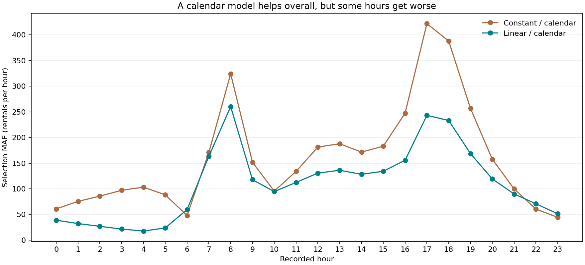

# Diagnose a failure, then test one change

The baseline cannot distinguish a quiet hour from a busy hour. This lab 02.01 author walkthrough records that diagnosis before two new fits. The comparison changes the model family while holding calendar inputs, seed, source, split and MAE fixed.

| Activity | Inspect the evidence |
|---|---|
| Inspect an earlier failure | [Prerequisite hourly errors](BASELINE-HOURLY.csv), copied from the [fixed-process baseline](../fixed-process/01-02/trial-001/error-by-hour.csv) |
| Write a testable hypothesis before fitting | [Hypothesis, alternative and possible failure](HYPOTHESIS.md), [protocol](PROTOCOL.md), decisions [one](DECISION-1.md) and [two](DECISION-2.md) |
| Fit both candidates and keep both | Commands [one](fit-1-command.txt) and [two](fit-2-command.txt), [ledger](experiment/trials.csv) and [comparison](experiment/COMPARISON.md) |
| Check the saved predictions | Checks [one](experiment/trial-001/CHECK.md) and [two](experiment/trial-002/CHECK.md) |
| Explain a weak slice and a regression | [24 hourly comparisons](HOURLY-CHANGES.csv) and [measured interpretation](RESULT.md) |

Constant/calendar selection MAE is **159.947912**. Linear/calendar gives **109.807668**. Hour 8 remains the linear model's weakest slice at 260.203781, and hours 6, 22 and 23 get worse. Those results support preferring this linear candidate on this selection period; they do not establish uniform improvement or future performance.

The fixed driver reads the hypothesis's recipe fields before fitting. [Eight checks](CHECKS.csv) verify the recipes, unchanged inputs, row count, baseline agreement and row-weighted scores. [Source identities](INPUT-IDENTITIES.csv), [runtime](ENVIRONMENT.md), [visual and chronology review](REVIEW.md), and [manifest](MANIFEST.csv) preserve the evidence. Recorded fit intervals total 0.146234 seconds; inference and author costs are unknown.

The author already knew related public results. This is a checked workflow, not blind discovery, causal evidence or student assessment. No final evaluation ran. The [historical run](../../2026-09-20/clean-journey/02-01/) is preserved; this new record does not supply a missing note retroactively. This navigation page was added after sealing the originals.
