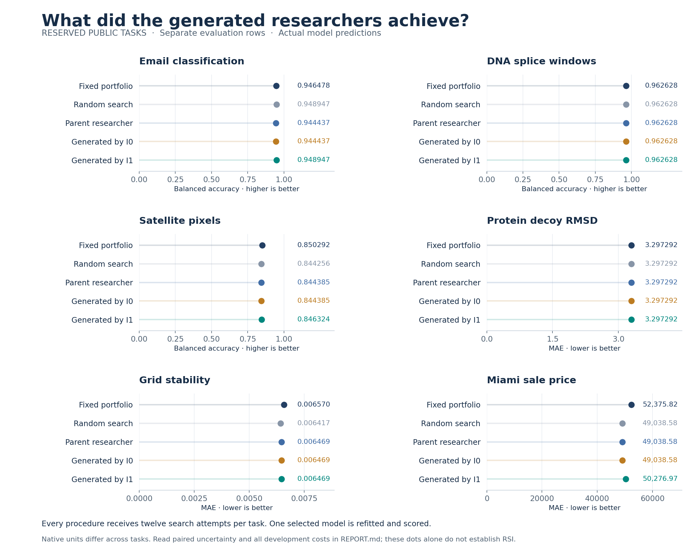

# The generated researcher did not establish an overall gain

**I1 improves two reserved tasks, ties three and worsens one against I0 and
the parent.** The mean normalized loss change is +0.000120, where lower is
better. Its exploratory 95% task-bootstrap interval is [−0.001826, +0.002390].
This supports an inconclusive quality result, not a successful overall RSI claim.

All **360 search attempts and 30 scoring refits succeeded**. Together with the
234-attempt development phase, the complete declared study used **624 model
attempts**, including losing researchers. No retry or shared-fit cache was used.

*Each procedure has twelve search attempts per task. The chart uses actual
prediction records, not generated artwork. Values are rounded for display;
[NATIVE-SCORES.csv](NATIVE-SCORES.csv) retains the full reported precision.*

## All comparisons

| I1 compared with | Better / tied / worse | Mean normalized loss change | 95% task-bootstrap interval |
|---|---|---:|---|
| I0 | 2 / 3 / 1 | +0.000120 | [−0.001826, +0.002390] |
| Parent researcher | 2 / 3 / 1 | +0.000120 | [−0.001826, +0.002390] |
| Fixed portfolio | 3 / 2 / 1 | −0.002307 | [−0.005816, +0.000790] |
| Random search | 1 / 3 / 2 | +0.001125 | [−0.000414, +0.003240] |

I1 minus I0 was the primary contrast. Every interval includes zero. These are
six public tasks and one model seed, with 10,000 bootstrap draws stratified by
task kind. The intervals are exploratory and unadjusted for multiple comparisons.
Do not select the comparison with the most favorable mean as the overall result.

In native units, I1's balanced accuracy is 0.948947 on spam versus the parent's
0.944437, and 0.846324 on satellite pixels versus 0.844385. Its Miami MAE rises
from the parent's 49,038.58 to 50,276.97. DNA, protein and grid predictions have
tied aggregate scores in this pair. The fixed portfolio is stronger than I1
on satellite pixels; random search is stronger on grid and housing.

[REPORT.md](REPORT.md) contains the complete table and analysis.
[CONTRASTS.csv](CONTRASTS.csv) contains the unrounded contrasts.

## What the experiment does establish

The [development study](../nested-research-development/README.md) generated
complete researchers, executed their searches, selected a retained parent
under a fixed outer rule and invoked both inherited improvers again. This
phase then executed those second-generation researchers on reserved tasks.
Thus the later code use is real, even though the primary quality comparison
is inconclusive.

I1's source controls coverage, unused alternatives and parent selection inside
the full search loop. It is a bounded programmatic rewrite, authored by the
coding agent. It is not an independent LLM researcher, a model-weight update,
a reproduction of the named frontier systems or evidence of acceleration.

Compare [the spam I1 source](runs/43/i1/researcher.py) with its
[actual ledger](runs/43/i1/LEDGER.csv). Then inspect the
[housing ledger](runs/361260/i1/LEDGER.csv), where the selected candidate has a
better selection loss but worse final MAE than the parent procedure's choice.
That observation does not, by itself, diagnose the cause of the regression.
[BEHAVIOR-CHANGES.csv](BEHAVIOR-CHANGES.csv) separates different executed
constructor choices from changes in the retained score.

## Verification and cost

The search passed **10,299 checks before final scoring**. All thirty choices
were frozen globally. The complete final audit passed **10,813 checks**,
including the search checks. It independently recomputes metrics from saved
predictions, checks row and truth identities, verifies inherited builder and
researcher source, replays feedback-dependent decisions and accounts for
rejected constructor duplicates. Every scoring refit reproduces selection loss.

The evaluation phase recorded 1,048.070 worker-process seconds. Development
adds 485.393 seconds. These figures exclude agent inference, host analysis and
preparation, so they do not establish lower total research cost. Every arm
spent its 72 search attempts and six scoring refits; there is no saved-fit claim.
See [COSTS.csv](COSTS.csv).

The [data preparation](../nested-data/README.md) excludes the grid's derived
target class and groups exact feature duplicates and recorded entity IDs.
These public classroom splits do not establish gene, protein or satellite-scene
independence. Grid data are simulated and Miami prices are retrospective.
Final-file access was procedural, not a secure evaluator service.

## Preserved artifacts and next use

The executed sources, proposals, rejected constructors, all predictions and
both plot versions are retained. The first chart used too many decimal places
for housing and overlapped a marker; the corrected version formats those
values to two decimals. No numerical result changed.

[ARCHIVE-MANIFEST.csv](ARCHIVE-MANIFEST.csv) covers the original completed
workspace files. This authored report and the manifest are additional
publication files. No task, score or failed phase was replaced.

The frozen source README contains relative links from its original location.
Its [exact bytes](source/README.md.original) remain preserved. The adjacent
[reading copy](source/README.md) corrects those six links and labels the old
status. The manifest's original_path column records each completed-workspace
name; its path column locates the byte-identical archived original. The
[pre-publication manifest](ARCHIVE-MANIFEST.before-navigation.csv) also remains.
The source freeze still names the original workspace path and hash. No
executable source, model result or frozen source identity changed.

This study is closed. Its final results may inform a new hypothesis, but these
tasks cannot be relabelled untouched for that hypothesis. The course should
teach the verified mechanism and mixed outcome. The user's requested success
presentation remains a separate decision because an overall efficacy gain
has not been established.
