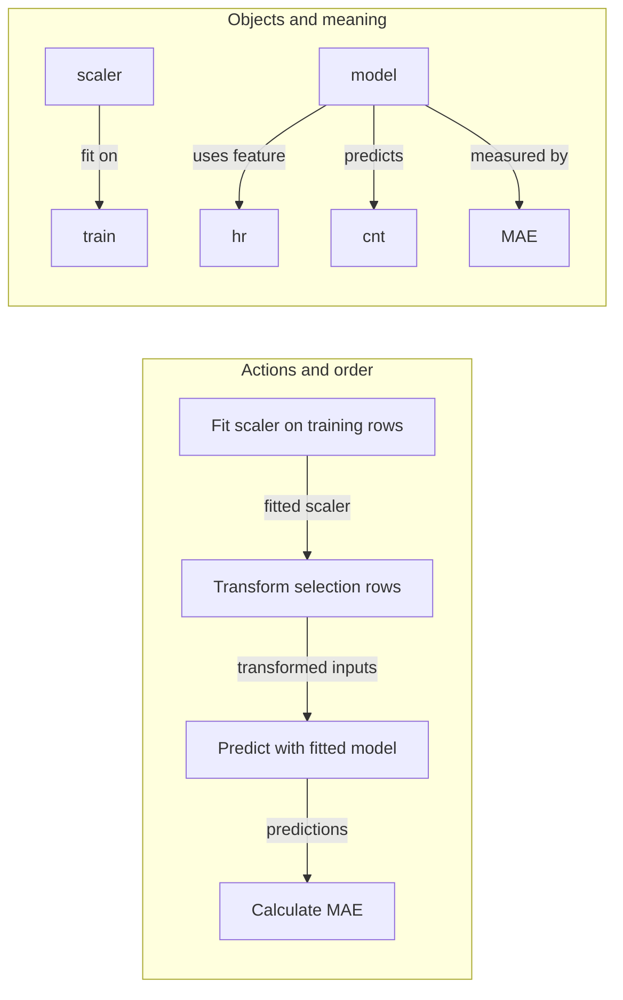

# Facts and actions answer different questions

The model receives hour-of-day as an input. The scaler learns its statistics from training rows. Search uses selection results to choose a candidate. MAE defines the error measurement. The model estimates cnt, the rental count for one hour. These five sentences explain the table's five rows.

The checker permits seven relation names: uses feature, derived from, fit on, selects on, measured by, predicts and evaluated on. It tests three declared invariants: no directly target-derived input, no fit-on partition other than train, and no selection on final. It also rejects an unknown relation name. It does not infer absent facts, follow arbitrary derivation chains, establish units, inspect actual execution, or verify that the named metric suits the task.

“Scaler” appears in both views. On the left, fitting and transforming are operations in time; on the right, scaler is the object in a statement about permitted data. The left order alone cannot prevent fitting on final data. The right fact alone cannot prove the scaler was fitted before use. This editable drawing is a plan, not an execution trace.

The omitted-derivation copy says that a model uses total_users but omits the fact that it is derived from target. A pass on that copy is the checker's coverage limit, not permission to use the leaked input. The three-violation historical table remains available separately.
