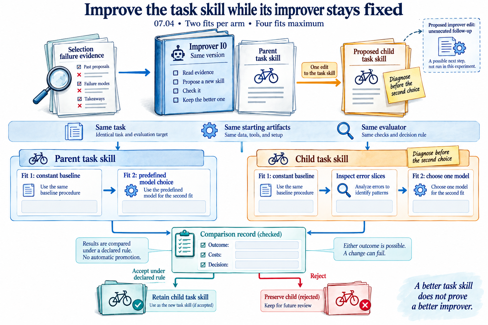

# Close development and retain the better incumbent

All **24 second-revision attempts succeeded**. **475 independent checks
pass**, and 184 original files are preserved with matching bytes. Read the
[proposal](source/PROPOSAL.md), [comparison](COMPARISON.csv),
[report](REPORT.md) and [archive identities](ARCHIVE-MANIFEST.csv).

The picture explains the distinction. This stage changes model-building code;
it does not yet compare two updaters on new tasks.

| Development task | Original portfolio | Retained after both revisions |
|---|---:|---:|
| Chess, balanced accuracy | 0.993846 | 0.993879 |
| Multiple Features, balanced accuracy | 0.982412 | 0.985309 |
| Optical digits, balanced accuracy | 0.985203 | 0.990844 |
| Abalone, rings MAE | 1.427318 | 1.427318 |
| Auction verification, milliseconds MAE | 443.365057 | 443.365057 |
| Solar flare, count MAE | 0.365629 | 0.325926 |

These are **selection scores from additional development fits**. They do not
show an equal-budget or held-out advantage. The solar-flare improvement comes
from adding a conventional median control, not a recursive discovery.
The unchanged regression rows are meaningful: neither target transformation
nor a richer representation automatically beats a strong incumbent.

Both earlier source generations are explicitly inherited. Unscaled RBF C=1
improves the two digit tasks in this stage. The other proposed changes do not
beat their best prior incumbent. The report compares against both the original
portfolio and the incumbent after revision one, so a weaker child cannot
silently replace a better earlier model.

Development is now closed at **96 total attempts**: 48 baseline, 24 first
revision and 24 second revision. No final rows were scored, and no reserved
task was fitted. Next, inspect the [retained memory and replay](../tabular-memory/README.md)
and implement the matched procedure comparison before using those tasks.
