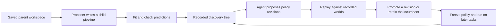

# Let experience change the search

A model can improve while the procedure that finds models stays the same.
This extension makes that procedure visible. It records a search, tests an
agent's proposed policy changes against that history, and uses the selected
policy on later work.

Start after labs 10.07–10.09. Their small exercises introduce the concepts.
This extension adds actual saved-workspace inheritance and repeated development
cycles. Keep each lab's own budget; the research study below is a separate run.

## Ask your coding agent

```text
Read rsi/skills/run-discovery-cycle/SKILL.md.
Explain this tabular discovery experiment.
Start with the six archived development trees.
Show one actual inherited code change, one policy
revision, its replay evidence and its later use.
Do not run new model fits yet.
Help me distinguish a model gain, a policy change,
and evidence of a better improvement process.
```

You do not need to type Python or configuration. After inspecting the evidence,
ask the agent to run the portion of the experiment you want to study. It must
state the combined allowance before starting. Reading the archive requires no
model fits. Reproducing the three development generations permits at most 72
fits, with twelve per task and a 120-second worker-process allowance per task.
The published run used 43. Your agent's proposed policies can differ.

## Trace the mechanism



An arrow is a requirement to verify. A child's inherited manifest must match
its parent. A replay decision must expose only recorded work. A later rollout
must use the selected policy's exact source. Inspect the [measured example](../../evidence/2026-09-22/online-discovery/README.md)
to see those records.

The current proposer tests ordinary linear and tree models, interaction
features, squared terms and local parameter changes. The agent edits a Python
policy, while the learner expresses its intent in words. In the published run,
one revision asks whether the current quality is already sufficient to stop.
That stops real future fits; it does not rename completed fits as saved work.

## What the comparison must establish

A lower search cost can matter even when predictive scores tie. A better
prediction can also cost more. Keep those outcomes separate. A replay winner
may exploit the limited recorded history and fail on new work.

The [development protocol](../../../how-did-i-generate-it/rsi/validation/ONLINE-DISCOVERY-PROTOCOL.md)
defines the three cycles. The [paired evaluation protocol](../../../how-did-i-generate-it/rsi/validation/DISCOVERY-EVALUATION-PROTOCOL.md)
defines five procedures, prospective shakedown tasks and a later sixteen-task
comparison. Its implementation is
`how-did-i-generate-it/rsi/scripts/evaluate_discovery.py`; final rows are kept
outside online rollouts and selected models are frozen before scoring.
These published seeds become known examples after the study. A new research
claim needs newly declared evaluation tasks.

This is a laptop adaptation. The inner proposer is a fixed program; the policy
developer is the current coding agent. It does not reproduce Dream-RSI's full
LLM discovery system. The generated tasks are controlled instances of three
known signal families. Real-data transfer and improvement of the improver
remain separate questions.

## Check your intuition

1. A new policy saves eight fits but has slightly worse final accuracy. What
   must its report show before you can judge it?
2. Replay has no continuation for a requested branch. Does that mean the branch
   is bad?
3. A revised policy is saved but the next run still loads its parent. Has the
   system demonstrated use of the revision?

<details>
<summary>Compare your reasoning</summary>

1. Show quality and actual resource differences separately, under the same
   task and allocation. Include policy-development overhead and uncertainty.
   Any combined tradeoff must have been declared before seeing the results.
2. No. Its outcome is unknown. It needs new online work.
3. No. The source file proves a proposal exists. The later execution must use
   it, and a fair comparison must assess its effect.

</details>

The key idea is to turn experience into an executable procedural change, then
check whether later work benefits. Next, compare this policy update with
[changes to the updater itself](../../skills/improve-research-skill/SKILL.md).
